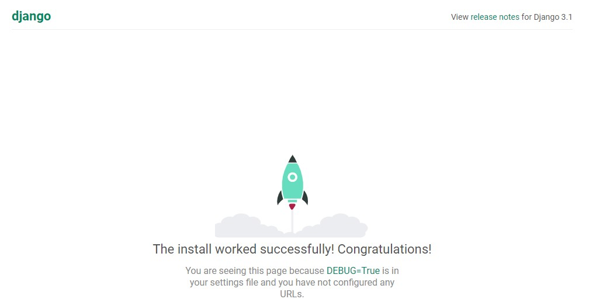

### 1.创建项目
```python
django-admin startproject mysite
```
#### 项目目录结构
```python
mysite/
    manage.py
    mysite/
        __init__.py
        settings.py
        urls.py
        asgi.py
        wsgi.py
```
* 最外层的mysite/:根目录名称，根目录名称对Django没有影响，你可以将它重命名为任何名称。
* manage.py:Django项目的命令行管理工具。
* 内层mysite/:纯python包，包含你的项目。
* mysite/settings.py：Django项目的配置文件。
* mysite/urls.py：Django 项目的URL声明，就像你网站的“目录”。
* mysite/asgi.py：项目运行在ASGI兼容的Web服务器上的入口。
* mysite/wsgi.py：项目运行在WSGI兼容的Web服务器上的入口。

### 2.启动用于开发的简易服务器
```python
python manage.py runserver
```
运行结果
```python
E:\code\mysite>python manage.py runserver
Watching for file changes with StatReloader
Performing system checks...

System check identified no issues (0 silenced).

You have 18 unapplied migration(s). Your project may not work properly until you apply the migrations for app(s): admin, auth, contenttypes, sessions.
Run 'python manage.py migrate' to apply them.
October 20, 2020 - 11:38:06
Django version 3.1.2, using settings 'mysite.settings'
Starting development server at http://127.0.0.1:8000/
```
访问地址：http://127.0.0.1:8000/


### 3.创建投票应用
* 应用是专门做某件事的网络应用程序。
* 项目是网站配置+应用的集合，一个项目可以包含多个应用，一个应用也可以被多个项目使用。
* django中每个应用都是一个python包，并遵循相同的约定。

```python
python manage.py startapp polls
```
根目录下会生成一个polls目录：
```python
polls/
    __init__.py
    admin.py
    apps.py
    migrations/
        __init__.py
    models.py
    tests.py
    views.py
```
### 4.设置时区和语言
/mysite/mysite/settings.py
```python
LANGUAGE_CODE = 'zh-hans'
TIME_ZONE = 'Asia/Shanghai'
```
settings.py文件中INSTALLED_APPS包含的django自带应用。
* django.contrib.admin：管理员站点。
* django.contrib.auth：认证授权系统。
* django.contrib.contenttypes：内容类型框架。
* django.contrib.sessions：会话框架。
* django.contrib.messages：消息框架。
* django.contrib.staticfiles：管理静态文件的框架。

### 5.创建模型-polls/models.py
**模型是真实数据的简单明确的描述，它包含了存储的数据所必须的字段和行为。**

每个模型都是django.db.models.Model的子类，模型中的类变量表示数据库中的字段。

polls/models.py
```python
from django.db import models
from django.utils import timezone
import datetime

class Question(models.Model):
    question_text = models.CharField(max_length=200)
    pub_date = models.DateTimeField()

    def __str__(self):
        return self.question_text

class Choice(models.Model):
    question = models.ForeignKey(Question, on_delete=models.CASCADE)
    choice_text = models.CharField(max_length=200)
    votes = models.IntegerField(default=0)

    def __str__(self):
        return self.choice_text
```
### 6.激活模型(Models)
#### 首先需要把polls应用配置到项目的INSTALLED_APPS中。
```python
INSTALLED_APPS = [
    'polls.apps.PollsConfig',
    ...
    ...
]
```
#### 迁移数据库
1. 生成迁移文件
2. 应用到数据库

```python
# 为模型的改变生成迁移文件（sql语句）
python manage.py makemigrations polls
# 选中所有还没有执行过的迁移，并应用在数据库上面，也就是将模型的更改同步到数据库上
python manage.py migrate
```
### 7.编写视图(Views)
* django中的视图概念是**一类具有相同功能和模板的集合**。
* 在django中，网页和数据都是从视图而来，每个视图表现为一个python函数(或者类视图中的方法)。
* django根据用户请求的url来选择执行哪个视图。

#### 投票应用中需要下列几个视图
1. 问题索引页(index)：展示最近的几个投票问题。
2. 问题详情页(detail): 展示某个投票的问题和不带结果的选项列表。
3. 问题结果页(result): 展示某个投票的结果。
4. 投票处理器(vote)：响应用户为某个问题的特定选项投票的动作。

polls/views.py
```python
from django.shortcuts import render, get_object_or_404
from django.http import HttpResponse, HttpResponseRedirect
from .models import Question, Choice
from django.urls import reverse


def index(request):
    latest_question_list = Question.objects.order_by('-pub_date')[:5]
    context = {
        'latest_question_list': latest_question_list
    }
    return render(request, 'polls/index.html', context)


def detail(request, question_id):
    question = get_object_or_404(Question, pk=question_id)
    return render(request, 'polls/detail.html', {'question': question})


def result(request, question_id):
    question = get_object_or_404(Question, pk=question_id)
    return render(request, 'polls/result.html', {'question': question})


def vote(request, question_id):
    question = get_object_or_404(Question, pk=question_id)
    try:
        selected_choice = question.choice_set.get(pk=request.POST['choice'])
    except (KeyError, Choice.DoesNotExist):
        return render(request, 'polls/detail.html', {
            'question': question,
            'error_message': "You didn't select a choice.",
        })
    else:
        selected_choice.votes += 1
        selected_choice.save()
        return HttpResponseRedirect(reverse('polls:result', args=(question.id,)))
```

### 8.为视图添加url映射关系
polls/urls.py
```python
from django.urls import path
from . import views

app_name = 'polls'
urlpatterns = [
    path('', views.index, name='index'),
    path('<int:question_id>/', views.detail, name='detail'),
    path('<int:question_id>/result/', views.result, name='result'),
    path('<int:question_id>/vote/', views.vote, name='vote'),
]
```
**同时在根URLconf文件(mysite/urls.py)中引入应用polls/urls.py.**</br>
mysite/urls.py
```python
from django.contrib import admin
from django.urls import path, include

urlpatterns = [
    path('admin/', admin.site.urls),
    path('polls/', include('polls.urls')),
]
```
### 9.使用模板
1. 在polls目录下创建一个templates目录，django会在这个目录下查找查找模板文件。
2. 在创建的templates目录下，再创建一个polls目录。
3. 然后在polls/templates/polls目录下创建三个模板(index.html,detail.html,result.html).

**为什么要在templates目录下再创建一个polls子文件夹？**</br>
虽然可以将模板文件直接放在polls/templates目录下，但是官方不建议这样做，django会选择第一个匹配的模板文件，如果有一个模板正好和另一个应用的模板名相同，Django没有办法区分它们。
我们需要django选择正确的模板，最好的方法就是把他们放入各自的命名空间中，也就是把这些模板放入一个和自身应用重名的子文件夹下。

##### index.html
```python

    <ul>
    
        <li><a href="">{{ question.question_text }}</a></li>
    
    </ul>

    <p>No polls are available.</p>

```
##### detail.html
```python
<h1>{{ question.question_text }}</h1>

<p><strong>{{ error_message }}</strong></p>

<form action="" method="post">


    <input type="radio" name="choice" id="choice{{ forloop.counter }}" value="{{ choice.id }}">
    <label for="choice{{ forloop.counter }}">{{ choice.choice_text }}</label><br>

<input type="submit" value="Vote">
</form>
```
##### result.html
```python
<h1>{{ question.question_text }}</h1>

<ul>

    <li>{{ choice.choice_text }} -- {{ choice.votes }} vote{{ choice.votes|pluralize }}</li>

</ul>

<a href="">Vote again?</a>
```
### 10.django后台管理系统
#### 创建管理员账号
```python
python manage.py createsuperuser
```
#### 向后台管理系统注册模型
polls/admin.py
```python
from django.contrib import admin
from .models import Question, Choice

admin.site.register(Question)
admin.site.register(Choice)
```
#### 启动web服务，访问127.0.0.1/admin
