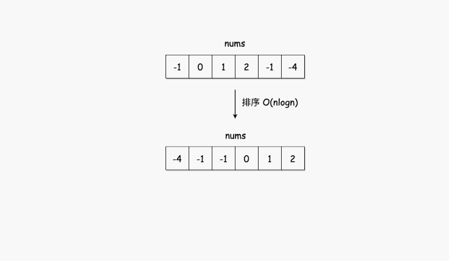

# 15.三数之和
## 题目
给你一个包含 n 个整数的数组 nums，判断 nums 中是否存在三个元素 a，b，c ，使得 a + b + c = 0 ？请你找出所有和为 0 且不重复的三元组。

注意：答案中不可以包含重复的三元组。

```python
输入：nums = [-1,0,1,2,-1,-4]
输出：[[-1,-1,2],[-1,0,1]]

输入：nums = []
输出：[]

输入：nums = [0]
输出：[]
```

## 分析


* 长度小于3的数组直接返回[]
* 对数组排序
* 遍历排序后的数组
    * 若nums[i]>0：因为已经排序好，所以后面不可能有三个数加和等于0，直接返回结果
    * 对于重复元素：跳过，避免出现重复解
    * 令左指针L=i+1，右指针R=n−1，当 L<R 时，执行循环：
        * 当nums[i]+nums[L]+nums[R]==0，执行循环，判断左界和右界是否和下一位置重复，去除重复解。并同时将 L,R 移到下一位置，寻找新的解
        * 若和大于 0，说明 nums[R] 太大，R左移
        * 若和小于 0，说明 nums[L] 太小，L右移
* 时间复杂度O(n^2),外层for循环遍历数组，内层双指针遍历数组

```python
class Solution:
    def threeSum(self, nums: List[int]) -> List[List[int]]:
        length = len(nums)
        if length < 3:
            return []
        nums.sort()
        ans = []
        for i in range(length):
            if nums[i] > 0:
                # 排序后的数组如果第一个元素都大于0，那三数之和必然大于0
                continue

            if i > 0 and nums[i] == nums[i-1]:
                # 跳过重复元素
                continue

            L = i+1
            R = length-1
            while L < R:
                sum_ = nums[i] + nums[L] + nums[R]
                if sum_ < 0:
                    L += 1
                    continue
                elif sum_ > 0:
                    R -= 1
                    continue
                else:
                    ans.append([nums[i], nums[L], nums[R]])
                    L += 1
                    R -= 1
                    while L < R and nums[L] == nums[L-1]:
                        L += 1
                    while L < R and nums[R] == nums[R+1]:
                        R -= 1

        return ans
```
