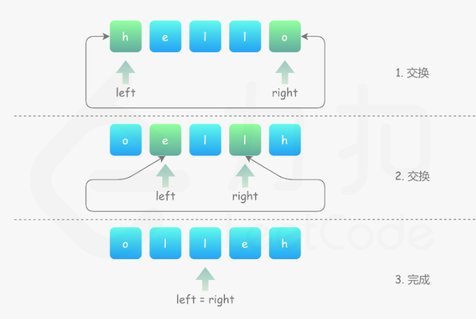

# 344.反转字符串
## 题目
编写一个函数，其作用是将输入的字符串反转过来。输入字符串以字符数组 char[] 的形式给出。

不要给另外的数组分配额外的空间，你必须原地修改输入数组、使用 O(1) 的额外空间解决这一问题。
```python
输入：["h","e","l","l","o"]
输出：["o","l","l","e","h"]
```

## 分析

* 左右两个指针分别从数组两端向中间运动，并交换两个指针对应的值

```python
class Solution:
    def reverseString(self, s: List[str]) -> None:
        L = 0
        R = len(s) - 1
        while L < R:
            s[L], s[R] = s[R], s[L]
            L += 1
            R -= 1
```
