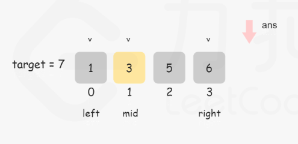
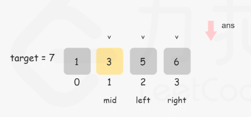
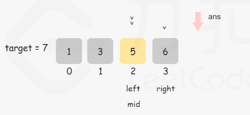
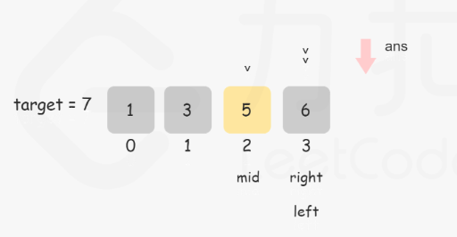
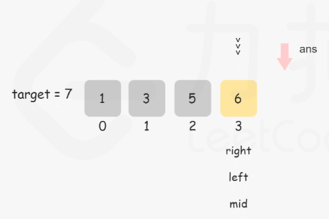
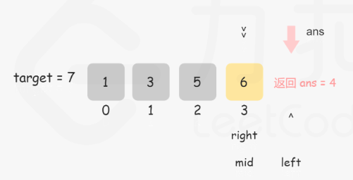

## 搜索插入位置
给定一个排序数组和一个目标值，在数组中找到目标值，并返回其索引。如果目标值不存在于数组中，返回它将会被按顺序插入的位置。
你可以假设数组中无重复元素
示例：
```Python
输入: [1,3,5,6], 5
输出: 2

输入: [1,3,5,6], 2
输出: 1
```
#### 方法一：遍历数组寻找插入位置
时间复杂度O(n),空间复杂度O(1)
```python
def searchInsert(nums, target):
    # 1.目标值在数组所有元素之前
    # 2.目标值等于数组中元素
    # 3.目标值介于数组元素之间
    # 4.目标值在数组所有元素之后
    for i, item in enumerate(nums):
        # 前三中情况
        if item >= target:
            return i

    # 第四种情况
    return len(nums)
```

#### 方法二：二分查找
* 时间复杂度O(logn),空间复杂度O(1)
* 设定坐下标left和右下标right，计算中间下标mid。
* nums[mid]等于目标值，直接返回mid。
* nums[mid]大于目标值，则right左移。
* nums[mid]小于目标值，则left右移。
* 查找结束没有值相等，返回left。








```python
def searchInsert(nums, target):
    left = 0
    right = len(nums) - 1
    while left <= right:  # 循环结束的条件
        mid = (left+right)//2
        if nums[mid] == target:
            return mid
        elif target < nums[mid]:
            right = mid -1
        elif target > nums[mid]:
            left = mid + 1
    return left
```
