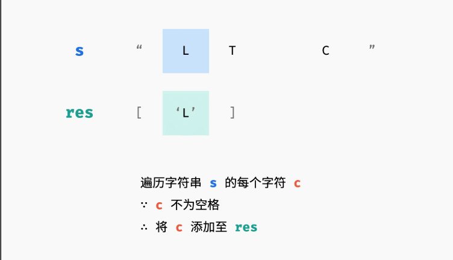

# 05.替换空格
## 题目
请实现一个函数，把字符串 s 中的每个空格替换成"%20"。
```python
输入：s = "We are happy."
输出："We%20are%20happy."
```

## 分析
* 初始化一个长度数组，长度为字符串长度的3倍
* 指针指向初始化数组的头部
* 遍历字符串，如果字符是空，就填充"%", "2", "0"，指针前进三步，如果不是空，填充字符，指针前进一步

```python
def replaceSpace(s):
    ans = ['' for _ in range(len(s)*3)]
    size = 0
    for char in s:
        if char == ' ':
            ans[size], ans[size+1], ans[size+2] = "%", "2", "0"
            size += 3
        else:
            ans[size] = char
            size += 1
    return ''.join(ans[:size])
```


```python
def replaceSpace(s):
    ans = []
    for char in s:
        ans.append(char) if char != ' ' else ans.append("%20")
    return ''.join(ans)
```
