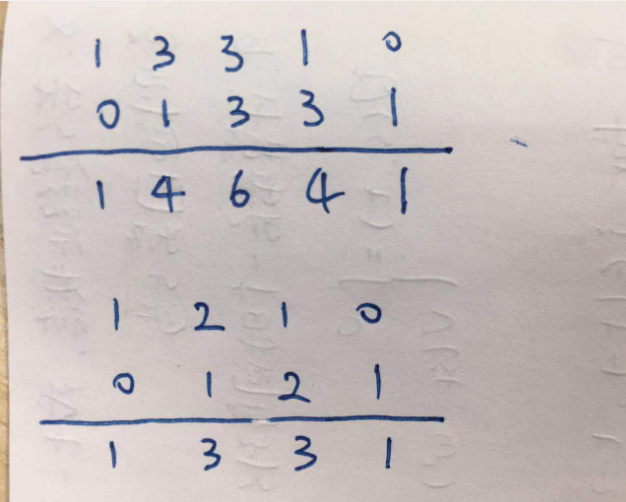

## 杨辉三角
给定一个非负整数 numRows，生成杨辉三角的前 numRows 行。
在杨辉三角中，每个数是它左上方和右上方的数的和。
示例：
```python
[
     [1],
    [1,1],
   [1,2,1],
  [1,3,3,1],
 [1,4,6,4,1]
]
```
#### 动态规划：
**通过第n-1行推算出第n行的结果。**

```python
class Solution:
    def get_n(self, n):
        if n == 1:
            return [1]
        elif n == 2:
            return [1, 1]
        else:
            list_ = self.get_n(n-1)
            res = []
            for i in range(1, len(list_)):
                res.append(list_[i]+list_[i-1])
            res = [1] + res + [1]
            return res

    def generate(self, numRows: int) -> List[List[int]]:
        res = []
        for i in range(numRows):
            res.append(self.get_n(i+1))
        return res
```
#### 错位相加：其实第n行等于第n-1行错位相加得到。


```python
class Solution:
    def generate(self, numRows: int) -> List[List[int]]:
        if numRows == 0:
            return []
        elif numRows == 1:
            return [[1]]
        elif numRows == 2:
            return [[1], [1,1]]
        else:
            last_res = self.generate(numRows-1)
            list_1 = last_res[-1] + [0]
            list_2 = [0] + last_res[-1]
            list_ = []
            for i in range(len(list_1)):
                list_.append(list_1[i] + list_2[i])
            res = last_res.copy()
            res.append(list_)
            return res
```
