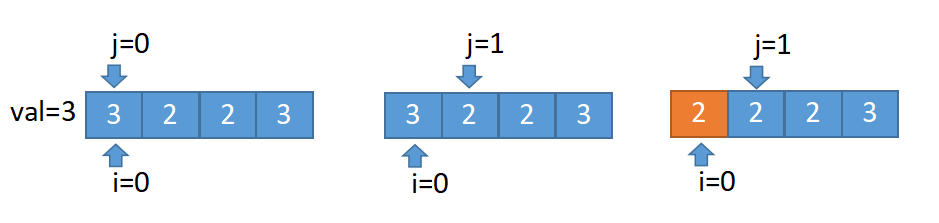
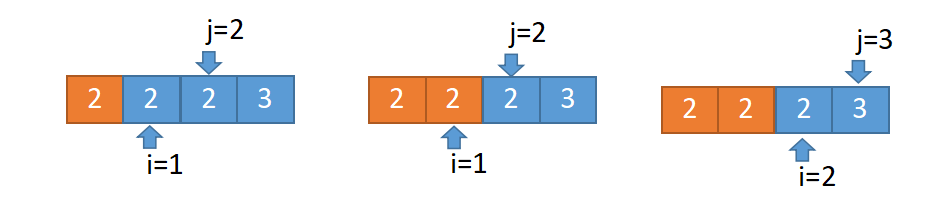

## 27.移除元素
给你一个数组 nums 和一个值 val，你需要 原地 移除所有数值等于 val 的元素，并返回移除后数组的新长度。

不要使用额外的数组空间，你必须仅使用 O(1) 额外空间并 原地 修改输入数组。

元素的顺序可以改变。你不需要考虑数组中超出新长度后面的元素。

示例：
```python
给定 nums = [0,1,2,2,3,0,4,2], val = 2,
函数应该返回新的长度 5, 并且 nums 中的前五个元素为 0, 1, 3, 0, 4。
注意这五个元素可为任意顺序。
```

#### 双指针法：
**i是慢指针，j是快指针，当nums[j]与给定的值相等时，递增j以跳过该元素。只要nums[j]!=给定值，就复制nums[j]到nums[i] 并同时递增两个索引。重复这一过程，直到j到达数组的末尾**

* 慢指针i=0,快指针j从0开始遍历数组。
* 当nums[j]等于目标值的时候，跳过。
* 当nums[j]不等于目标值的时候，nums[j]复制给nums[i],i递增。
* 时间复杂度O(n),空间复杂度O(1)




```python
def removeElement(nums, val):
    i = 0
    for j in range(0, len(nums)):
        if nums[j] == val:
            continue
        nums[i] = nums[j]
        i += 1
    return i
```
