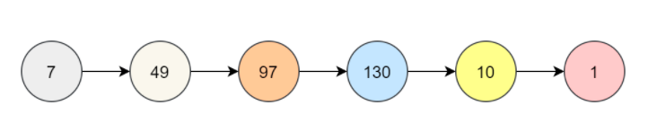
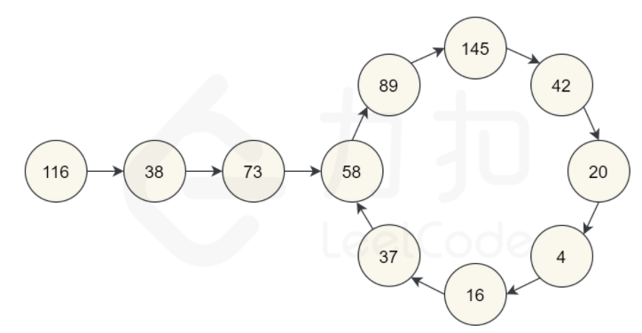

# 202.快乐数
## 题目
编写一个算法来判断一个数 n 是不是快乐数。
* 对于一个正整数，每一次将该数替换为它每个位置上的数字的平方和。
* 然后重复这个过程直到这个数变为 1，也可能是 无限循环 但始终变不到 1。
* 如果 可以变为  1，那么这个数就是快乐数。
```python
输入：19
输出：true
解释：
1 + 81 = 82
64 + 4 = 68
36 + 64 = 100
1 + 0 + 0 = 1
```

## 分析
* 可能最终会得到1
* 可能最终会无限循环
* 会不会无限增大

#### 为什么不会无限变大
* 如果是一位数，最大为9，平方和最大是81
* 如果是两位数，最大为99，平方和最大为162
* 如果是三位数，最大为999，平方和最大为243
* 如果是四位数，最大为9999，平方和最大为324

**所以对于三位数的整数，它的下一个数字（每个位置数字的平方和）不会大于243，对于四位和四位以上的整数，每次计算都会减小，最终变为三位数的整数，所以结果不会无限增大，算法可能会在243以下的所有数字上循环，然后回到它已经到过的一个循环或者回到1。**

**判断元素是否重复出现就要考虑使用哈希表。**
* 逐个计算下一个数字，并将结果保存在哈希表中
* 如果结果出现1，返回True
* 如果出现重复的结果，说明出现循环，返回False



```python
class Solution:
    def isHappy(self, n: int) -> bool:
        def get_next(n):
            sum = 0
            while n > 0:
                sum += (n % 10) ** 2
                n = n // 10
            return sum

        hash_table = dict()
        while n not in hash_table:
            if n == 1:
                return True
            hash_table[n] = None
            n = get_next(n)

        return False
```
