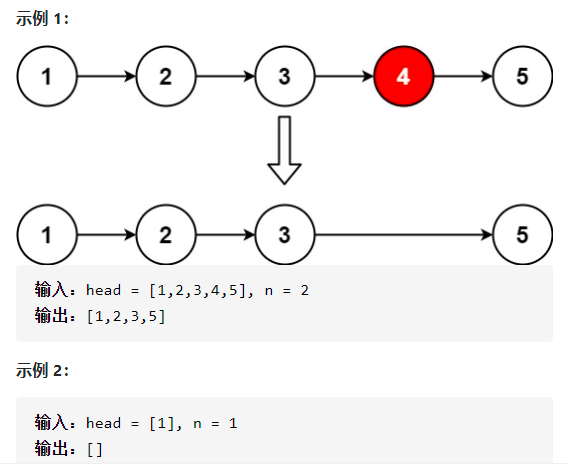
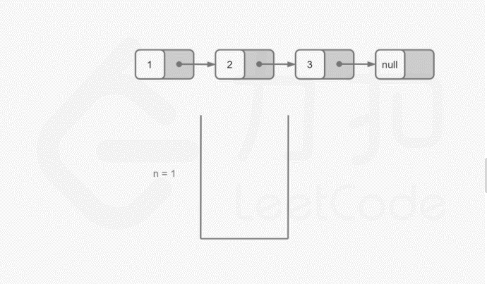
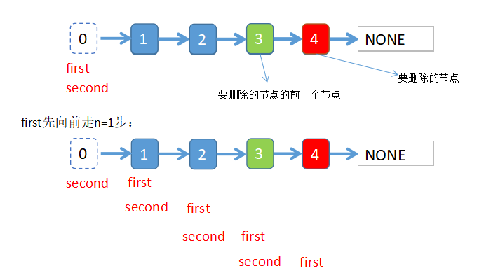

# 19.删除链表的倒数第N个结点
给你一个链表，删除链表的倒数第 n 个结点，并且返回链表的头结点。


## 代码
**要想删除倒数第n个节点，最终的目的是要找到倒数第n个节点的上一个节点。**
* 两次迭代：第一次迭代获取链表长度，第二次迭代就知道要删除节点的上个节点的位置了
* 利用栈：迭代链表，把节点入栈，然后弹栈n次，同样找到要删除节点的上个节点
* 双指针：第一个指针先走n步，然后两个指针同步前进，当第一个指针到达链表尾部的时候，第二个指针的位置就是要删除节点的上个节点


#### 方法一：两次迭代
* 第一次迭代获取链表的总长度size
* 倒数第n个节点，也就是正着数第 size-n+1个节点
* 倒数第n个节点的前一个节点就是正向第size-n个节点,找到这个节点执行删除操作

```python
def removeNthFromEnd(head, n):
    node_0 = ListNode(0)  # 虚拟头结点
    node_0.next = head
    point = node_0
    size = 0
    while point.next:
        point = point.next
        size += 1

    # 倒数第n个元素,正着数位置是size-n+1
    # 所以倒数第n个元素的前一个元素位置，正着数位置是size-n
    point = node_0
    for _ in range(size-n):
        # 找到倒数第n个元素的前一个元素
        point = point.next
    # 执行删除操作
    point.next = point.next.next
    return node_0.next
```

#### 方法二：利用栈结构先进后出的特性实现

* 遍历链表将节点入栈
* 执行弹栈操作，删除倒数第n个节点，就弹栈n次，此时栈的最后一个元素，就是要删除节点的前一个节点

```python
def removeNthFromEnd(head, n):
    stack = list()
    node_0 = ListNode(0)
    node_0.next = head
    point = node_0
    while point:
        stack.append(point)
        point = point.next

    for _ in range(n):
        stack.pop()

    stack[-1].next = stack[-1].next.next
    return node_0.next
```

#### 双指针
**利用两个指针的距离差找到倒数第n个节点的前一个节点**


```python
def removeNthFromEnd(head, n):
    node_0 = ListNode(0)
    node_0.next = head
    first = node_0
    second = node_0
    for _ in range(n):
        first = first.next

    while first.next:
        first = first.next
        second = second.next
    second.next = second.next.next
    return node_0.next
```
