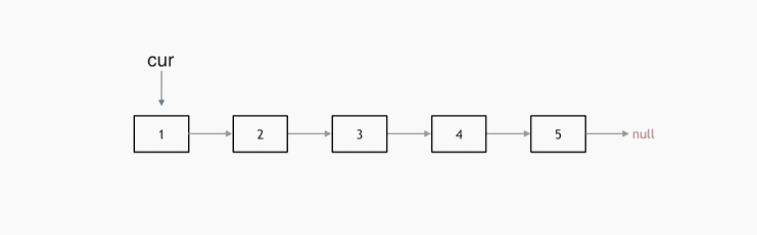

# 206.反转链表
## 题目
反转一个单链表。

```python
输入: 1->2->3->4->5->NULL
输出: 5->4->3->2->1->NULL
```

## 代码
##### 双指针

* 定义两个指针,cur指向当前节点，prev指向当前节点的前一个节点
* 临时记录当前节点的下一个节点，然后把当前节点的下一个节点指向改为当前节点的前一个节点，这样就完成了两个节点的反转
* prev,和cur向后移动

```python
def reverseList(head):
    prev = None
    cur = head
    while cur:
        tmp = cur.next
        cur.next = prev
        prev = cur
        cur = tmp
    return prev
```
