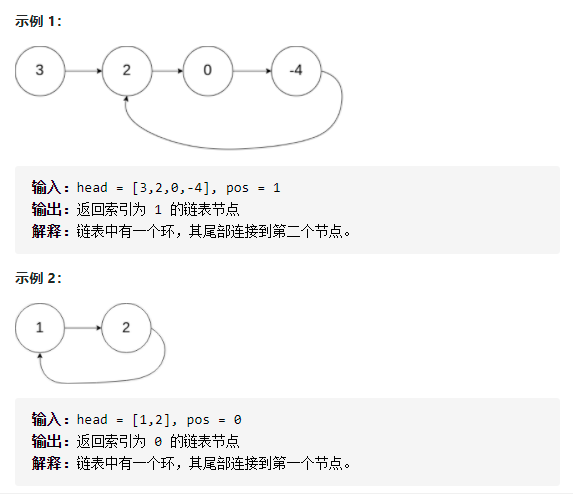
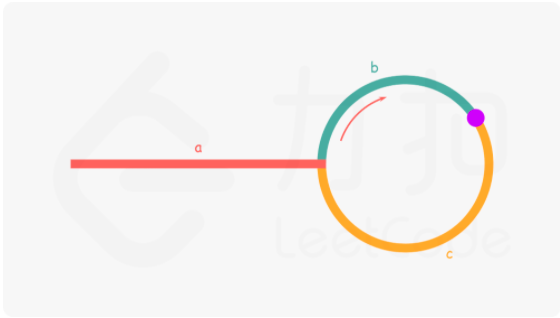

# 142.环形链表II
## 题目
给定一个链表，返回链表开始入环的第一个节点。如果链表无环，则返回null。


## 代码
#### 利用字典
**遍历链表中的每个节点，并将它记录下来；一旦遇到了此前遍历过的节点，就可以判定链表中存在环。**
```python
def detectCycle(head):
    node_dict = {}
    node_0 = ListNode(0)
    node_0.next = head
    point = node_0
    while point.next:
        if point.next in node_dict:
            return point.next
        node_dict[point.next] = ''
        point = point.next
    return None
```

#### 快慢指针

* 定义两个指针fast和slow，快指针每次前进两步，慢指针每次前进一步
* 如图，如果存在环，慢指针在进入环后又走了b的距离与快指针相遇
* 此时快指针走了多少步，a+n(b+c)+b,n为快指针在环内走的圈数
* 此时慢指针走的步数 a+b
* 由于快指针每次走的距离都是慢指针的两倍，所以相遇的时候快指针走的步数也是慢指针的两倍
* 所以 2(a+b) = a+n(b+c)+b
* 最终我们要知道环的入口，也就是a的值，a = (n-1)(b+c)+c
* 等式的意义：从相遇点到入环点的距离c + (n-1)圈环的长度 = 链表从头部到入环点的距离
* **所以当快慢指针相遇的时候，再额外使用一个指针从链表头部开始每次前进一步，最终该指针会跟慢指针在入环的节点相遇**

```python
def detectCycle(head):
    slow = head
    fast = head
    while fast and fast.next:
        fast = fast.next.next  # 快指针每次运动两步
        slow = slow.next  # 慢指针每次运动一步
        if fast == slow:
            # 相遇的时候重新定义一个指针从链表头部开始运动
            p = head
            while p:
                # 最终慢指针跟新指针会在入环节点相遇
                if p == slow:
                    return p
                p = p.next
                slow = slow.next
    return None
```
