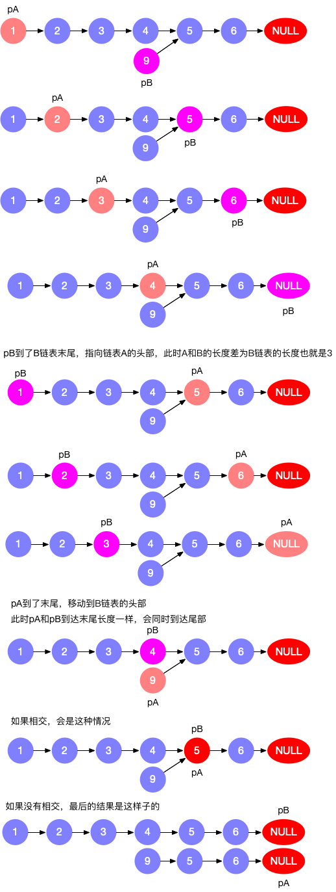

## 相交链表
编写一个程序，找到两个单链表相交的起始节点。


#### 代码
##### 迭代法
把A链表的每个节点保存在字典中，迭代B链表，如果节点存在字典中，则就是相交的起始节点。

```python
class ListNode:
    def __init__(self, val=0, next=None):
        self.val = val
        self.next = next

    def __str__(self):
        var_list = []
        var_list.append(self.val)
        while self.next:
            var_list.append(self.next.val)
            self = self.next
        return '->'.join([str(item) for item in var_list])


def getIntersectionNode(headA, headB):
    if not headA or not headB:
        return None

    node_dict = {id(headA): None}
    while headA.next:
        node_dict[id(headA.next)] = None
        headA = headA.next

    while headB:
        if id(headB) in node_dict:
            return headB
        headB = headB.next

    return None
```

##### 双指针
* 指针 pA 指向 A 链表，指针 pB 指向 B 链表，依次往后遍历
* 如果 pA 到了末尾，则 pA = headB 继续遍历
* 如果 pB 到了末尾，则 pB = headA 继续遍历
* 遍历的长度就是 A+B的长度
* 如果两个链表不相交，最后肯定是pA pB同时为None
* 如果两个链表相交，那么相交点之后的长度是相同的
* 我们需要做的事情是，让两个链表从距离末尾节点同等距离的位置开始遍历，消除链表的长度差。
* 比较长的链表指针指向较短链表head时，长度差就消除了



```python
class Solution:
    def getIntersectionNode(self, headA: ListNode, headB: ListNode) -> ListNode:
        if not headA or not headB:
            return None
        prevA = headA
        prevB = headB

        while prevA or prevB:
            if not prevA:
                prevA = headB
            if not prevB:
                prevB = headA
            if prevA == prevB:
                return prevA
            prevA = prevA.next
            prevB = prevB.next
        return None 
```
