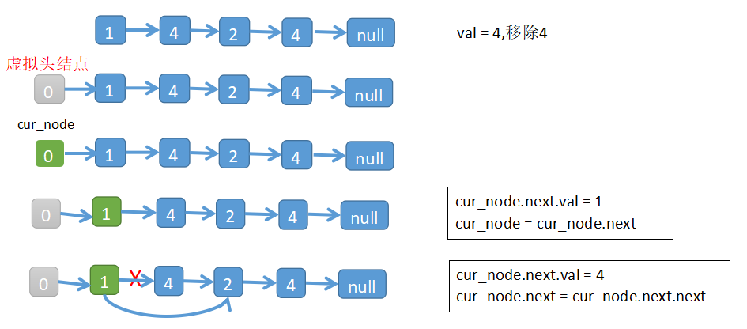
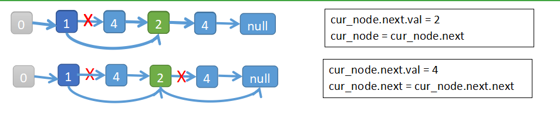

# 203.移除链表元素
删除链表中等于给定值 val 的所有节点。
#### 示例
```python
输入: 1->2->6->3->4->5->6, val = 6
输出: 1->2->3->4->5
```

#### 分析
* 添加虚拟头结点，然后从头部开始遍历链表
* 如果当前节点下一个节点值为目标值，就将当前节点的下一个节点指向下下个节点
* 如果当前节点的下一个节点不是目标值，就将下一个节点作为当前节点




```python
class ListNode:
    def __init__(self, x):
        self.val = x
        self.next = None

    def __str__(self):
        vals = [str(self.val)]
        next_node = self.next
        while next_node:
            vals.append(str(next_node.val))
            next_node = next_node.next
        return '->'.join(vals)


def removeElements(head, val):
    start = ListNode(0)  # 虚拟头结点
    cur_node = start
    cur_node.next = head
    while cur_node.next:
        if cur_node.next.val == val:
            cur_node.next = cur_node.next.next
        else:
            cur_node = cur_node.next
    return start.next
```
