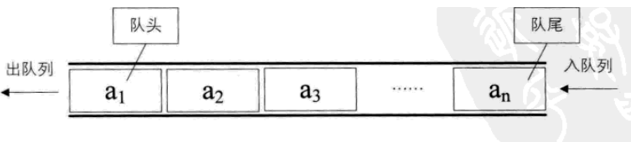
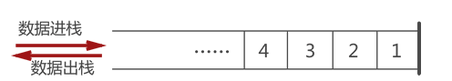

# LeetCode栈与队列
## 1.定义
#### 队列
队列是一种先进先出的线性表（FIFO：First In First Out），它只允许在表的前端进行删除操作，在表的后端进行插入操作。

#### 栈
栈是一种后进先出的线性表（LIFO：Last In First Out），它只允许在表尾部进行插入和删除操作。

## 2.题目
* [有效的括号](有效的括号.md)
* [用栈实现队列](用栈实现队列.md)
* [用队列实现栈](用队列实现栈.md)
* [删除字符串中的所有相邻重复项](删除字符串中的所有相邻重复项.md)
* [逆波兰表达式求值](逆波兰表达式求值.md)

<!--
2. [最小栈](最小栈.md)
3. [用队列实现栈](用队列实现栈.md)
4. [用栈实现队列](用栈实现队列.md)
5. [下一个更大元素1](下一个更大元素1.md)
6. [棒球比赛](棒球比赛.md)
7. [比较含退格的字符串](比较含退格的字符串.md)
8. [删除最外层的括号](删除最外层的括号.md)
9. [删除字符串中的所有相邻重复项](删除字符串中的所有相邻重复项.md)
10. [用栈操作构建数组](用栈操作构建数组.md)
11. [整理字符串](整理字符串.md)
12. [文件夹操作日志搜集器](文件夹操作日志搜集器.md)
-->
