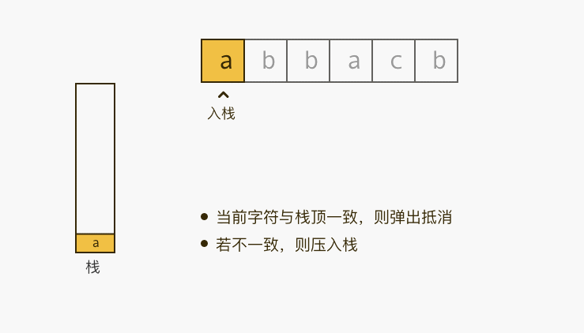

# 1047.删除字符串中的所有相邻重复项
## 题目
给出由小写字母组成的字符串 S，重复项删除操作会选择两个相邻且相同的字母，并删除它们。

在 S 上反复执行重复项删除操作，直到无法继续删除。

在完成所有重复项删除操作后返回最终的字符串。答案保证唯一。

示例：
```python
输入："abbaca"
输出："ca"
解释：
例如，在 "abbaca" 中，我们可以删除 "bb" 由于两字母相邻且相同，这是此时唯一可以执行删除操作的重复项。之后我们得到字符串 "aaca"，其中又只有 "aa" 可以执行重复项删除操作，所以最后的字符串为 "ca"。
```

## 分析


* 利用栈后进先出特性
* 遍历字符串，如果栈为空就入栈，如果栈不为空，比较栈顶元素与当前元素，如果相同就弹栈，不相同就入栈

```python
def removeDuplicates(S):
    stack = []
    for char in S:
        if not stack:
            stack.append(char)
            continue
        if stack[-1] == char:
            # 弹栈
            stack.pop()
            continue
        stack.append(char)
    return ''.join(stack)
```
