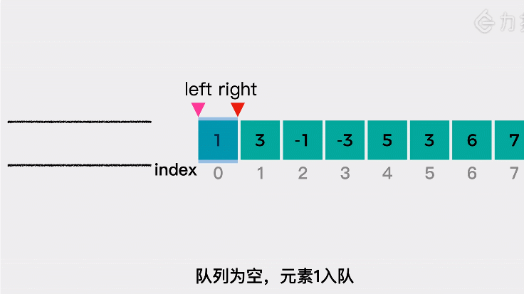
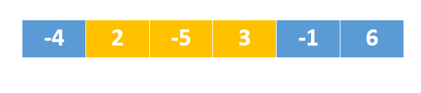

# 239.滑动窗口最大值
## 题目
给你一个整数数组 nums，有一个大小为 k 的滑动窗口从数组的最左侧移动到数组的最右侧。你只可以看到在滑动窗口内的 k 个数字。滑动窗口每次只向右移动一位。

返回滑动窗口中的最大值。

```python
输入：nums = [1,3,-1,-3,5,3,6,7], k = 3
输出：[3,3,5,5,6,7]
解释：
滑动窗口的位置                最大值
---------------               -----
[1  3  -1] -3  5  3  6  7       3
 1 [3  -1  -3] 5  3  6  7       3
 1  3 [-1  -3  5] 3  6  7       5
 1  3  -1 [-3  5  3] 6  7       5
 1  3  -1  -3 [5  3  6] 7       6
 1  3  -1  -3  5 [3  6  7]      7
```

## 分析
* 1.窗口形成阶段
* 2.滑动窗口阶段


参考链接:https://leetcode-cn.com/problems/sliding-window-maximum/solution/dong-hua-yan-shi-dan-diao-dui-lie-239hua-hc5u/

#### 窗口形成阶段
* 窗口大小为k，数组大小为n，初始状态窗口为空，遍历数组前k个元素
* 如果窗口最右端的元素(队列尾部)小于或等于当前新元素，那就将窗口最右端的元素移出窗口，直到窗口最右端元素大于当前新加入元素，或者窗口为空为止，将当前元素的索引值加入窗口（队列实际保存的是元素的索引值）

#### 滑动窗口阶段
* 遍历完前k个元素，继续遍历剩余元素
* 将窗口右端所有小于等于当前元素的元素移出，将新元素添加进窗口
* 如果窗口最左端的元素（索引值）超出了窗口的范围，将其移出窗口
* 每个时刻窗口中元素最大值都在窗口的最左端

#### 为什么要将右端小于等于新元素值的元素移出窗口


新元素3，比2和-5都大，完全可以将2和-5移出，因为后面新加入的元素都只是跟窗口中的最大值比较，这样可以降低时间复杂度

#### 窗口动态变化过程
```python
[-4, 2, -5, 1, -1, 6] , k=3
1. 窗口中的值[0(-4)],0 表示的是-4的下标值，窗口中实际保存的是下标值
2. [1(2)],因为2>-4,所以移出-4
3. [1(2), 2(-5)],此时窗口刚好形成，区域间（0,1,2）,最大值为nums[1]=2
4. [1(2), 3(1)], 因为1>-5,所以移出-5,此时窗口区域间（1,2,3），最大值为nums[1]=2
5. [1(2), 3(1), 4(-1)]，此时窗口区域间（2,3,4），此时1(2)已经不再窗口范围内了，应该移出，所以窗口应该是[3(1), 4(-1)],最大值为nums[3]=1
6. [5(6)],因为6>-1,6>1,所以移出，此时窗口区域间（3,4,5）,最大值nums[5]=6
```

```python
from collections import deque
def maxSlidingWindow(nums, k):
    deque_ = deque([])
    # 窗口形成
    for i in range(k):
        while deque_ and nums[i] >= nums[deque_[-1]]:
            deque_.pop()
        deque_.append(i)

    ans = []
    ans.append(nums[deque_[0]])

    for i in range(k, len(nums)):
        while deque_ and nums[i] >= nums[deque_[-1]]:
            deque_.pop()
        deque_.append(i)

        # 窗口区间范围 (i-k+1,k)
        while deque_[0] < i - k + 1:
            # 不在窗口区间内，移出
            deque_.popleft()

        ans.append(nums[deque_[0]])
    return ans
```
