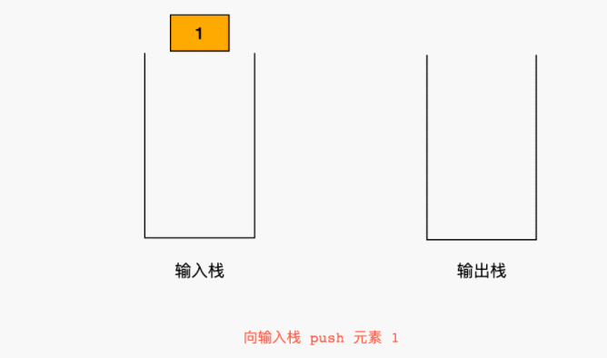

# 232.用栈实现队列
## 题目
请你仅使用两个栈实现先入先出队列。队列应当支持一般队列的支持的所有操作（push、pop、peek、empty）：

实现 MyQueue 类：

* void push(int x) 将元素 x 推到队列的末尾
* int pop() 从队列的开头移除并返回元素
* int peek() 返回队列开头的元素
* boolean empty() 如果队列为空，返回 true ；否则，返回 false


## 代码
* 用两个列表模拟栈，只能后进先出
* 队列先进先出，入队顺序1,2,3,4， 出队顺序也是1,2,3,4
* 入栈，入栈顺序 1，2,3,4，  出栈顺序4,3,2,1
* 出栈，入栈顺序，4,3,2,1，  出栈顺序1,2,3,4,
* 正好两个栈的顺序结合效果等于队列的顺序



```python
class MyQueue:

    def __init__(self):
        self.stack_in = []  # 入栈
        self.stack_out = []  # 出栈

    def push(self, x: int) -> None:
        # 往队列中添加元素
        self.stack_in.append(x)

    def pop(self) -> int:
        # 从队列中取出一个元素
        if not self.stack_out:
            self.stack_out = self.stack_in[::-1]
            self.stack_in = []
        return self.stack_out.pop()

    def peek(self) -> int:
        # 获取队列的头部
        if not self.stack_out:
            self.stack_out = self.stack_in[::-1]
            self.stack_in = []
        return self.stack_out[-1]

    def empty(self) -> bool:
        # 判断队列是否为空
        if self.stack_out or self.stack_in:
            return False
        return True
```
