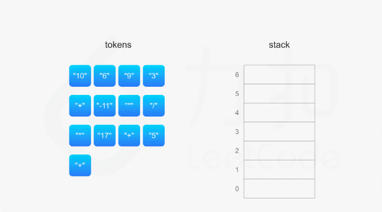

# 150.逆波兰表达式求值
## 题目
根据 逆波兰表示法，求表达式的值。

有效的算符包括 +、-、*、/ 。每个运算对象可以是整数，也可以是另一个逆波兰表达式。
* 整数除法只保留整数部分。
* 给定逆波兰表达式总是有效的。换句话说，表达式总会得出有效数值且不存在除数为 0 的情况。

```python
输入：tokens = ["2","1","+","3","*"]
输出：9
解释：该算式转化为常见的中缀算术表达式为：((2 + 1) * 3) = 9
```

#### 逆波兰表达式：
逆波兰表达式是一种后缀表达式，所谓后缀就是指算符写在后面。
* 平常使用的算式则是一种中缀表达式，如 ( 1 + 2 ) * ( 3 + 4 ) 。
* 该算式的逆波兰表达式写法为 ( ( 1 2 + ) ( 3 4 + ) * ) 。

## 分析
* 利用栈，碰到数字就入栈，碰到运算符号就从栈顶弹出两个元素进行运算，并将计算结果入栈



```python
def evalRPN(tokens):
    stack = []
    operator = {'+', '-', '*', '/'}
    for char in tokens:
        if char not in operator:
            stack.append(int(char))
            continue
        num_2 = stack.pop()
        num_1 = stack.pop()
        if char == '+':
            res = num_1 + num_2
        elif char == '-':
            res = num_1 - num_2
        elif char == '*':
            res = num_1 * num_2
        else:
            res = int(num_1 / num_2)
        stack.append(res)
    return stack[0]
```
