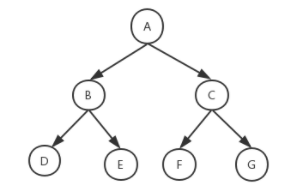
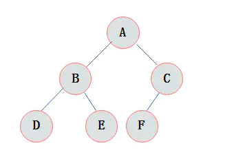
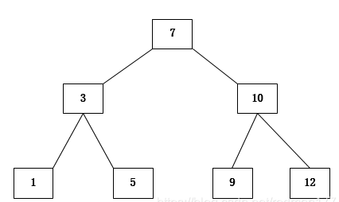
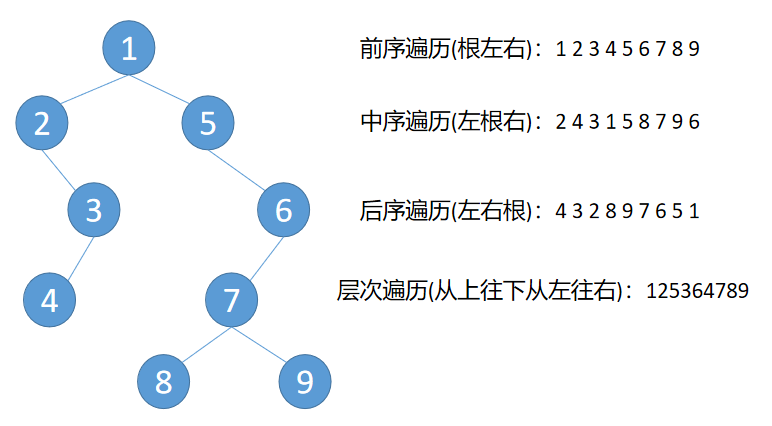

# LeetCode二叉树
## 1.定义
**二叉树是指树中节点的度不大于2的有序树。递归定义为：二叉树是一个空树，或者由一个根节点和两个互不相交的，分别称为根的左子树和右子树组成的非空树，左子树和右子树又同样是二叉树。**
* 节点：包含一个数据元素和指向子树分支的信息
* 节点的度：一个节点拥有的子树的数目
* 叶子节点：没有子树的节点（度为零的节点）
* 分支节点：度不为零的节点
* 树的度：树中所有节点的度的最大值
* 节点的层次：从根结点开始，假设根结点为第1层，根结点的子节点为第2层，依此类推
* 树的深度(高度)：树中所有节点的层次最大值

#### 满二叉树
如果一颗二叉树只有度为0的节点和度为2的节点，并且度为0的节点在同一层，这颗二叉树就是满二叉树。

#### 完全二叉树
在完全二叉树中，除了最底层的节点可能没填满外，其余每层节点数都达到最大值，并且最下面一层的节点都集中在该层最左边。
（对一颗具有n个结点的二叉树按层编号，如果编号为i(1<=i<=n)的结点与同样深度的满二叉树中编号为i的结点在二叉树中位置完全相同，则这棵二叉树称为完全二叉树。）

#### 二叉搜索树(有序树)
* 一个二叉树，如果左子树不为空，左子树上所有节点的值均小于根节点的值
* 如果右字树不为空，右子树上所有节点的值大于根节点的值
* 左右两个字树也是二叉搜索树

#### 平衡二叉搜索树
它是一棵空树或它的左右两个子树的高度差的绝对值不超过1，并且左右两个子树都是一棵平衡二叉树。

#### 二叉树的遍历
* 二叉树的遍历分为前序遍历，中序遍历，后序遍历，和层次遍历
* 前序遍历：根左右，先遍历根节点，再遍历左子树，然后遍历右子树
* 中序遍历：左根右，先遍历左子树，再遍历根节点，最后遍历右子树
* 后序遍历：左右根，先遍历左子树，再遍历右子树，最后遍历根节点
* 层次遍历：从上向下，从左向右遍历

## 2.题目
* [二叉树的前序遍历](二叉树的前序遍历.md)
* [二叉树的中序遍历](二叉树的中序遍历.md)
* [二叉树的后序遍历](二叉树的后序遍历.md)
* [二叉树的层序遍历](二叉树的层序遍历.md)
* [反转二叉树](反转二叉树.md)

1. [相同的树](相同的树.md)

2. [对称二叉树](对称二叉树.md)
3. [二叉树的最大深度](二叉树的最大深度.md)
4. [二叉树的层次遍历 II](二叉树的层次遍历II.md)
5. [将有序数组转换为二叉搜索树](将有序数组转换为二叉搜索树.md)
6. [平衡二叉树](平衡二叉树.md)
7. [二叉树的最小深度](二叉树的最小深度.md)
