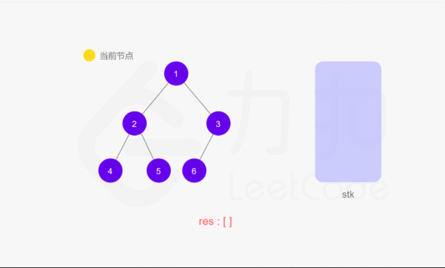

# 94.二叉树的中序遍历
## 题目
给定一个二叉树的根节点 root ，返回它的 中序 遍历。

## 分析
#### 递归
中序遍历是按照 左子树-根节点-右子树的方式遍历 ，在访问左子树或右子树的时候，也是同样的方式遍历

```python
class TreeNode:
    def __init__(self, val=0, left=None, right=None):
        self.val = val
        self.left = left
        self.right = right


def inorderTraversal(root):
    def inorder(root):
        if not root:
            return
        inorder(root.left)
        ans.append(root.val)
        inorder(root.right)

    ans = list()
    inorder(root)
    return ans

if __name__ == '__main__':
    root = TreeNode(1)
    node_1 = TreeNode(2)
    node_2 = TreeNode(3)
    root.left = node_1
    root.right = node_2

    res = inorderTraversal(root)
    print(res)
```

#### 迭代


```python
def inorderTraversal(root):
    ans = list()
    if not root:
        return ans

    stack = []
    node = root
    while stack or node:
        while node:
            stack.append(node)
            node = node.left
        node = stack.pop()
        ans.append(node.val)
        node = node.right
    return ans
```
