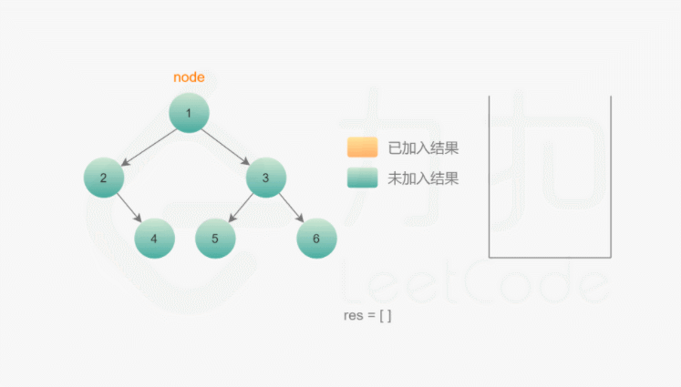

# 144.二叉树的前序遍历
## 题目
给你二叉树的根节点 root ，返回它节点值的 前序 遍历。

## 分析
#### 递归
前序遍历是按照 根节点-左子树-右子树的方式遍历 ，在访问左子树或右子树的时候，也是同样的方式遍历

```python
class TreeNode:
    def __init__(self, val=0, left=None, right=None):
        self.val = val
        self.left = left
        self.right = right


def preorderTraversal(root):
    def preorder(root):
        if not root:
            return
        ans.append(root.val)
        preorder(root.left)
        preorder(root.right)

    ans = list()
    preorder(root)
    return ans
```

#### 迭代
* 利用栈，每遍历到非空节点，就记录节点的值(根)就入栈，然后继续遍历该节点的左节点(左)
* 如果左节点为空，说明节点的做节点遍历完毕，结束循环，弹栈，开始遍历右节点，重复第一步



```python
class TreeNode:
    def __init__(self, val=0, left=None, right=None):
        self.val = val
        self.left = left
        self.right = right


def preorderTraversal(root):
    ans = list()
    if not root:
        return ans

    stack = []
    node = root
    while stack or node:
        while node:
            ans.append(node.val)
            stack.append(node)
            node = node.left
        node = stack.pop()
        node = node.right
    return ans
```
