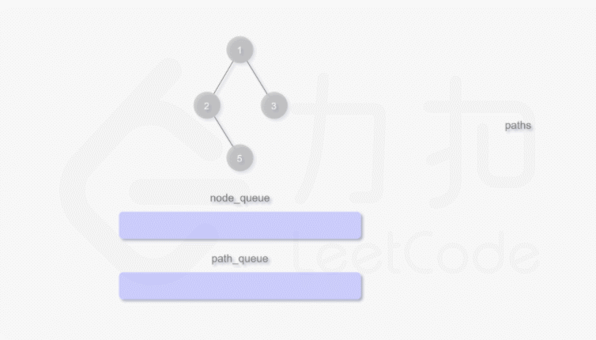

# 257.二叉树的所有路径
## 题目  
给定一个二叉树，返回所有从根节点到叶子节点的路径。

说明: 叶子节点是指没有子节点的节点。

```python
输入:

   1
 /   \
2     3
 \
  5

输出: ["1->2->5", "1->3"]

解释: 所有根节点到叶子节点的路径为: 1->2->5, 1->3
```

## 分析
#### 迭代

* 定义两个队列，一个队列存储节点，一个队列存储根到该节点的路径
* 遍历每一个节点的同时，也在记录路径，直到叶子节点，将路径添加到返回列表中



```python
from queue import Queue
def binaryTreePaths(root):
    if not root:
        return []
    node_queue = Queue()
    path_queue = Queue()
    node_queue.put(root)
    path_queue.put(str(root.val))

    ans = []
    while node_queue.qsize():
        node = node_queue.get()
        path = path_queue.get()
        if node.left:
            node_queue.put(node.left)
            path_queue.put(path + '->' + str(node.left.val))
        if node.right:
            node_queue.put(node.right)
            path_queue.put(path + '->' + str(node.right.val))
        if node.left is None and node.right is None:
           ans.append(path)
    return ans
```

#### 递归
```python
def binaryTreePaths(root):
    def construct_paths(root, path):
        if root:
            path += str(root.val)
            if root.left is None and root.right is None:
                ans.append(path)
            else:
                path += '->'
                construct_paths(root.left, path)
                construct_paths(root.right, path)

    ans = []
    construct_paths(root, '')
    return ans
```
