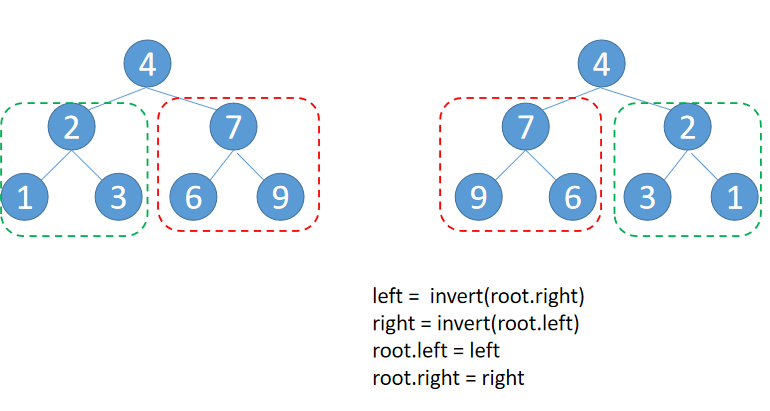
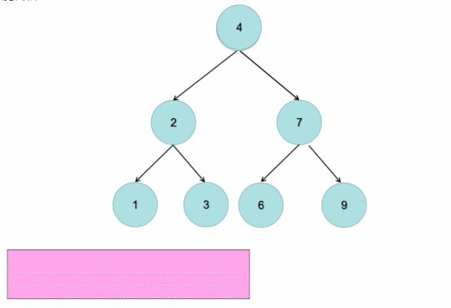

# 226.反转二叉树
## 题目
翻转一棵二叉树。
```python
输入
     4
   /   \
  2     7
 / \   / \
1   3 6   9

输出
     4
   /   \
  7     2
 / \   / \
9   6 3   1
```

## 分析
#### 递归
* 新树的左子树，是旧树的右子树的反转树
* 新树的右子树，是旧树的左子树的反转树


```python
def invertTree(root):
    if not root:
        return root
    left = invertTree(root.right)
    right = invertTree(root.left)
    root.left = left
    root.right = right
    return root
```

#### 迭代
* 遍历所有节点，交换每个节点的左右节点的位置



```python
def invertTree(root):
    if not root:
        return root
    q_ = [root]
    while q_:
        node = q_.pop()
        left = node.left
        right = node.right
        # 左右两个子节点交换
        node.left = right
        node.right = left
        if node.left:
            q_.append(node.left)
        if node.right:
            q_.append(node.right)
    return root
```
