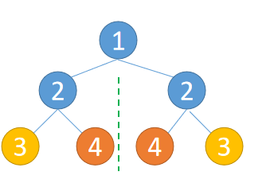

# 101.对称二叉树
## 题目
给定一个二叉树，检查它是否是镜像对称的。

#### 示例
```python
# 例如，二叉树 [1,2,2,3,4,4,3] 是对称的。

      1
     / \
    2   2
   / \ / \
  3  4 4  3

# 但是下面这个 [1,2,2,null,3,null,3] 则不是镜像对称的:
    1
    / \
   2   2
    \   \
    3    3
```

## 分析
#### 递归
* 如果一个树镜像对称，则左子树和右子树互为镜像
* 只需要判断左子树和右子树是不是互为镜像



```python
def isSymmetric(root):
    def check(node_1, node_2):
        if node_1 is None and node_2 is None:
            # 两个节点都是None
            return True
        if not node_1 or not node_2:
            # 一个为None，一个不为None
            return False
        if node_1.val != node_2.val:
            return False
        return check(node_1.left, node_2.right) and check(node_1.right, node_2.left)

    res = check(root.left, root.right)
    return res
```

#### 迭代
* 两个队列分别存储根节点的左子节点与右子节点
* 分别从两个队列中取出一个节点，进行比较
* 如果两个节点一个为None，一个不为None，则说明不对称，直接返回False
* 如果两个节点都不为None，比较节点值，如果值不相等，则说明不对称，直接返回False
* 如果值相等，按照顺序，添加节点的子节点到队列中，等待下一轮比较

```python
from queue import Queue
def isSymmetric(root):
    left = root.left
    right = root.right
    queue_1 = Queue()
    queue_2 = Queue()
    queue_1.put(left)
    queue_2.put(right)

    while queue_1.qsize() and queue_2.qsize():
        node_1 = queue_1.get()
        node_2 = queue_2.get()
        if node_1 is None and node_2 is None:
            continue
        if not node_1 or not node_2:
            return False
        if node_1.val != node_2.val:
            return False
        queue_1.put(node_1.left)
        queue_2.put(node_2.right)

        queue_1.put(node_1.right)
        queue_2.put(node_2.left)

    if queue_1.qsize() or queue_2.qsize():
        # 两个队列必须同时为空才说明对称
        return False
    return True
```
