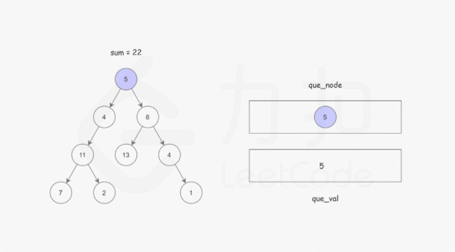

# 112.路径总和
## 题目
给你二叉树的根节点 root 和一个表示目标和的整数 targetSum ，判断该树中是否存在 根节点到叶子节点 的路径，这条路径上所有节点值相加等于目标和 targetSum 。


```python
输入：root = [5,4,8,11,null,13,4,7,2,null,null,null,1], targetSum = 22
输出：true
```

## 分析
#### 迭代
与[二叉树的所有路径](二叉树的所有路径.md)思路相似，用两个队列，分别存节点，以及到该节点的总和

```python
from queue import Queue
def hasPathSum(root, targetSum):
    if not root:
        return False

    node_queue = Queue()
    sum_queue = Queue()
    node_queue.put(root)
    sum_queue.put(root.val)

    while node_queue.qsize():
        node = node_queue.get()
        sum_ = sum_queue.get()
        if node.left is None and node.right is None:
            if sum_ == targetSum:
                return True
            else:
                continue
        if node.left:
            node_queue.put(node.left)
            sum_queue.put(sum_ + node.left.val)
        if node.right:
            node_queue.put(node.right)
            sum_queue.put(sum_ + node.right.val)
    return False
```

#### 递归
假定从根节点到当前节点的值之和为val，可以将这个大问题转化为一个小问题：是否存在从当前节点的子节点到叶子的路径，满足其路径和为 sum - val。
```python
def hasPathSum(root, targetSum):
    if not root:
        return False

    if root.left is None and root.right is None:
        return root.val == targetSum

    return hasPathSum(root.left, targetSum-root.val) or hasPathSum(root.right, targetSum-root.val)

```
