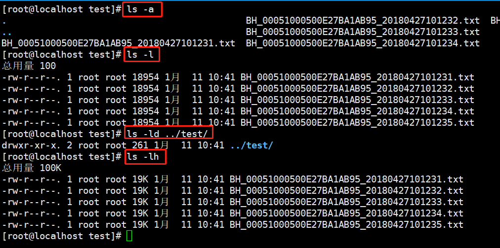
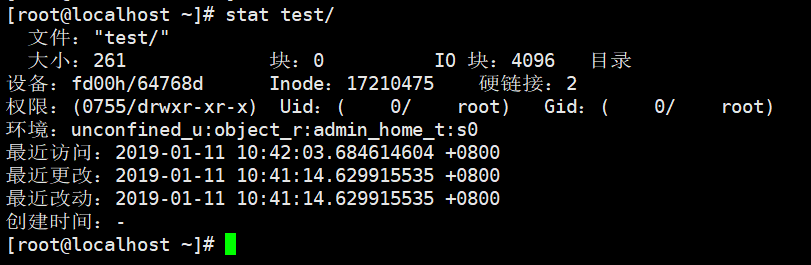
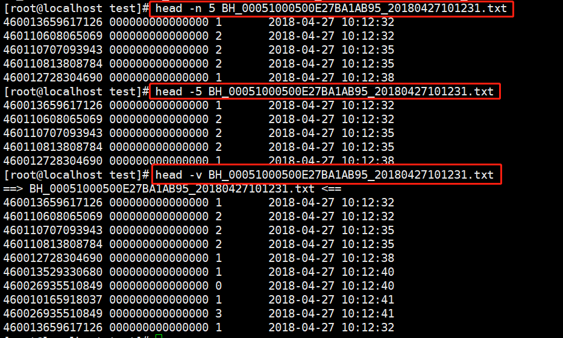
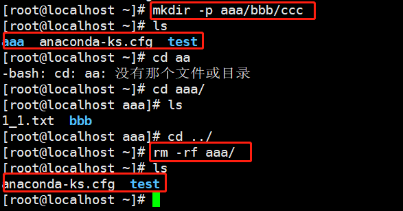
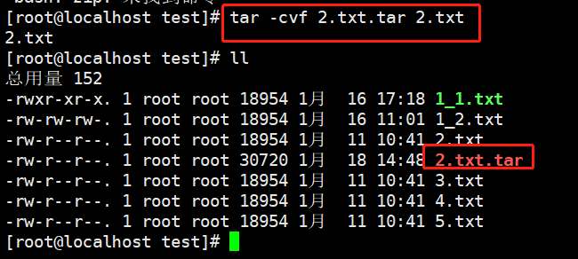

## Linux命令
<a href="#jump1" target="_self">1、ls(查看)</a> 
<a href="#jump2" target="_self">2、cd（切换目录）</a> 
<a href="#jump3" target="_self">3、mkdir（创建目录）</a> 
<a href="#jump4" target="_self">4、stat（查看文件/文件夹状态）</a> 
<a href="#jump5" target="_self">5、cat（査看文件内容）</a> 
<a href="#jump6" target="_self">6、more（查看大文件内容）</a> 
<a href="#jump7" target="_self">7、head(显示文件开头的命令)</a> 
<a href="#jump8" target="_self">8、tail(显示文件结尾的命令)</a> 
<a href="#jump9" target="_self">9、rm(删除文件或目录)</a> 
<a href="#jump10" target="_self">10、cp(复制文件)</a> 
<a href="#jump11" target="_self">11、mv(移动文件)</a> 
<a href="#jump12" target="_self">12、whereis(搜索命令)</a> 
<a href="#jump13" target="_self">13、locate(按照文件名搜索普通文件)</a> 
<a href="#jump14" target="_self">14、tar(打包与解打包)</a> 
<a href="#jump15" target="_self">15、sync(刷新文件系统缓冲区)</a> 

## 1、ls（list查看）
**ls [选项][文件名/目录名]**
#### [选项]
* -a：显示所有文件
* -l：显示目录下文件的详细信息（权限、所有者、大小、时间等）
* -d：显示目录信息，而不是目录下的文件
* -h：人性化显示，按照我们习惯的单位显示文件大小
#### 命令
* ls -a : 显示所有文件(包含隐藏文件)
* ls -l : 显示目录下文件的详细信息
* ls -ld : 显示某个文件夹的详细信息
* ls -lh : 人性化的方式显示文件详细信息

## 2、cd（切换目录）
#### 命令
* cd /usr/local : 切换到指定文件夹
* cd ~ : 切换到用户的家目录(root)
* cd - : 切换到上一次所在的目录
* cd ../: 切换到上级目录

## 3、mkdir（创建目录）
#### 命令
* mkdir dirname : 创建单个文件目录
* mkdir -p /dir1/dir2/dir3 : 递归创建文件夹

## 4、stat（查看文件/文件夹状态）

## 5、cat（査看文件内容） 
**cat [选项] 文件名**
#### 选项
* -n：显示行数
* -A：显示所有隐藏字符，回车符 ($)、Tab 键 (^I)等

## 6、more（查看大文件内容）
**more是分屏显示文件的命令**
#### 命令
* 空格键：向下翻页
* b：向上翻页
* 回车：向下滚动一行
* / 字符串：搜索指定的字符串
* q：退出

## 7、head(显示文件开头的命令)
* head -n 20 filename:指定显示行数

## 8、tail(显示文件结尾的命令)
* tail -f filename: 监听文件新增的内容

## 9、rm(删除文件或目录)
**rm [选项] 文件或目录**
#### 选项
* -f: 强制删除(force)
* -r: 递归删除，可以删除目录
#### 命令
* rm -rf 目录 ： 强制递归删除(不会提示，直接默认删除)

## 10、cp(复制文件)
**命令： cp 源文件 目标文件**
## 11、mv(移动文件)
**命令： mv 源文件 目标文件** 
**命令： mv 1.txt 2.txt 如果源文件和目标文件在同一个目录下，就相当于改名字**
## 12、whereis(搜索命令)
**whereis 命令不能搜索普通文件，而只能搜索系统命令**
## 13、locate(按照文件名搜索普通文件)
**centOS7以上的系统中使用“locate”文件查找命令,需要先安装locate命令**
* yum install mlocate
* updatedb
* locate inittab

## 14、tar(打包与解打包)
**打包： tar -cvf 压缩包名 源文件**
* -c：打包
* -v：显示打包文件过程
* -f：指定压缩包的文件名

**解打包(.tar)：tar xvf 压缩包**
* -x：解打包
* -v：显示打包文件过程
* -f：指定压缩包的文件名

**解打包(.gz)：tar zxvf 压缩包**

## 15、sync(刷新文件系统缓冲区)
计算机上保存数据其实是先在内存中保存一定时间，再写入硬盘。这其实是一种缓存机制，当在内存中保存的数据需要被读取的时候，从内存中读取要比从硬盘中读取快得多。

不过，如果数据还没有来得及保存到硬盘中，就发生了突然岩机（比如断电）的情况，数据就会丟失。

sync 命令的作用就是把内存中的数据强制向硬盘中保存。这个命令在常规关机的命令中其实会自动执行，但如果不放心，则应该在关机或重启之前手工执行几次，避免数据丟失。
