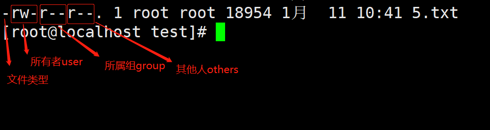

# Linux文件权限
## 1.Linux文件属性


通过ls -l查看文件的详细信息:<br>
##### 第一列：代表文件的类型与权限
```python
[-][rwx][r-x][r--]
# 第一位[-]代表文件类型，"-":表示文件；"d":表示目录；"l":表示链接文件。
# 第二~四位[rwx]表示文件所有者user权限，-r读权限，-w写权限，-x执行权限
# 第五~七位[r-x]表示文件所属组group权限
# 第八~十位[r--]表示文件其他人others的权限
```
##### 第二列：表示有多少文件名链接到此节点(i-node)
每个文件都会将他的权限与属性记录到文件系统的i-node中，不过，我们使用的目录树却是使用文件名来记录， 因此每个文件名就会链接到一个i-node！这个属性记录的，就是有多少不同的文件名链接到相同的一个i-node号码。
##### 第三列：表示文件/目录的所有者
##### 第四列：表示这个文件所属的群组
##### 第五列：表示文件大小
##### 第六列：表示文件创建或修改日期
##### 第七列：表示文件名(.开头的为隐藏文件 ls -a查看)
## 2.改变文件属性与权限
* chgrp:改变文件所属群组，change group
* chown:改变文件拥有者，change owner
* chmod：改变文件权限

##### chgrp
```python
[root@study ~]# chgrp [-R] groups dirname/filename ...
选项与参数：
-R : 进行递回（recursive）的持续变更，亦即连同次目录下的所有文件、目录
都更新成为这个群组之意。常常用在变更某一目录内所有的文件之情况。
范例：
[root@study ~]# chgrp users initial-setup-ks.cfg
```
##### chown
```python
[root@study ~]# chown [-R] 帐号名称 文件或目录
[root@study ~]# chown [-R] 帐号名称:群组名称 文件或目录
[root@study ~]# chown root:root initial-setup-ks.cfg
[root@study ~]# ls -l
-rw-r--r--. 1 root root 1864 May 4 18:01 initial-setup-ks.cfg
```
##### chmod
通过数字类型修改权限：
```python
r:4  w:2  x:1
chmod 755 1_1.txt  
# 第一个数字"7"：代表所有者的权限是"4+2+1"，也就是读、写和执行权限。
# 第二个数字"5"：代表所属群组的权限是"4+1"，也就是读和执行权限。
# 第三个数字"5"：代表其他人的权限是"4+1"，也就是读和执行权
```

通过符号类型修改权限：
```python
u:user  g:group  o:others
# chmod u+x 1_1.txt
# chmod g+w,o+w 1_1.txt
# chmod u=rwx 1_1.txt
```

## 3.目录与文件的权限意义
##### 权限对于文件的意义
* r: read,读取文件内容
* w: write, 编辑修改文件内容，只针对文件内容，不能删除文件本身。
* x: execute,该文件具有可被系统执行的权限。

##### 权限对于目录的意义
文件是存放实际数据的，目录主要是记录文件名清单，如果是针对目录：
* r: 表示具有读取目录结构清单的权限，可以利用ls读取该目录下的文件列表。
* w: 表示具有修改该目录结构清单的权限，也就是可以再该目录下，创建新文件，修改文件名，或者是删除文件。
* x: 表示使用者能否进入（cd）该目录成为工作目录。

## 4.linux目录配置
##### FHS-Linux目录配置的依据
...
##### 目录树
...
