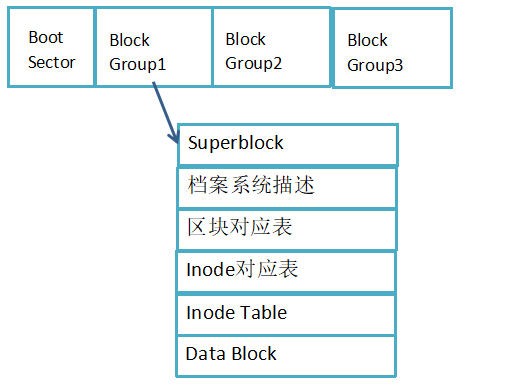

## 1.索引式文件系统
操作系统的文件数据，除了包含文件的实际内容之外，还包含一些文件的属性，如文件的权限、拥有者、时间等。Linux文件系统通常将
这两部分数据存放在不同的区块，权限和属性存放在inode中，实际数据存放在data block中，另外还有一个superblock会记录整个文件系统的整体信息。
* superblock：记录此文件系统的整体信息，包括inode/block的总量、使用量、剩余量，以及文件系统的格式与相关信息。
* inode：记录文件的属性，一个文件占用一个inode，同时记录此文件数据所在的block号码。
* block：记录文件的数据内容，文件太大时，会占用多个block。

每个inode与block都有编号，每个文件占用一个inode，inode中记录有文件数据放置的block号码，所以，如果找到inode，就能够
找到block，进而获取到该文件的实际数据内容。

如图，假设文件的inode序号是4，记录的文件block号码分别是2,7,13,15，此时操
作系统就能够据此来排列磁盘的读取顺序，可以一口气将四个block内容读出来。


## 2.Liunx的Ext2文件系统
标准的Linux文件系统Ext2就是使用inode为基础的文件系统。second extended filesystem，第二代扩展文件系统。

文件系统的inode与block一开始就规划好了，除非重新格式化。如果文件系统比较大，inode与block的数量比较庞大，如果放置在一起不易管理。

所以Ext2文件系统在格式化的时候是区分为多个区块群组（block group），每个区块群组都有独立的superblock，inode，block。



### data block(数据区块)
data block是存放文件数据的地方，block的大小有1k，2k，4k三种，在格式化的时候block大小与号码都已经固定，以方便inode的记录。
* block的大小与数量在格式化完就不能再改变
* 每个block内只能存放一个文件的数据
* 如果文件大于block的大小，则一个文件占用多个block
* 如果文件大小小于block，则该block的剩余容量不能够在使用（磁盘空间被浪费）

### Inode Table
inode的大小和数量也是在格式化的时候就已经固定，
* 每个inode大小固定128bytes（ext4可设置256bytes）
* 每个文件只会占用一个inode
* 文件系统能创建的文件个数与inode的数量有关
* 系统读取文件时需要先找到inode，分析inode所记录的权限与所有者是否符合，若符合才会读取block内容

inode中记录的有：
1. 文件的权限（rwx）
2. 文件的拥有者、群组
3. 文件的容量
4. 文件的创建或状态改变时间（ctime）
5. 文件的读取时间（atime）
6. 文件的修改时间（mtime）
7. 文件真正内容的指向等。

**一个inode只有128bytes，记录一个block需要4bytes，那一个inode如何记录大文件所有的block号码？**

文件系统将inode记录block号码的区域定义为12个直接，一个间接，一个双间接，一个三间接。
直接指向就是inode记录的block号码直接可以获取文件的数据内容。
间接指向就是再拿一个block来记录block号码的记录。inode指向bolck，该block中记录的block号码指向的才是实际文件数据。
以此类推，双间接，三间接是同样道理。

### superblock
superblock是非常重要的，因为文件系统的基本信息都在这里记录。
* 记录block与inode的总量
* 未使用与已使用的inode/block数量
* block与inode的大小
* filesystem的挂载时间、最近一次写入数据的时间等文件系统的相关信息
* 一个valid bit数值，已挂载为0，未挂载为1

### 文件系统描述
描述每个block group的开始与结束的block号码。

### 区块对应表
新增文件的时候，需要用到block，通过区块对应表就知道那个block是空的，系统可以通过区块对应表，快速找到可使用的空间来处置文件。

### inode对照表
与区块对应表一样，inode对照表记录的是已使用与未使用的inode号码

#### 目录
在linux下创建一个目录的时候，系统会分配一个inode与至少一个block给该目录，inode记录该文件夹的相关权限与属性，以及分配到的block号码；
block记录的则是在这个目录下的文件名与该文件名占用的inode号码。

#### 创建文件
1. 先确定使用者对新增的文件的目录是否具有w和x的权限，有的话才可以新增
2. 根据inode对照表找到没有使用的inode号码，将新文件的权限和属性写入
3. 根据block对照表找到没有使用的block号码，将实际数据写入到block中，并且更新inode中的block指向。
4. 更新inode对照表与block对照表，更新superblock的内容。

#### 挂载
每个 filesystem 都有独立的 inode / block / superblock 等信息，这个文件系统要能够链接到目
录树才能被我们使用。 将文件系统与目录树结合的动作称为“挂载”。挂载点一定是目录，该目录为进入该文件系统的入口。

## 3.文件系统的简单操作
* df:列出文件系统的整体磁盘使用量
* du：评估文件系统的磁盘使用量

#### df -h 将容量结果以易读的容量格式显示出来
```python
Filesystem      Size  Used Avail Use% Mounted on
/dev/vda1        40G  4.0G   34G  11% /
devtmpfs        486M     0  486M   0% /dev
tmpfs           496M     0  496M   0% /dev/shm

# Filesystem:代表该文件系统是在哪个 partition ，所以列出设备名称
# Mounted on:磁盘挂载的目录，挂载点。
```

#### df -ih 将目前各个 partition 当中可用的 inode 数量列出
```python
[root@iZ8vb6ughzbdqkfd58dowoZ ~]# df -ih
Filesystem     Inodes IUsed IFree IUse% Mounted on
/dev/vda1        2.5M  101K  2.5M    4% /
devtmpfs         122K   324  122K    1% /dev
tmpfs            124K     1  124K    1% /dev/shm
tmpfs            124K   387  124K    1% /run
tmpfs            124K    16  124K    1% /sys/fs/cgroup
tmpfs            124K     1  124K    1% /run/user/0
```

#### du:列出当前目录下所有文件的大小
直接输入du不加任何参数， du会分析“目前所在目录”的文件与目录所占用的磁盘空间，
但实际显示仅包含目录容量，不包含文件的大小。
* du -a: 将文件的容量也列出来
* du -h:以人们较易读的容量格式 （G/M） 显示
* du -s:列出总量而已，而不列出每个各别的目录占用容量
* du -S:不包括子目录下的总计，与 -s 有点差别

```python
[root@iZ8vb6ughzbdqkfd58dowoZ test]# ll
total 28
drwxr-xr-x 2 root root  4096 Oct 26 09:47 log
-rw------- 1 root root 12980 Oct 26 13:51 nohup.out
-rw-r--r-- 1 root root  1984 Oct 26 10:02 test.py
-rw-r--r-- 1 root root  1984 Feb 12 18:20 test.py.bak
[root@iZ8vb6ughzbdqkfd58dowoZ test]# du
20	./log
48	.
[root@iZ8vb6ughzbdqkfd58dowoZ test]# du -a
4	./test.py.bak
4	./test.py
16	./nohup.out
16	./log/test
20	./log
48	.
[root@iZ8vb6ughzbdqkfd58dowoZ test]# du -h
20K	./log
48K	.
[root@iZ8vb6ughzbdqkfd58dowoZ test]# du -ah
4.0K	./test.py.bak
4.0K	./test.py
16K	./nohup.out
16K	./log/test
20K	./log
48K	.
```

## 4.实体链接与符号链接
### hard link(实体链接、硬链接)
**目录下记录的是每个文件的文件名，以及文件对应的inode号码，多个文件名对应同一个inode时候，就是hard link。**

* hard link生成的文件inode与源文件的inode相同。
* hard link不能跨filesystem
* hard link不能link目录
* 安全，删除任意一个链接，只要文件的inode引用不为0，文件就还存在

```python
[root@iZ8vb6ughzbdqkfd58dowoZ test]# ln /etc/crontab
[root@iZ8vb6ughzbdqkfd58dowoZ test]# ll
total 4
-rw-r--r--. 2 root root 451 Jun 10  2014 crontab
[root@iZ8vb6ughzbdqkfd58dowoZ test]# ll -i /etc/crontab /root/test/crontab
394377 -rw-r--r--. 2 root root 451 Jun 10  2014 /etc/crontab
394377 -rw-r--r--. 2 root root 451 Jun 10  2014 /root/test/crontab
```

### symbolic link（符号链接）
符号链接类似windows的快捷方式，符号链接记录的是源文件的绝对路径，当访问符号链接时候，其实访问的是源文件。如果源文件不存在，符号链接就会报错。

* 符号链接文件有自己的inode与block
* 符号链接文件的block记录的是源文件的真实路径

```python
[root@iZ8vb6ughzbdqkfd58dowoZ test]# ln -s /etc/crontab /root/test/crontab2
[root@iZ8vb6ughzbdqkfd58dowoZ test]# ll -i /etc/crontab /root/test/crontab2
 394377 -rw-r--r--. 2 root root 451 Jun 10  2014 /etc/crontab
1184788 lrwxrwxrwx  1 root root  12 Feb 16 21:32 /root/test/crontab2 -> /etc/crontab
```
