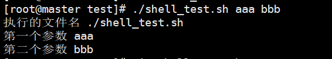

# shell语法
## 一、变量
**变量名和等号之间不可以有空格**

    name="aaa"
    # 删除变量
    unset name

## 二、shell字符串

    youname="bbb"
    greet="hello ${youname}"
    echo $greet
    # 获取字符串长度
    echo ${#youname}
    # 截取字符串
    echo ${youname:1:4}
## 三、数组

    arr=(2 3 3 4 5)
    # 读取元素
    echo ${arr[0]}
    # 获取数组长度
    echo ${#arr[*]}
## 四、参数传递
**$n,n 代表一个数字，1 为执行脚本的第一个参数，2 为执行脚本的第二个参数，以此类推.**
* $# : 参数个数
* $* : 显示所有参数

        echo "执行的文件名 $0"
        echo "第一个参数 $1"
        echo "第二个参数 $2"
        echo "参数个数 $#"
        echo "所有参数 $*"

        for arg in  "$*";do
            echo $arg
        done

## 五、基本运算符
#### 算数运算符
* 原生bash不支持简单的数学运算，但是可以通过expr命令来实现。
* 注意使用的是反引号 ，而不是单引号。
* 表达式和运算符之间要有空格，例如 2+2 是不对的，必须写成 2 + 2

        a=2
        b=3
        var=`expr $a + $b`
        echo "2+3 = $var"

        var=`expr $a \* $b`
        echo "2*3 = $var"

#### 关系运算符
* 关系运算符只支持数字，不支持字符串，除非字符串的值是数字。
* -eq : 检测两个数是否相等，相等返回 true。
* -ne : 检测两个数是否不相等，不相等返回 true。
* -gt : 检测左边的数是否大于右边的，如果是，则返回 true。
* -lt : 检测左边的数是否小于右边的，如果是，则返回 true。
* -ge : 检测左边的数是否大于等于右边的，如果是，则返回 true。
* -le : 检测左边的数是否小于等于右边的，如果是，则返回 true。

        a=2
        b=3
        if [ $a -eq $b ]
        then
            echo "$a 等于 $b"
        else
            echo "$a 不等于 $b"
        fi

#### 逻辑运算符
* && ： AND
* || ： OR
#### 字符串运算符
* = ： 检测两个字符串是否相等，相等返回 true。
* != ： 检测两个字符串是否相等，不相等返回 true。
* -z ： 检测字符串长度是否为0。
* $ ： 检测字符串是否为空，不为空返回 true。
## 六、流程控制
#### if

    a=2
    b=3
    if [ $a -eq $b ]
    then
        echo "$a 等于 $b"
    else
        echo "$a 不等于 $b"
    fi
#### for

    for var in 1 2 3 4
    do
        echo $var
    done
#### while

    i=1
    while(($i<=5))
    do
     echo $i
     let "i++"
    done
