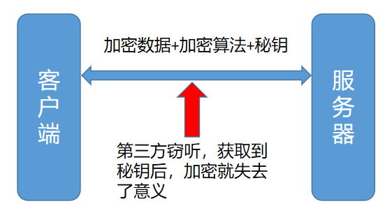

# HTTPS原理
## 1.HTTP通信存在的问题
* HTTP通信数据传输使用的是明文，传输过程中数据可能被窃听
* HTTP无法验证数据的完整性，数据可能在传输过程中被篡改（没有办法确认发送的请求/响应和接收到的请求/响应前后是否完全一致）
* 无法验证通信方的身份，可能遭遇伪装，任何人都可以伪装成服务器欺骗客户端

## 2.HTTPS
HTTPS是HTTP+SSL/TSL,在HTTP的基础上添加了一个安全层，SSL,Secure Socket Layer,对所有的数据进行加密后传输，是安全版本的HTTP。通常HTTP直接和TCP通信，当使用SSL时，则变成HTTP先和SSL层通信，再由SSL和TCP通信。

## 3.HTTPS的主要作用
* 对数据进行加密，并建立一个信息安全通道，来保证传输过程中数据安全
* 对网站服务器进行身份认证

## 4.加密算法
#### 4.1. 对称加密
**加密和解密使用的是同一个秘钥。如AES，DES加密算法。**

通过对称加密算法加密时，必须要把秘钥告诉给对方，不然对方无法解密。但是在互联网上转发秘钥时，如果通信被窃听，秘钥也会被第三方获取，这时也就失去了加密的意义。

#### 4.2. 非对称加密
非对称加密有两个秘钥：公钥与私钥，公钥是公开的，如果用公钥对数据进行加密，只有对应的私钥才可以解密；如果用私钥进行加密，只有对应的公钥才能解密。如RSA加密算法。

缺点：
* 公钥是公开的，所以针对私钥加密的数据，第三方截获后，可以利用公钥解密，获取其中的内容
* 非对称加密在数据加密解密过程中相对耗时，传输效率低

## 5.HTTPS使用对称加密+非对称加密相结合
如果使用对称加密算法，对数据进行加密传输，但是对称加密的秘钥在互联网传输过程中会被窃取，这样就导致数据传输并不安全。

如果使用非对称加密算法 + 对称加密算法相结合，也就是在传输过程中利用非对称加密算法，将对称加密算法的秘钥进行加密，这样就算传输过程中秘钥被截获，别人也无法解密获取到秘钥，相对来说就很安全了。流程如下：

* 服务器将自己的公钥（非对称加密的公钥）告诉给客户端
* 客户端随机生成一个秘钥（对称加密的秘钥），客户端利用非对称加密的公钥 对 对称加密算法的秘钥进行加密，发送给服务器
* 服务器利用自己的私钥解密，得到对称加密算法的秘钥
* 这样客户端与服务器都知道了对称加密算法的秘钥，并且就算该秘钥被第三方获取，也无法解密
* 这样客户端与服务器就可以利用对称加密算法进行加密传输通信了

#### 以上流程仍然不太安全
非对称加密的公钥，如果直接通过互联网传输给客户端，容易被不法分子劫持，篡改为自己的公钥，如果这样的话，数据传输过程中又不安全了。

## 6.客户端如何获取服务器的公钥？
服务器的公钥不能在不安全的网络中直接发送给客户端，这时就引入了证书颁发机构（Certificate Authority，简称CA）
#### 数字证书认证机构的业务流程
1. 服务器的运营人员向第三方机构CA提供自己的公钥，组织信息，域名信息等申请认证
2. CA审核通过后，会给服务器颁发签名证书，证书包含：申请者的公钥，申请者的组织信息，域名信息，签发机构的CA信息，有效时间等，同时还包含一个**数字签名**
3. **数字签名**是通过对证书中的明文信息进行哈希计算，得到数字摘要，然后采用CA的私钥对数字摘要进行加密，进而得到数字签名

4. 客户端向服务器发起https请求时，服务器返回给客户端的是CA颁发的证书
5. 客户端读取证书中的明文，通过哈希计算得到数字摘要；同时利用CA的公钥(操作系统内置)对数字签名进行解密得到数字摘要，如果两个摘要相同，说明证书内容没有被篡改，证书中的秘钥是可以信赖的

6. 客户端还会验证证书相关的域名信息、有效时间等信息; 客户端会内置信任CA的证书信息(包含公钥)，如果CA不被信任，则找不到对应CA的证书，证书也会被判定非法

**以上可知，通过第三方证书传输公钥，可以防止公钥被第三方篡改的问题，这样这个通信流程就非常安全了。**

## 7.HTTPS工作流程
1. 客户端发起HTTPS请求，连接服务器的443端口
2. 服务器把配置好的证书发送给客户端
3. 客户端对证书的合法性进行验证，比如是否在有效期内，证书的用途是不是匹配客户端请求的站点等，如果验证不通过会警告
4. 如果证书验证通过，客户端从证书中获取服务器的非对称加密的公钥
5. 客户端随机生成一个对称加密秘钥，利用公钥进行加密，发送给服务器
6. 服务器使用自己的私钥解密，得到对称加密算法的秘钥
7. 之后客户端与服务器就通过对称加密算法进行数据传输
