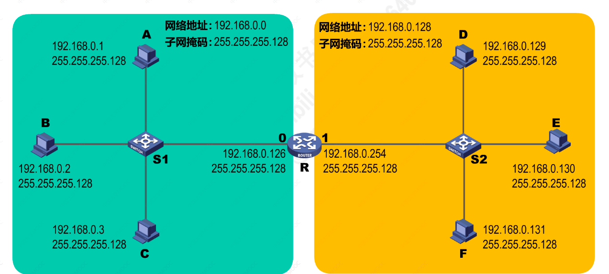
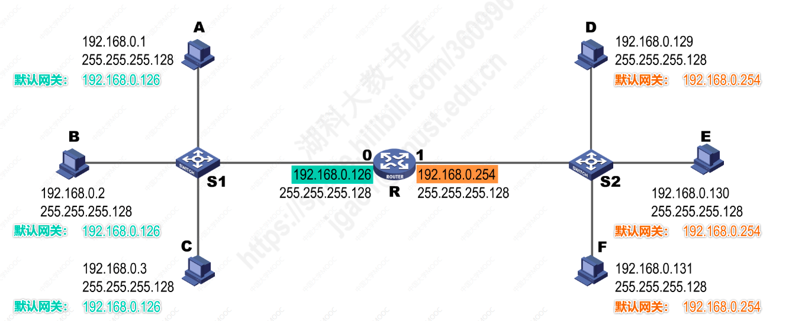
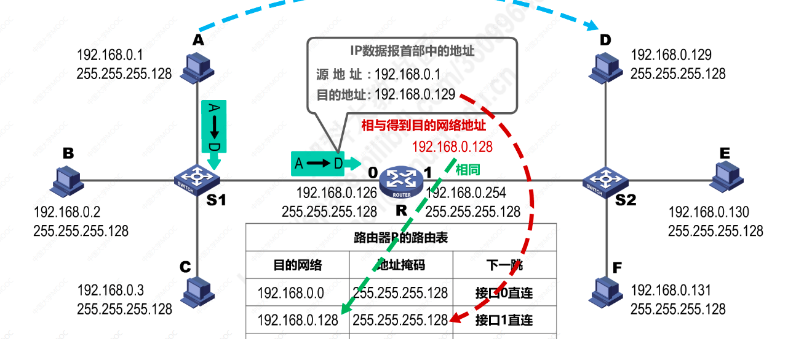

# IP数据报的发送和转发过程
1. 主机发送IP数据报
2. 路由器转发IP数据报

#### 过程
**下图，路由器的接口0直连了一个以太网，接口1直连了一个以太网，每个网络的子网掩码及主机地址如图：**

* 同一个网络中的主机可以直接通信，属于直接交付
* 不同网络之间的通信需要通过路由器，属于间接交付

#### 1.源主机如何知道目的主机是否与自己在同一个网络中？
* 主机C要与主机F发送IP数据报
* 主机C把自己的IP地址与子网掩码与运算，得到主机C所在网络的网络地址
* 主机C知道主机F的IP地址，同样把主机F的IP地址与自己的子网掩码运算，得到主机F的网络地址
* 两次运算的网络地址不相等，所以主机C判定主机F与自己不在同一个网络
* 所以主机C需要将IP数据报传输给路由器，通过路由器转发

#### 2.主机C如何把IP数据报交给路由器进行转发？
* 用户为了让本网络中的主机与其他网络的主机进行通信
* 必须给主机指定一个本网络中的路由器地址，由该路由器进行转发，指定的路由器地址也称为“默认网关”
* 所以把路由器接口0的IP地址设置为该接口直连网络中的各个主机的默认网关

#### 3.路由器收到IP数据报后如何转发？
* 路由器会先检查IP数据报首部是否出错，如果出错，会丢弃该IP数据报，并告知源主机；如果没有出错，则进行转发
* 根据IP数据报中的目的地址，在路由表中查找匹配条目，如果找到匹配，就进行转发；如果找不到匹配，就丢弃并告之源主机
* 路由器知道自己的接口对应的网络的网络地址
* 路由器通过目的IP地址与路由表中的子网掩码进行运算，得到目的网络地址与路由表中记录的目的网络地址如果相同，则通过该接口转发数据报

**路由器不转发广播数据报，避免网络风暴。** 
