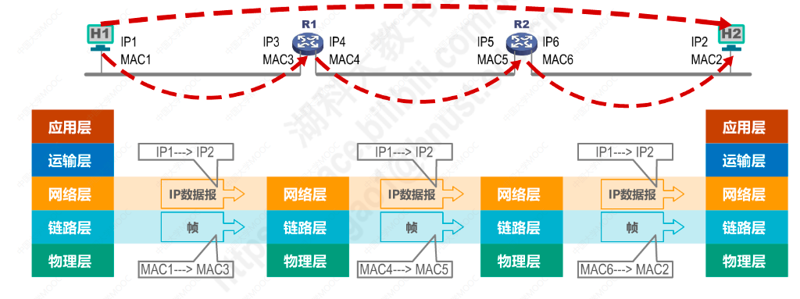
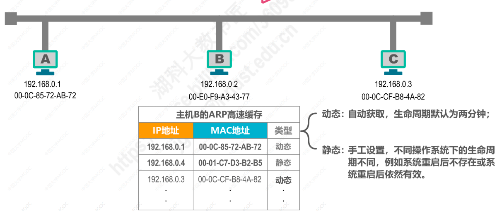

# MAC地址、IP地址、ARP协议
## 1.MAC地址
* 点对点连接的两个主机，不需要地址也可以进行通信
* 但是当多个主机连接在同一个数据链路中，想要实现两个主机之间的通信，则每个主机都必须要有一个唯一标识，即数据链路层地址
* 每个主机发送的帧中，必须携带发送主机和接收主机的地址，由于这类地址是用于媒体接受控制（Media Access Control），所以称为MAC地址
* MAC地址一般被固化在网卡中，因此又被称为硬件地址或物理地址
* 一般情况下用户主机包含两个网络适配器（有线网卡与无线网卡），每个网络适配器都有一个全球唯一的MAC地址
* 交换机和路由器有多个网络接口，所以交换机与路由器有多个MAC地址
* 严格说，MAC地址是对网络上各接口的唯一标识，而不是网络上各设备的唯一标识

## 2.IP地址
**IP地址是因特网上的主机和路由器所使用的地址，用于标识两部分信息：**
* 网络地址：标识因特网上数以百万计的网络
* 主机地址：标识同一网络上的不同主机

**显然，如果只是在一个数据链路上，只需要知道源主机与目的主机的MAC地址也可以进行通信，但是如果是在不同的网络中，还需要有IP地址才可以进行通信。**

#### 数据包转发过程中IP地址与MAC地址的变化情况:
* 数据包转发过程中源IP地址和目的IP地址保持不变
* 数据包转发过程中源MAC地址与目的MAC地址逐个链路（逐个网络）改变

## 3.ARP地址解析协议
上图中：
* 主机H1知道把数据包发送给R1，由R1把数据包转发出去，H1知道R1的IP地址，但是不知道R1的MAC地址
* R1知道把数据包转发给R2，R1知道R2的IP地址，但是不知道R2的MAC地址是多少

**如何通过主机的IP地址找到其相应的MAC地址，就是ARP协议所要解决的问题。ARP协议只能在一个数据链路或一个网络上使用，不能跨网络使用。**

#### ARP地址解析的流程如下：

1. 在一个数据链路（一个网络）中，有三台主机A，B，C
2. 每台主机内部都有一个ARP高速缓存表，主要记录该网络中每台主机的IP地址，及其对应的MAC地址
3. 当主机B要给主机C发送数据包时，会先在自己的ARP缓存表中，查找主机C的IP地址对应的MAC地址
4. 如果ARP缓存表中没有找到对应关系，那么主机B会在网络中发送ARP请求报文（广播）
5. ARP请求报文内容主要包含：主机B的IP地址，主机B的MAC地址，目的主机的IP地址，希望获取目的主机的MAC地址
6. 主机B发送广播帧后，该网络内的所有主机都会接受到ARP请求报文
7. 主机A接受ARP请求后，发现所询问的IP地址不是自己的IP地址，就不理会
8. 主机C收到ARP请求后，发现所询问的IP地址是自己的IP地址，主机C会先将主机B的IP地址与MAC地址记录在自己的ARP缓存表中，然后响应ARP请求，将自己的IP地址与MAC地址发送给主机B
9. 主机B收到ARP响应后，将主机C的IP地址与MAC地址记录在自己的ARP高速缓存表中
