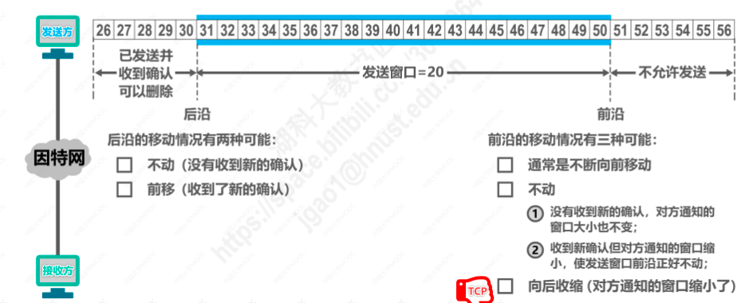
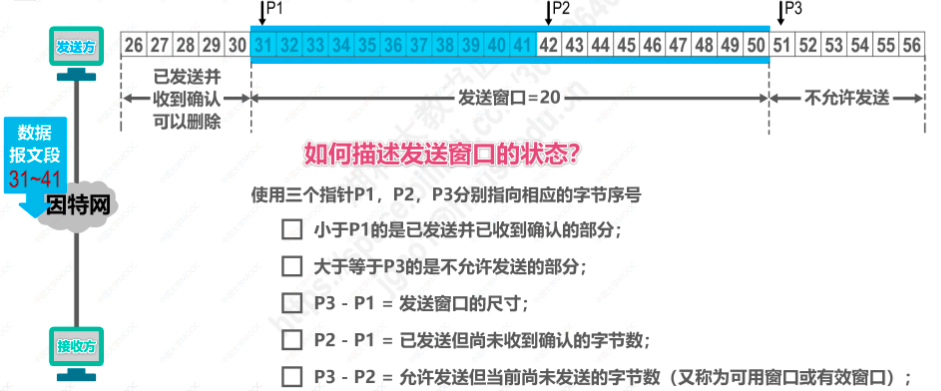
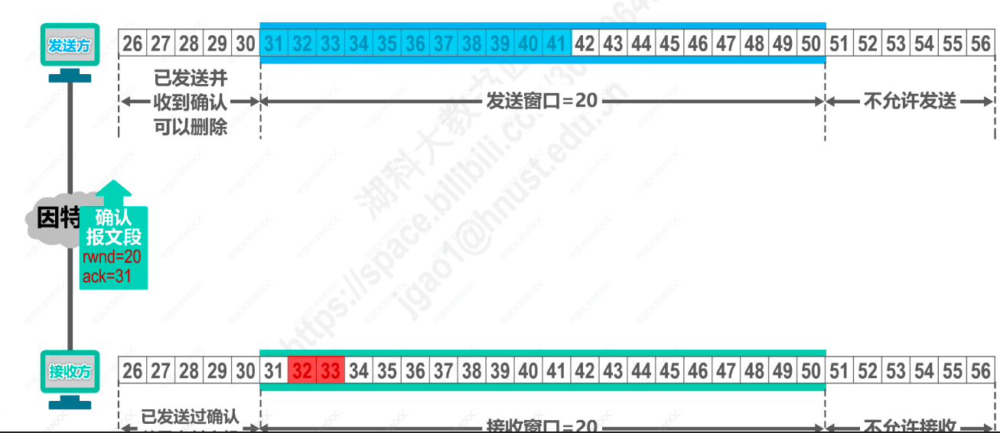
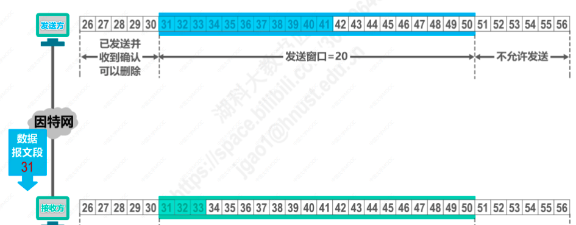
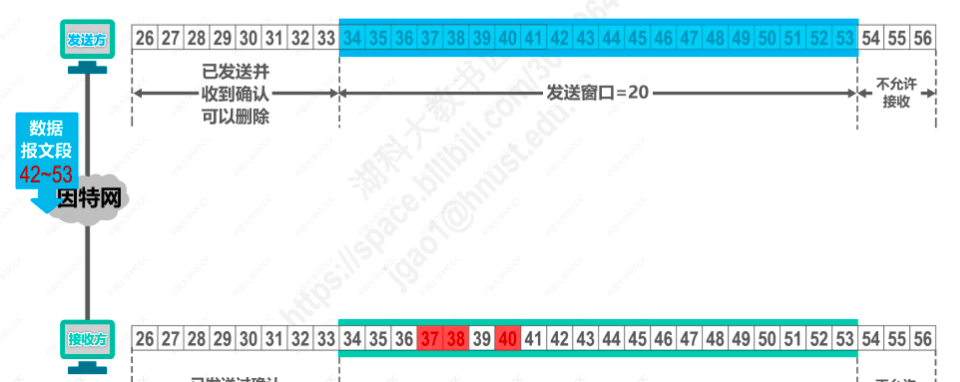
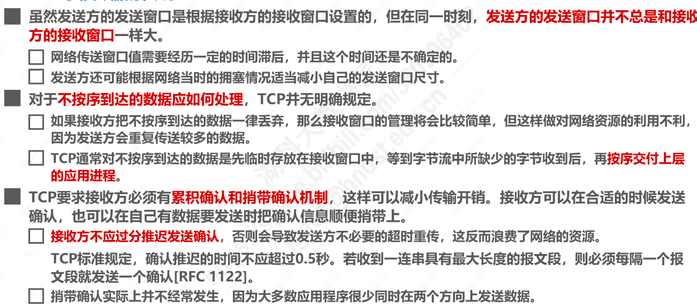

# TCP可靠传输的实现
**TCP协议是基于以字节为单位的滑动窗口来实现可靠传输的。**

1. 如图，接收方发送TCP确认报文段给发送方，rwnd表示自己的接收窗口大小为20，确认号ack=31表示序号31之前的数据都已经正确接收

2. 发送方收到确认报文段，调整自己的发送窗口

3. 发送窗口内31-50号的数据都是允许发送的，如图，31-41号数据已发送，还没有收到确认，42-50号数据是允许发送还没有发送的

4. 如图，接收方接收窗口31号之前的数据是已成功接收并交付的数据，可以从缓存中删除，31-50号数据是等待接收的数据
5. 发送方此时发送的32-33号数据成功被接收方接收到，并被接收方存入到接收缓存中
6. 但是32-33号数据是未按序到达的数据，因为此时还没有收到31号数据
7. **接收方只能对按序收到的数据中的最高序号给出确认**，所以，接收方发出的确认报文段的确认号仍然是ack=31,告知发送方自己还没有收到31号数据
8. 发送方收到确认报文段后，发现是对31号数据的重复确认，知道接收方收到了未按序到达的数据
9. 由于是发送方收到的第一个重复确认，所以并不会引起发送方快重传现象（三次连续重复确认才会快重传）

10. 31号数据到达接收方后，接收方将数据存入接收缓存，此时接收方可以将31-33号数据交付给应用进程，并发送确认报文段ack=34,表示34号之前的数据都已正确接收了

11. 发送方和接收方调整滑动窗口
12. 发送方将发送窗口内的数据全部发送，此时，如果没有收到新的确认，发送方将不再发送新数据（流量控制）

13. 如果接收方迟迟收不到按序到达的数据，会引起发送方超时重传，发送方会将发送窗口内的已发送的数据进行重传，并重新启动计时器

