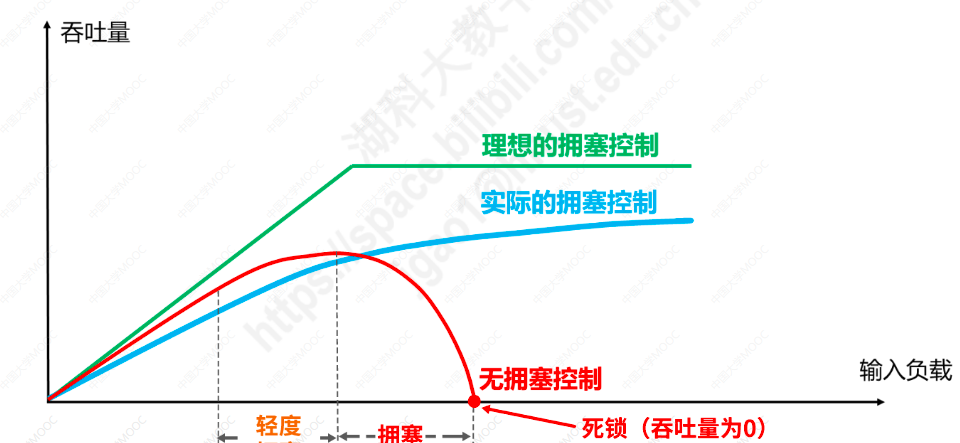
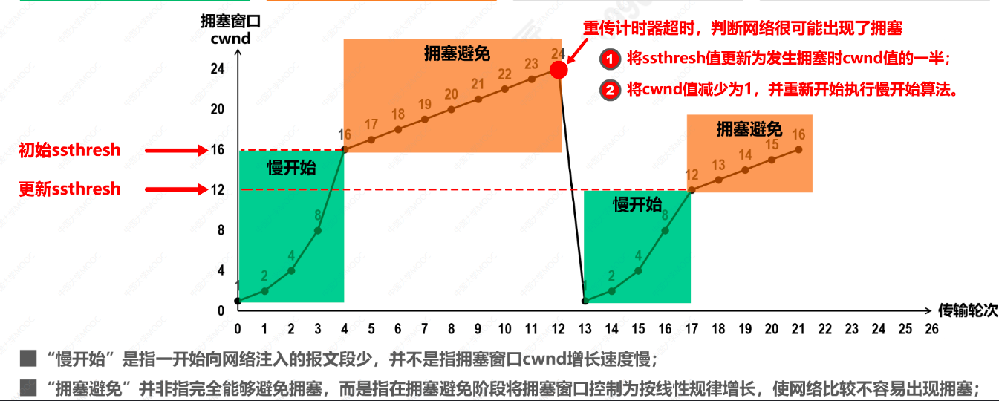
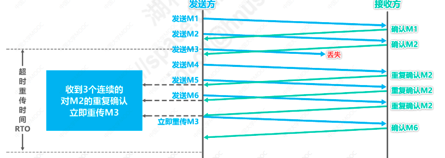
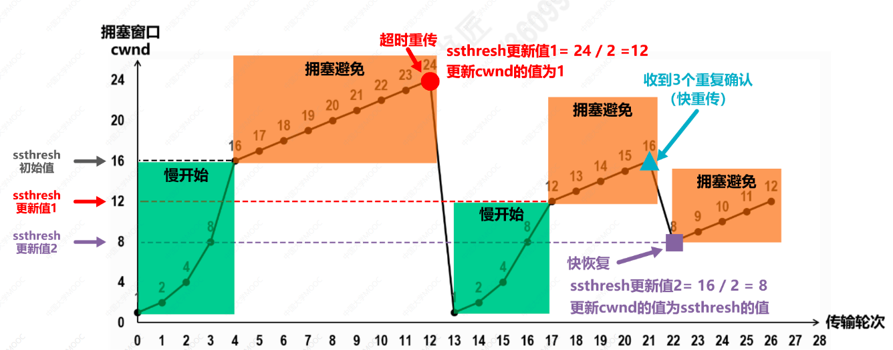

# TCP的拥塞控制
## 1.网络拥塞
**某段时间内，如果对网络中某一资源（如网络带宽，交换机的缓存等）的需求超过了该资源所能提供的可用部分，网络性能就会变坏，这种情况就叫拥塞。**如果出现拥塞而不进行控制，整个网络的吞吐量将随负荷的增大而下降

## 2.TCP的四种拥塞控制算法（拥塞窗口值，慢开始门限值）
* 发送方给接收方发送TCP数据报文段，接收方收到报文段后返回给发送方确认报文段
* 发送方维护一个**拥塞窗口**cwnd变量，根据网络的拥塞程度动态变化
* cwnd的变化原则就是：只要没有出现网络拥塞，拥塞窗口的值就增大一些，一旦出现了网络拥塞，拥塞窗口的值就减少一些
* 如何判断出现了网络拥塞：发送方没有按时收到应该到达的确认报文段（发送方出现了超时重传）
* 发送方发送窗口大小与拥塞窗口大小相等
* 发送方还维护一个变量：**慢开始门限值**，ssthresh
* 当拥塞窗口的大小 <= 慢开始门限值：使用慢开始算法
* 拥塞窗口大小 > 慢开始门限值：使用拥塞避免算法

### 2.1 慢开始算法 + 拥塞避免算法
* 初始连接建立是，发送方拥塞窗口大小为1，慢开始门限值为16
* 执行慢开始算法时，发送方每收到一个对新报文段的确认后，就将拥塞窗口值加1
* 初始拥塞窗口值为1，发送方发送0号数据报文段，接收方收到后发回确认报文段，发送方收到0号报文段的确认后，拥塞窗口值变为1+1=2
* 此时发送方拥塞窗口值为2，发送方分别发送1号，2号报文段，收到接收方的确认报文段后，拥塞窗口值变为2+2=4
* 此时发送方拥塞窗口值为4，发送方分别发送3，4，5,6号报文段，收到接收方的确认报文段后，拥塞窗口值变为4+4=8
* 以此类推，当拥塞窗口值增大到16，达到慢开始门限值，此时开始采用拥塞窗口避免算法
* 拥塞避免算法是：每个传输轮次结束后，拥塞窗口值只能线性加1
* 此时拥塞窗口大小为16，发送方发送15-30号共16个数据报文段，发送方全部收到15-30号每个报文段的确认后，拥塞窗口值为16+1=17
* 此时拥塞窗口大小为17，发送方发送31-47号共17个数据报文段，发送方全部收到31-47号每个报文段的确认后，拥塞窗口值为17+1=18
* 以此类推，拥塞窗口线性增加
* 当拥塞窗口值增大到24时，发生了报文段丢失的情况，发送方于是出现超时重传，发送方判断出现了网络拥塞
* 此时发送方将慢开始门限值更新为发生拥塞时一半 24/2=12
* 发送方此时还会把拥塞窗口值减小为1
* 此时拥塞窗口值 小于 慢开始门限值，1<12,于是再次开始执行慢开始算法，如此循环

### 2.2 快重传
* 有时个别报文段在网络中丢失，并不一定是网络拥塞导致（比如误码）
* 如果此时按照慢开始算法，误认为发生网络拥塞，发送方把拥塞窗口值减小为1，此时会降低网络传输效率
* **快重传是指让发送方尽快知道报文段发生了丢失，需要重传，不要等到重传计时器超时才进行重传**
* 快重传要求接收方收到数据后立即确认，不要捎带确认
* 即使接收方收到了失序的报文段，也要立即发出对自己已收到的报文段的重复确认
* 发送方一旦收到3个连续的重复确认，就判定为出现了丢包的情况，立即重传，不必等到计时器超时再重传

如图所示：

1. 发送方发送1号报文段，接收方收到后立刻返回对1号报文段的确认
2. 发送方在收到1号报文段的确认之前还可以发送2号报文段，接收方收到2号报文段后立即返回对2号报文段的确认
3. 发送方在收到2号报文段的确认之前还可以发送3号报文段，但3号报文段发生了丢失
4. 3号报文段发生了丢失，发送方自然不会收到接收方对3号报文段的确认
5. 发送方继续发送4号报文段，接收方收到4号报文段后，发现这不是按序到达的报文段，因此会给接收方发送2号报文段的重复确认
6. 表明接收方需要收到3号报文段
7. 发送方继续发送5号报文段，接收方收到5号报文段后，仍然发送2号报文段的重复确认
8. 发送方继续发送6号报文段，接收方收到6号报文段后，仍然发送2号报文段的重复确认
9. 连续三次收到了2号报文段的重复确认，发送方知道3号报文段发生了丢失，立即重传3号报文段
10. 接收方收到后，返回6号报文段的确认，表明序号到6为止的报文段都正确接收了
11. 这样，对于个别丢失的报文段，发送方不会出现超时重传，也就不会误认为网络拥塞（不会把拥塞窗口值改为1），提高了网络传输效率

### 2.3 快恢复
* 发送方一旦收到三个连续的重复确认后，就知道丢失了个别的报文段，于是不启动慢开始算法，而是执行快恢复算法
* 发送方将慢开始门限值和拥塞窗口值都调整为当前值的一半，开始执行拥塞避免算法

