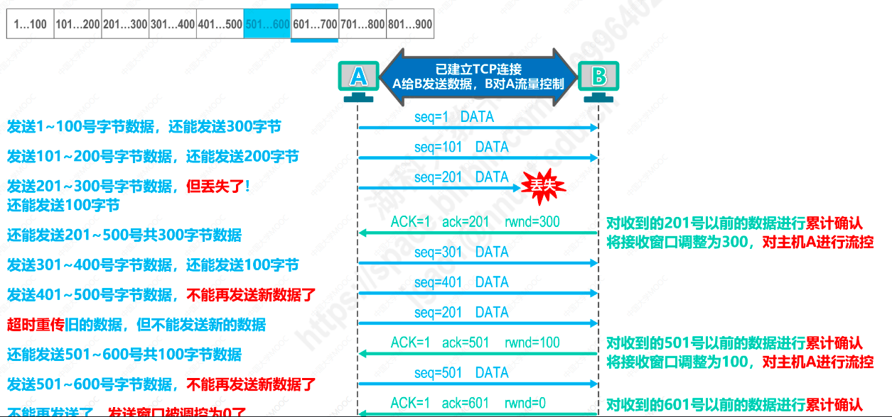
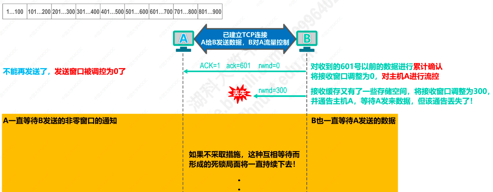
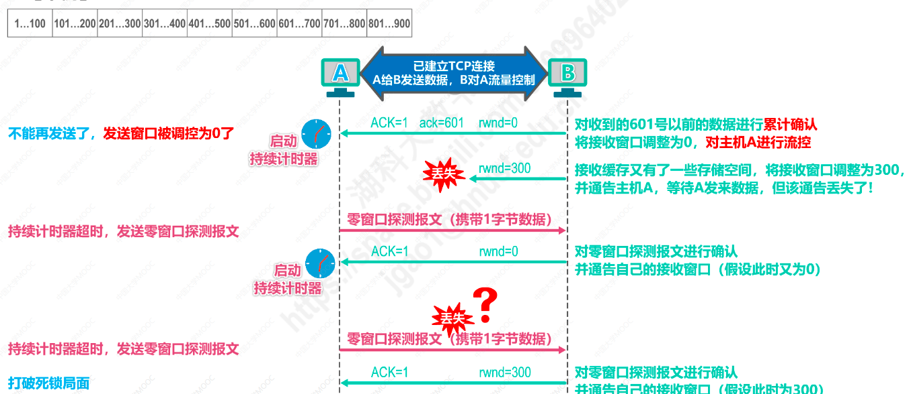

# TCP的流量控制
* 一般来说我们希望数据传输的速度能够更快一些
* 但是如果发送方把数据发送的太快，接收方可能来不及接收，这就会造成数据的丢失
* 流量控制就是让发送方的发送速度不要过快，要让接收方来得及接收
* TCP协议通过滑动窗口机制实现对TCP连接的流量控制

## 流量控制示例

1. 主机A和主机B建立了TCP连接，A向B发送数据，B对A进行流量控制
2. 主机A和主机B建立了TCP连接的过程中，主机B告知主机A，主机B的接收窗口值大小是400，主机A同时会将自己的发送窗口大小设置为400
3. 主机A将发送窗口内序号1-100内的数据封装成报文段发送出去，seq=1指出本TCP报文段数据载荷的第一个字节的序号,此时主机A还能在发送300字节
4. 主机A将发送窗口内序号101-200的数据封装成报文段发送出去，seq=101,此时主机A还能在发送200字节
5. 主机A将发送窗口内序号201-300的数据发送出去，但该数据丢失了，此时主机A的发送窗口内还有100字节可以发送
6. 主机B对接收到的201号以前的数据进行确认，确认标志位ACK=1表明这是TCP确认报文段，确认号ack=201，表示201号之前的数据都已经确认接收了，rwnd=300表示主机B将自己的接收窗口调整为300，以此对主机A进行流量控制
7. 主机A收到累计确认号，将发送窗口向前滑动，使已接收并收到确认的数据(1-200)移除发送窗口,同时将自己的发送窗口大小调整为300
8. 此时主机A发送窗口内的数据为201-500序号的字节，其中201-300的数据是已发送的数据(丢失了)，等到重传计时器超时，该部分数据会被重传
9. 主机A发送窗口内301-400,401-500的数据依次封装发送，此时主机A发送窗口内的数据全部发送出去，不能再发送新数据了
10. 此时发送窗口内序号201-300的字节数据的重传计时器超时了，主机A会将201-300序号的数据重新封装发送(只能超时重传旧数据，不能发送新数据)
11. 主机B收到超时重传的数据后，将主机A发送的501号之前的数据进行累计确认，ACK=1，ack=501
12. rwnd=100主机B第二次对主机A进行流量控制
13. 主机A接收到ACK确认后，将发送窗口内501号之前的数据清除，发送窗口向前滑动，窗口值大小改为100
14. 此时主机A还能发送序号501-600字节的数据，将其封装发送
15. 主机B对501-600字节的数据的数据进行累计确认，ACK=1，ack=601,并将窗口值设置为0，这是主机B对主机A进行的第三次流量控制
16. 主机A收到确认报文后，将发送窗口中的601号之前的数据清除，并将自己的发送窗口大小调整为0
17. 此时主机A不能再发送一般的TCP报文段了（发送窗口大小为0）

18. 过了一段时间，主机B的接收缓存又有了一些空间，主机B将窗口值大小调整为300，并通告主机A
19. 如果通知主机A调整窗口大小的报文段丢失了，主机A一直等待主机B发送非零窗口的通知，主机B一直等待主机A发送的数据，如果不采取行动，这种死锁现象会一直存在
20. 为了解决上述死锁情况，TCP为每个连接设立了一个持续计时器
21. 只要TCP连接的一方收到对方零窗口的通知，就启动持续计时器，若持续计时器超时，就发送一个零窗口探测报文，仅协带一字节数据；对方在确认探测报文段的同时，会给出自己当前的接收窗口值，如果接收窗口仍然是0，收到零窗口报文段的一方仍然会重新启动持续计时器；如果接收窗口不是零，那死锁的情况就会被打破
22. 如果零窗口探测报文段也丢失了，该怎么办？零窗口探测报文段也有一个重传计时器，重传计时器超时后，零窗口探测报文段会被重传

## TCP流量控制总结
接收方主机根据自己的接收窗口大小，控制发送方的发送窗口大小，发送方发送窗口内的数据全部发送后，在没有收到ACK确认报文，不会发送新的数据。丢失的数据包会超时重传，发送方收到零窗口通知时会启动持续计时器，超时后会发送零窗口探测报文，以次获取接收方的窗口值大小，保证数据传输。
