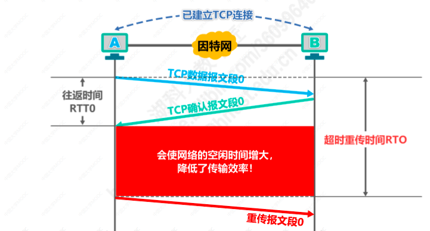
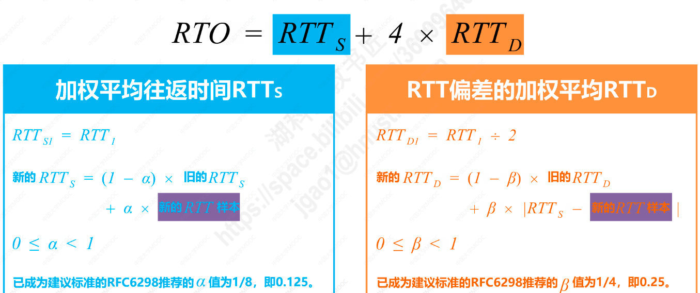
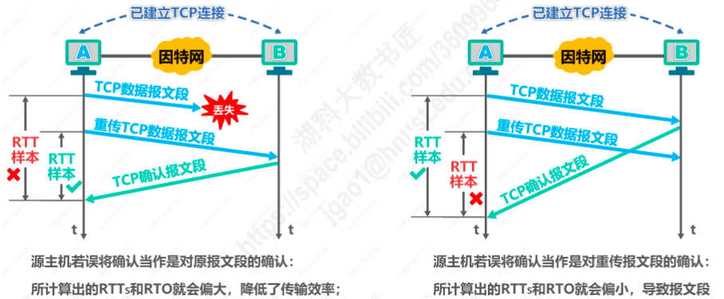

# TCP超时重传时间的选择（超时重传时间应略大于加权平均往返时间）
* 往返时间：RTT，TCP数据报文段从发送到收到对应的确认报文段所用的时间
* 超时重传时间RTO
* 如果超时重传时间小于往返时间，会引起TCP报文段不必要的重传，使网络负荷增大
* 如果超时重传时间远大于往返时间，会使网络的空闲时间增大，降低了传输效率

## 1.计算加权平均往返时间RTTS
* 但不能直接使用某次测量得到的RTT样本来计算超时重传时间RTO，这样不准确
* 需要利用每次测量得到的RTT样本，计算加权平均往返时间 RTTS
* 加权平均往返时间 RTTS = （1-a）*旧RTTS + a*新的RTT样本， a建议为0.125
* 通过加权平均计算出来的往返时间RTTS比RTT更加平滑，**超时重传时间RTO应略大于加权平均往返时间RTTS**

## 2.超时重传时间RTO计算

## 3.往返时间RTT的测量
* 通过上述公式发现超时重传时间RTO的计算跟往返时间RTT关系密切
* TCP报文段传输丢失后，然后进行超时重传，此时收到对应的TCP确认报文段，但发送方此时无法判断该确认报文段是对原报文段的确认，还是对重传的TCP报文段的确认
* 针对出现超时重传时无法准确测量往返时间的问题，报文段每重传一次，就把超时重传时间RTO的值增大一些，典型做法是将新的RTO的值取值为旧的RTO的两倍

