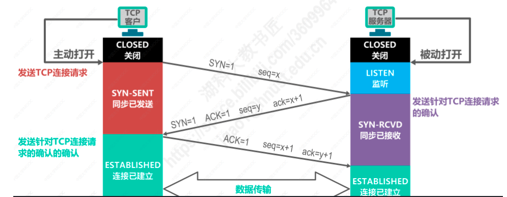
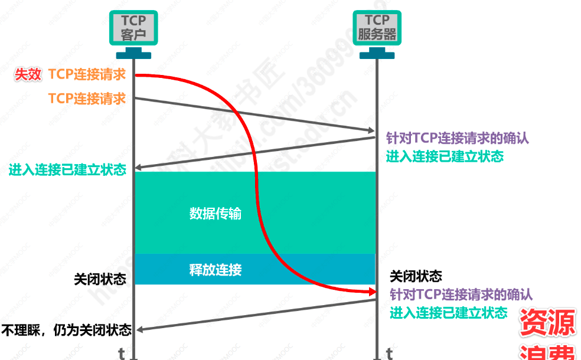
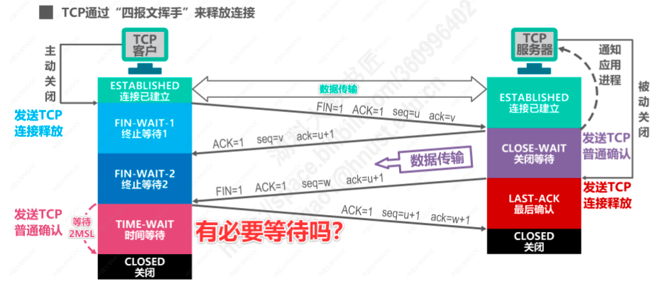
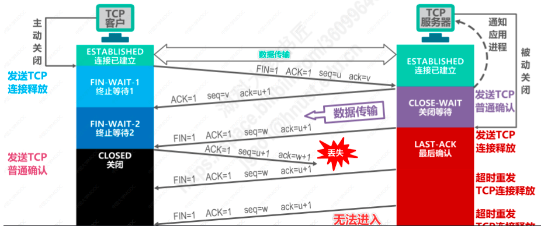

# 1.TCP连接的建立
TCP运输连接分为三个阶段：建立TCP连接、数据传输、释放TCP连接，TCP连接的建立主要解决三个问题：
1. 使TCP双方能够确认对方的存在
2. 使TCP双方能够协商一些参数（如最大窗口值）
3. 使TCP双方能够对运输实体资源（如缓存大小）进行分配

## TCP三报文建立连接
1. 主动发起TCP连接的建立的应用进程称为TCP客户端，被动等待TCP连接的建立的应用进程为TCP服务端
2. 最初，两端的TCP进程都处于**关闭（CLOSE）**状态
3. TCP服务端首先创建TCP传输控制块，用于存储TCP连接过程中的重要信息（如TCP联结表，指向发送和接收缓存的指针，指向重传队列的指针等），然后TCP服务端就进入**监听（LISTEN）**状态，等待TCP客户进程的连接请求。
4. TCP客户端也是首先创建传输控制块，在打算建立TCP连接时，向TCP服务端发送“TCP连接请求报文”,此时TCP客户端进入**同步已发送（SYN-SENT）**状态。同步标志位SYN=1表示这是一个TCP连接请求报文段，序号seq=x（TCP规定SYN为1的报文段不能携带数据，但要消耗掉一个序号）
5. TCP服务端收到TCP连接请求报文段后，如果同意建立连接，就向TCP客户端发送“TCP连接请求的确认报文段”，此时TCP服务端进入**同步已接收（SYN-RCVD）**状态。同步标志位SYN=1和确认标志位ACK=1表明这是一个“TCP连接请求确认报文段”，序号seq=y,确认号ack=x+1
6. TCP客户端收到服务端发送的“TCP连接请求确认报文段”后，还要向TCP服务端发送一个普通的TCP确认报文段，主要是针对“TCP连接请求确认报文段”的确认，并进入**连接已建立（ESTABLISHED）**状态。确认标志位ACK=1，表明这是一个普通的TCP确认报文段，序号seq=x+1,确认号ack=y+1.
7. TCP服务端收到客户端发送的确认报文段后，也进入**连接已建立（ESTABLISHED）**状态
8. 此时客户端和服务端可以基于已经建立好的连接进行可靠的数据传输了

#### 为什么是三报文建立连接，而不能是两报文建立连接
TCP客户端发送连接请求后，接收到服务端发送的连接请求确认，为什么还要再发送一个针对“连接请求确认报文”的确认？

1. 如图，TCP连接请求报文段由于某些原因导致在发送过程中滞后，引发超时重传
2. 第二次连接请求发送后，与服务端建立了TCP连接，并进行了数据传输与连接释放
3. 这个时候，第一次发送的TCP连接请求到达了TCP服务端，服务端返回相应的确认报文段
4. 如果是两报文握手建立连接，此时服务端就进入了连接已建立状态，一直等待客户端发送数据
5. 但此时客户端已经发送完成数据进入关闭状态，收到服务端的确认后并不理睬，仍然为关闭状态
6. 但此时服务端认为连接已经建立好了，并一直等待客户端发送数据，这会造成TCP服务端所在主机的资源浪费

**所以，采用三报文建立连接而不是两报文建立连接，是为了防止已经失效的连接请求报文段又突然传送到了TCP服务端，导致错误，造成服务器资源浪费。**

# 2.TCP连接的释放

1. TCP客户端主动释放TCP连接，发送“TCP连接释放报文段”，终止标志位FIN=1表明这是一个“TCP连接释放报文段”，确认标志位ACK=1，序号seq=u,确认号ack=v，表明对之前收到的报文段的确认。此时TCP客户端进入**终止等待1（FIN-WAIT-1）**状态（终止标志位FIN=1的报文段即使不携带数据也要消耗一个序号）。
2. TCP服务端收到TCP客户端发送的"TCP连接释放报文段"后，会发送一个普通的“TCP确认报文段”，并进入**关闭等待（CLOSE-WAIT）**状态。确认标志位ACK=1，序号seq=v,确认号ack=u+1.
3. TCP服务端这时向上通知应用进程，TCP客户端要断开连接，这个时候，TCP连接处于半关闭状态，也就是TCP客户进程已经没有数据要发送了，但TCP服务进程还可以继续发送数据，TCP客户进程得继续接收数据。
4. TCP客户端收到“TCP确认报文段”后就进入**终止等待2（FIN-WAIT-2）状态。**
5. TCP服务端如果没有要发送的数据了，TCP服务进程发送“TCP连接释放报文段”给TCP客户端，并进入**最后确认（LAST-ACK）**状态.终止标志位FIN=1,表示这是一个“TCP连接释放报文段”，确认标志位ACK=1，序号seq=w(半关闭状态下TCP服务器进程又发送了一些数据),确认号ack=u+1
6. TCP客户端收到TCP服务端发送的“TCP释放报文段”后，要发送一个普通的“TCP确认报文段”，此时TCP客户端进入**时间等待（TIME-WAIT）**状态。确认标志位ACK=1，序号seq=u+1,确认号ack=w+1
8. TCP服务端收到TCP客户端发送的“TCP确认报文段”，就进入**关闭（CLOSE）**状态
9. TCP客户端还要等待2倍MSL时间，最大约4分钟，才能进入**关闭（CLOSE）**状态

#### 为什么TCP客户端在发送完最后一个ACK确认报文段后，不直接进入CLOSE状态，而是进入时间等待状态？

1. 如图，如果TCP客户端发送“TCP确认报文段”后直接进入关闭状态，而不是时间等待状态
2. 如果最后一个“TCP确认报文段”丢失了，这就会导致TCP服务端对之前发送的“TCP释放报文段”的超时重传
3. 但此时TCP客户端已经关闭，这就会导致TCP服务端反复重传“TCP释放报文段”，并一直处于最后确认状态

**所以，TCP客户端进入时间等待状态，2倍的SML时间可以确保TCP服务端收到最后一个“TCP确认报文段”，并进入关闭状态。**

#### TCP中保活计时器的作用
TCP双方在建立连接后，TCP客户端如果突然出现了故障，TCP服务端就收不到TCP客户端发送的数据了，应当有措施，使TCP服务端知道TCP客户端出现了故障，从而避免TCP服务端白白等待浪费资源。
* TCP服务进程每收到一次TCP客户进程发送的数据后，就重新启动保活计时器，2小时定时
* 如果保活计时器周期内没有收到TCP客户端发送的数据，保活计时器到时，TCP服务器就会向TCP客户端发送一个探测报文，以后每隔75秒发送一次，连续10个探测报文都没有响应的话，TCP服务进程就判定TCP客户进程出现了故障，于是就关闭连接

#### 为什么建立连接是三次，断开连接是四次？
建立连接的三次通信过程，并没有开始传输数据，服务端接收客户端发送的SYN请求包后，把自己的确认包ACK和请求包SYN一起发送。 断开连接的过程中，客户端发送断开连接的请求，服务端接收到请求后，先发送确认包ACK，然后把还没有发送完的数据发送完之后，在发送FIN包，客户端在收到服务端的FIN之后，在发送ACK，连接断开。** 断开连接过程中，为确保数据完整传输，服务端的ACK包和FIN包分开发送，所以建立连接是三次握手，断开连接是四次挥手。**
