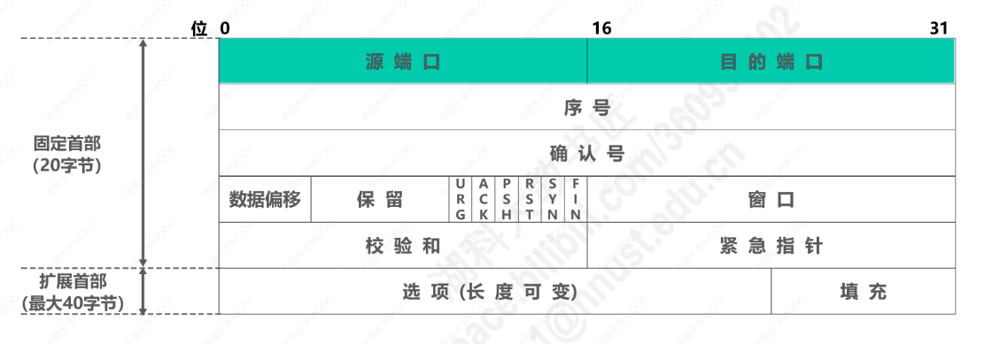
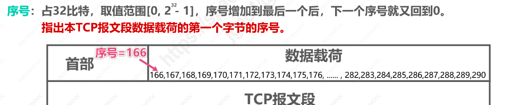
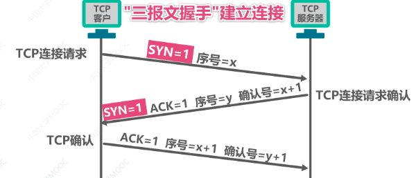

# TCP首部
* 为了实现可靠传输，TCP采用面向字节流的方式
* TCP在发送数据的时候，是从发送缓存中取出一部分或全部字节，并给其添加一个首部使之成为TCP报文段进行发送
* 一个TCP报文段由首部和数据载荷两部分组成
* TCP的全部功能都体现在它首部中的各字段的作用
* TCP首部固定字节长度是20，扩展首部最大长度是40

#### 源端口与目的端口
* 源端口：占16比特，用于标识发送该TCP报文段的应用进程
* 目的端口：占16比特，用于标识接收该TCP报文段的应用进程

#### 序号
* 占32比特，序号增加到最后一个，下一个序号又回到0
* 数据载荷中每个字节都有字节的序号，序号指出本TCP报文段数据载荷的第一个字节的序号

#### 确认号
* 占32比特，确认号增加到最后一个，下一个确认号又回到0
* 确认号是对之前收到的所有数据的确认，同时指出期望收到对方下一个TCP报文段的数据载荷的第一个字节的序号
* 确认号=n,表示序号n-1为止的所有数据都已经正确接收，期望接收序号为n的数据

#### 确认标志位ACK
* 只有当确认标志位ACK等于1的时候，确认号字段才有效
* TCP规定，在连接建立之后传送的TCP报文段都必须把ACK置1

#### 数据偏移
* 占4比特，以4字节为单位
* 用来指出TCP报文段的数据载荷部分的起始处距离TCP报文段的起始处有多远
* 实际上是指出了TCP报文段的首部长度
* 首部长度的固定长度为20字节，所以数据偏移的最小值是5,5*4=20字节
* 首部长度最大长度60字节，数据偏移的最大值为15,15*4=60字节

#### 窗口
* 占16比特，以字节为单位，指出发送本报文段的一方的接收窗口
* 窗口值作为接收方让发送方设置其发送窗口的依据
* 这是以接收方的接受能力来控制发送方的发送能力，称为流量控制

#### 校验和
* 占16比特，检查TCP报文段的首部和数据载荷两部分
* 用于检查传输过程中是否出现误码

#### 同步标志位SYN
* 在TCP建立连接的时候用来同步序号
* TCP通过“三报文握手”建立连接，TCP客户端进程发送的TCP连接请求报文段首部中的同步标志位SYN=1，表明这是一个TCP连接请求报文段
* TCP服务器进程发送的TCP连接请求确认报文段的SYN=1,ACK=1,表明这是TCP连接请求确认报文段

#### 终止标志位FIN
* 用来释放TCP连接
* TCP通过“四报文挥手”释放连接，终止标志位FIN=1，表明这是一个TCP连接释放报文段

#### 复位标志位RST
* 用来复位TCP连接
* RST=1时，表明TCP连接出现了异常，必须释放连接，然后重新建立连接
* RST=1还可用来拒绝一个非法的报文段或拒接打开一个TCP连接

#### 推送标志位PSH
* 接收方的TCP收到该标志为1的报文段，会尽快上交应用进程，而不必等到接收缓存都填满后再向上交付

#### 紧急标志位URG
* URG=1时，紧急指针字段有效
