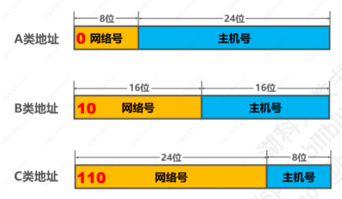
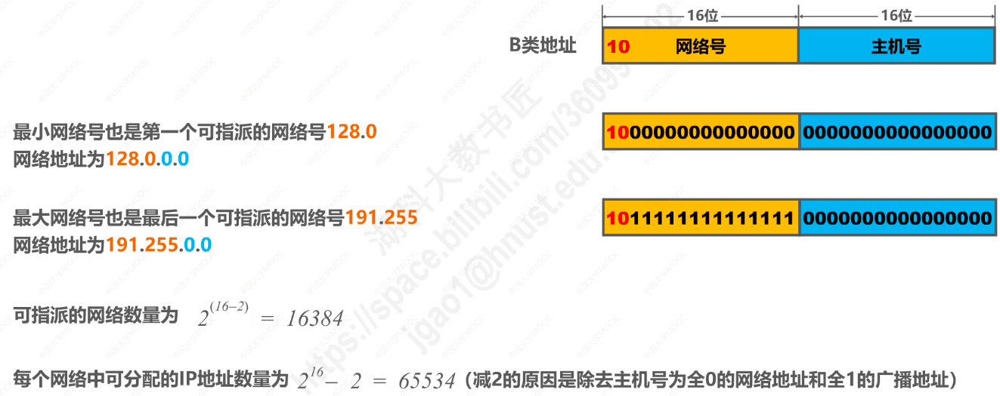
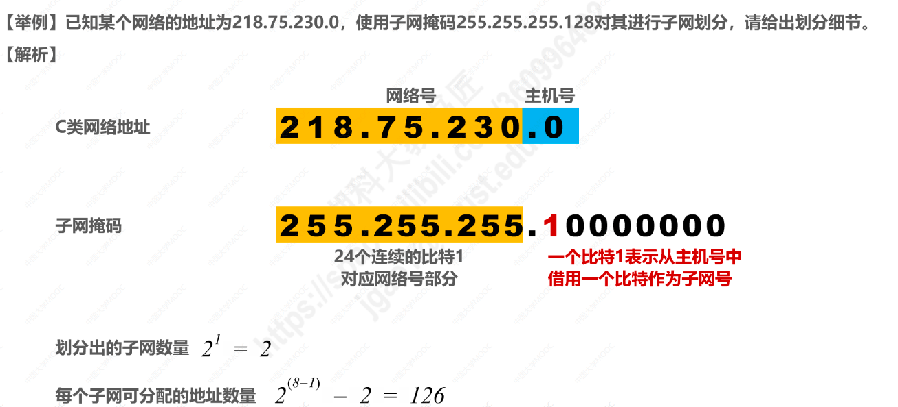
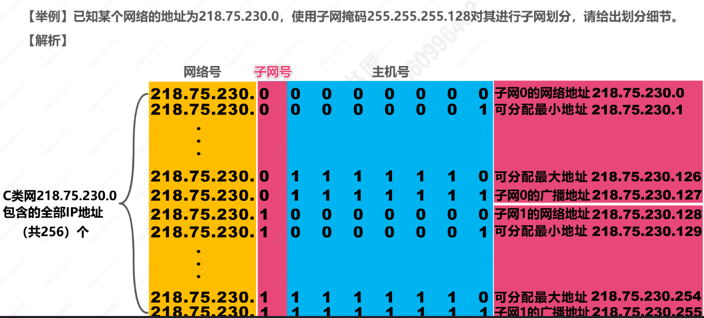

# 网络层
## 1.网络层提供的是无连接的数据服务（简单灵活，无连接，尽最大努力传输数据报服务）
* 可靠通信应该由用户主机来保证
* 不需要建立网络层连接
* 每个分组可以走不同的路径
* 每个分组的首部必须携带目的主机的完整地址
* 分组可能存在误码，丢失，重复发送的情况
* 网络层不需要提供可靠传输，所以路由器可以做的相对比较简单，价格低廉
* 因特网的设计思想也是将复杂的网络处理功能交给边缘处理（用户主机和运输层），将简单的分组交付功能交付给因特网核心。

## 2.IPV4的分类
* A类地址：第1到8位是网络号，首位以二进制0开头，后24位二进制是主机号。
* B类地址：第1到16位是网络号，前两位是二进制10，后16位二进制是主机号。
* C类地址：第1到24位是网络号，前三位是二进制110，后8位二进制是主机号。
* D类地址：第1到32位是网络号，前四位是二进制1110，没有主机号。
* 只有A类，B类，C类地址可以分配分配给网络中的主机或路由器接口
* 主机号全为“0”的是网络地址，不能分配给主机或路由器
* 主机号全为“1”的是广播地址，不能分配给主机或路由器

#### 2.1. A类地址细节
* A类地址网络号最小是0（00000000，保留不使用），最大是127（01111111，作为本地回测地址，不指派）
* 所以A类地址最后一个可指派的网络号是126
* A类地址可指派的网络数量一共有 126个，(2**(8-1))-2 = 128 -2 = 126
* A类地址每个网络中可分配的IP地址数量 (2**24)-2 = 16777214 (去掉主机号全0和全1的)

#### 2.2. B类网络

#### 2.3. C类网络

## 3. 子网的划分与子网掩码
* 除了A，B，C三大类网络地址之外，还可以从主机号中借用一部分作为子网号，从而将这个网络划分为多个子网
* 32比特的子网掩码，可以表示分类IP地址的主机号，分别被借用了几个比特作为子网号
* 子网掩码用连续的比特1对应网络号和子网号，用连续的比特0对应主机号
* IPV4地址与子网掩码进行逻辑与运算，可得到IPV4所在子网的网络地址

