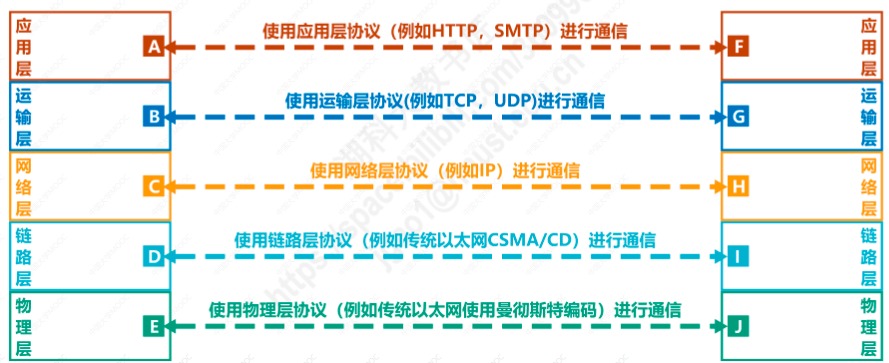

# 计算机网络的体系结构
* OSI体系结构（法律上的国际标准）：分为7层，从下到上依次为物理层，数据链路层，网络层，运输层，会话层，表示层，应用层。
* TCP/IP体系结构（事实上的国际标准）：从下到上分为网络接口层，网络层，运输层，应用层。
* 原理体系结构（适用于教学，理解原理）：从下到上依次为物理层，数据链路层，网络层，运输层，应用层。

## 1.分层的必要性
**计算机网络是个非常复杂的系统，分层可以将庞大而复杂的问题转化为较小的局部问题，进而对这些较小的局部问题进行研究和处理。**

#### 1.1. 物理层：确定使用何种信号来传输比特
* 采用怎样的传输介质
* 采用怎样的物理接口
* 使用什么信号表示比特0和1

#### 1.2. 数据链路层：解决分组在同一个网络(同一段链路)上传输的问题
* 如何标识网络中各个主机（主机编址问题，MAC地址）
* 目的主机如何从比特流中区分出地址与数据（分组的封装格式问题）

#### 1.3. 网络层：解决分组在多个网络上传输与路由问题
* 如何标识各个网络以及网络中的各个主机（网络与主机编址问题，IP地址）
* 源主机与目的主机之间的传输路径有多条，路由器如何进行分组转发，如何进行路由选择

#### 1.4. 运输层：解决进程之间基于网络的通信问题
* 如何解决进程之间网络通信的问题（端口问题）
* 数据传输错误应该如何处理

#### 1.5. 应用层：解决如何通过应用进程交互实现网络应用的问题
* 应用进程之间交互协议（HTTP，SMTP，FTP）

## 2.网络通信实例
**通过在浏览器中输入一个网址，到浏览器显示网页，这一过程中发生了哪些事情，计算机网络分层各做了那些事情**

#### 大概流程
1. 应用层根据HTTP协议，封装HTTP报文，将HTTP报文交给运输层处理
2. 运输层给HTTP请求报文添加TCP首部，使之成为TCP报文段，并将TCP报文段交给网络层处理
3. 网络层给TCP报文段添加IP首部，使之成为IP数据报(使数据可以通过路由器转发),并将IP数据报交给数据链路层处理
4. 数据链路层给IP数据报添加一个首部和一个尾部，封装为帧(使数据可以再一个网络或一个链路内传输，并且被目的主机接收)，并将帧交给物理层
5. 物理层将帧看作比特流，转换为信号，通过传输媒体发送给路由器
6. 传输媒体传输信号到路由器
7. 路由器接收到比特流，进行处理后还原成帧，向上传输给数据链路层
8. 数据链路层去掉首部与尾部，还原为IP数据报，向上传输给网络层处理
9. 网络层解析IP数据报首部，获取目的网络地址，查找路由表，确定转发端口
10. 网络层将IP数据报交给数据链路层
11. 数据链路层将IP数据报添加一个首部和尾部，封装为帧，交给物理层处理
12. 物理层将帧看作比特流，转换为信号，通过传输媒体发送给路由器
13. 传输媒体传输信号到目的主机
14. 14~18，目的主机接收到数据后，从下往上处理传递，最终解析得到HTTP报文，然后将响应结果也通过HTTP协议封装为HTTP报文，通过上述过程发送给源主机。

## 3.相关术语
* 实体：任何可发送或接受信息的硬件或软件进程
* 对等实体：收发双方相同层次中的实体为对等实体，如下AF为对等实体，BG也是对等实体
* 协议：控制两个对等实体进行逻辑通信的规则集合
* 协议数据单元PDU：对等层次之间传输的数据包，应用层称为“报文”，传输层称为“TCP报文段或UDP用户数据报”，网络层称为“IP数据报或分组”，数据链路层称为“帧”，物理层称为“比特流”
* 服务数据单元SDU：同一系统内，层与层至之间交换的数据包称为服务数据单元。

