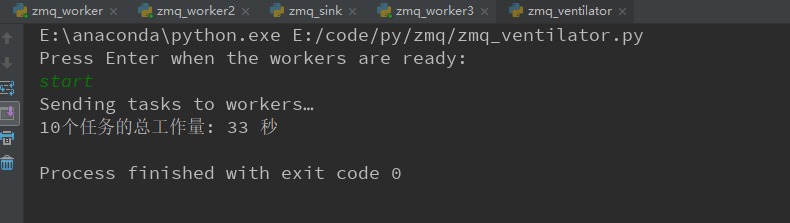

# ZeroMQ基础
## ZMQ是什么？
普通的socket是端到端（1:1）的关系，ZMQ是N:M的关系，socket的连接需要显式地建立连接，销毁连接，选择协议（TCP/UDP）和错误处理，ZMQ屏蔽了这些细节，他像是一个封装了的socket库，他让网络编程变得更加简单。ZMQ不光用于主机与主机间的socket通信，还可以是线程和进程间的通信。 
ZMQ提供的套接字可以再多种协议中传输消息，线程间、进程间、TCP等。可以使用套接字创建多种消息模型，如“请求-应答模型”，“发布-订阅模型”，“分布式模型”等。

## ZMQ特点
* ZMQ的组件来去自如，ZMQ会负责自动重连，服务端客户端可以随意的退出网络。TCP的话，必须先有服务端启动，在启动客户端，否则程序会报错。
* ZMQ会在必要的情况下将消息放入队列中保存，一旦建立了连接就开始发送。
* ZMQ有阈值机制，当队列满时，可以自动阻塞发送者，或者丢弃部分消息。
* ZMQ可以使用不同的通信协议进行连接，TCP，进程间，线程间。
* ZMQ提供了多种模式进行消息路由。如请求-应答模式、发布-订阅模式等。这些模式可以用来搭建网络拓扑结构。
* ZMQ会在后台线程异步地处理I/O操作，它使用一种不会死锁的数据结构来存储消息。

## 一、ZMQ的三种消息模式
### 1.1. Request-Reply（请求-应答模式）
* 使用Request-Reply模式，需要遵循一定的规律。
* 客户端必须先发送消息，再接收消息；服务端必须先进行接收客户端发送过来的消息，再发送应答给客户端。如此循环。
* 服务端和客户端谁先启动，效果都是一样的。
* 服务端在收到消息之前，会一直阻塞，等待客户端连上来。

#### 创建一个客户端和服务端，客户端发送Hello给服务端，服务端返回World给客户端
#### client.py

    import zmq

    context = zmq.Context()
    socket = context.socket(zmq.REQ)
    socket.connect("tcp://localhost:5555")

    if __name__ == '__main__':
        print('zmq client start....')
        for i in range(1, 10):
            socket.send_string("hello")
            message = socket.recv()
            print('received reply message:{}'.format(message))

#### server.py

    import zmq
    import time

    context = zmq.Context()
    socket = context.socket(zmq.REP)
    socket.bind("tcp://*:5555")
    count = 0

    if __name__ == '__main__':
        print('zmq server start....')
        while True:
            message = socket.recv()
            count += 1
            print('received request. message:{} count:{}'.format(message, count))
            time.sleep(1)
            socket.send_string("World!")

### 1.2. Publisher-Subscriber(发布-订阅模式)
* Publisher-Subscriber模式，消息是单向流动的，发布者只能发布消息，不能接受消息；订阅者只能接受消息，不能发送消息。
* 服务端发布消息过程中，如果有订阅者退出，不影响发布者继续发布消息，当订阅者再次连接上来，收到的消息是后来发布的消息。
* 比较晚加入的订阅者，或者中途离开的订阅者，必然会丢掉一部分信息。
* 如果发布者停止，所有订阅者会阻塞，等发布者再次上线的时候会继续接受消息。
* 订阅者必须使用zmq_setsockopt()方法来设置订阅的内容，否则将收不到任何消息。
* “慢连接”：我们不知道订阅者是何时开始接收消息的，就算先启动“订阅者”，再启动“发布者”，“订阅者”还是会缺失一部分消息，**因为建立连接是需要时间的，虽然很短，但不是零。ZMQ在后台是进行异步的IO传输，在建立TCP连接的短短的时间段内，ZMQ就可以发送很多消息了。**
* 有种简单的方法来同步“发布者”和“订阅者”，通过sleep让发布者延迟发送消息，等连接建立完成后再进行发送。

#### Publisher.py

    import zmq
    import time
    import random

    context = zmq.Context()
    socket = context.socket(zmq.PUB)
    socket.bind("tcp://*:5555")

    if __name__ == '__main__':
        print("发布者启动.....")
        time.sleep(2)
        for i in range(1000):
            tempterature = random.randint(-10, 40)
            message = "我是publisher, 这是我发布给你们的第{}个消息！今日温度{}".format(i+1, tempterature)
            socket.send_string(message)

#### Subscriber.py

    import zmq

    context = zmq.Context()
    socket = context.socket(zmq.SUB)
    socket.connect("tcp://localhost:5555")

    # 客户端需要设定一个过滤，否则收不到任何信息
    socket.setsockopt_string(zmq.SUBSCRIBE, '')

    if __name__ == '__main__':
        print('订阅者一号启动....')
        while True:
            message = socket.recv_string()
            print("（订阅者一号）接收到'发布者'发送的消息：{}".format(message))
## 1.3. Push-Pull(平行管道模式/分布式处理)
* Ventilator: 任务发布器会生成大量可以并行运算的任务
* Worker: 有一组worker会处理这些任务
* Sink: 结果接收器会在末端接收所有Worker的处理结果，进行汇总
* Worker上游和“任务分发器”相连，下游和“结果接收器”相连。
* “任务分发器”和“结果接收器”是这个网路结构中比较稳定的部分，由他们绑定至端点。Worker只是连接两个端点。
* **需要等Worker全部启动后，再进行任务分发。socket的连接会消耗一定时间（慢连接），如果不进行同步的话，第一个Worker启动时会一下子接收很多任务。**
* “任务分发器”会向Worker均匀地分发任务（负载均衡机制）。
* “结果接收器”会均匀地从Worker处收集消息（公平队列机制）。

#### Ventilator.py 任务分发

    import zmq
    import random

    raw_input = input
    context = zmq.Context()

    sender = context.socket(zmq.PUSH)
    sender.bind("tcp://*:5557")

    sink = context.socket(zmq.PUSH)
    sink.connect("tcp://localhost:5558")

    if __name__ == '__main__':

        # 同步操作
        print("Press Enter when the workers are ready: ")
        _ = raw_input()
        print("Sending tasks to workers…")

        sink.send_string('0')

        # 发送十个任务
        total_msec = 0
        for task_nbr in range(10):

            # 每个任务耗时为N
            workload = random.randint(1, 5)
            total_msec += workload

            sender.send_string(u'%i' % workload)

        print("10个任务的总工作量: %s 秒" % total_msec)

#### Worker.py

    import time
    import zmq

    context = zmq.Context()

    receiver = context.socket(zmq.PULL)
    receiver.connect("tcp://localhost:5557")

    sender = context.socket(zmq.PUSH)
    sender.connect("tcp://localhost:5558")

    if __name__ == '__main__':

        while True:
            s = receiver.recv()
            print('work1 接收到一个任务... 需要{}秒'.format(s))

            # Do the work
            time.sleep(int(s))

            # Send results to sink
            sender.send_string('work1 完成一个任务，耗时{}秒'.format(s))

#### Sink.py 结果接收器

    import time
    import zmq

    context = zmq.Context()

    receiver = context.socket(zmq.PULL)
    receiver.bind("tcp://*:5558")

    if __name__ == '__main__':

        s = receiver.recv()
        print('开始接收处理结果.....')

        # 计时，所有任务处理完一共需要多久
        tstart = time.time()

        # 接受十个任务的处理结果
        for task_nbr in range(10):
            s = receiver.recv_string()
            print(s)

        tend = time.time()
        print("三个worker同时工作，耗时: %d 秒" % (tend-tstart))

#### 结果

