# git教程文档
教程来源  https://www.liaoxuefeng.com/wiki/0013739516305929606dd18361248578c67b8067c8c017b000
## 一、git简介
Git是目前世界上最先进的分布式版本控制系统（没有之一）。

### 1.1、关于版本控制系统：

如果你用Microsoft Word写过长篇大论，那你一定有这样的经历：

想删除一个段落，又怕将来想恢复找不回来怎么办？有办法，先把当前文件“另存为……”一个新的Word文件，再接着改，改到一定程度，再“另存为……”一个新文件，这样一直改下去，最后你的Word文档变成了这样：

过了一周，你想找回被删除的文字，但是已经记不清删除前保存在哪个文件里了，只好一个一个文件去找，真麻烦。

看着一堆乱七八糟的文件，想保留最新的一个，然后把其他的删掉，又怕哪天会用上，还不敢删，真郁闷。

更要命的是，有些部分需要你的财务同事帮助填写，于是你把文件Copy到U盘里给她（也可能通过Email发送一份给她），然后，你继续修改Word文件。一天后，同事再把Word文件传给你，此时，你必须想想，发给她之后到你收到她的文件期间，你作了哪些改动，得把你的改动和她的部分合并，真困难。

于是你想，如果有一个软件，不但能自动帮我记录每次文件的改动，还可以让同事协作编辑，这样就不用自己管理一堆类似的文件了，也不需要把文件传来传去。如果想查看某次改动，只需要在软件里瞄一眼就可以，岂不是很方便？

这个软件用起来就应该像这个样子，能记录每次文件的改动：

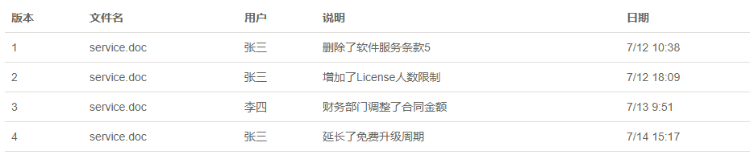

### 1.2、集中式与分布式
集中式版本控制系统，版本库是集中存放在中央服务器的，而干活的时候，用的都是自己的电脑，所以要先从中央服务器取得最新的版本，然后开始干活，干完活了，再把自己的活推送给中央服务器。
中央服务器就好比是一个图书馆，你要改一本书，必须先从图书馆借出来，然后回到家自己改，改完了，再放回图书馆。
集中式版本控制系统最大的毛病就是必须联网才能工作，如果在局域网内还好，带宽够大，速度够快，可如果在互联网上，遇到网速慢的话，可能提交一个10M的文件就需要5分钟，这还不得把人给憋死啊。

分布式版本控制系统根本没有“中央服务器”，每个人的电脑上都是一个完整的版本库，这样，你工作的时候，就不需要联网了，因为版本库就在你自己的电脑上。既然每个人电脑上都有一个完整的版本库，那多个人如何协作呢？比方说你在自己电脑上改了文件A，你的同事也在他的电脑上改了文件A，这时，你们俩之间只需把各自的修改推送给对方，就可以互相看到对方的修改了。
和集中式版本控制系统相比，分布式版本控制系统的安全性要高很多，因为每个人电脑里都有完整的版本库，某一个人的电脑坏掉了不要紧，随便从其他人那里复制一个就可以了。而集中式版本控制系统的中央服务器要是出了问题，所有人都没法干活了。
在实际使用分布式版本控制系统的时候，其实很少在两人之间的电脑上推送版本库的修改，因为可能你们俩不在一个局域网内，两台电脑互相访问不了，也可能今天你的同事病了，他的电脑压根没有开机。因此，分布式版本控制系统通常也有一台充当“中央服务器”的电脑，但这个服务器的作用仅仅是用来方便“交换”大家的修改，没有它大家也一样干活，只是交换修改不方便而已。

### 1.3、windows安装git
git官网下载windows版本的， https://git-scm.com/downloads      
然后安装。（关于安装可以百度，很详细）

安装完成后，在你安装的git文件夹下面，运行git bash

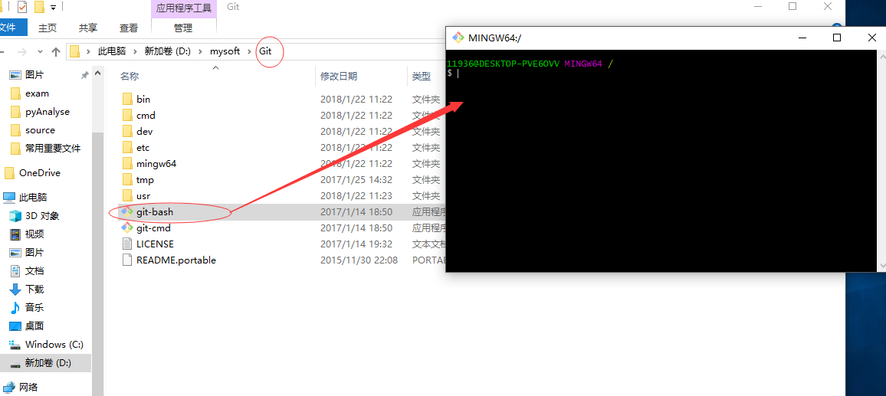

* 查看所有配置: git config -l
* 查看系统配置：git config --system --list
* 查看本地配置：git config --global --list
* 配置用户名: git config --global user.name "XXX"
* 配置邮箱: git config --global user.email "XXX@qq.com"
* 新建一个分支：git branch [branch-name]
* 新建一个分支并切换到新的分支上：git checkout -b [branch]
* 合并指定分支到当前分支：git merge [branch]
* 删除分支: git branch -d [branch-name]
* 删除远程分支：git push origin --delete [branch-name]

## 二、git使用
### 2.1、用git创建版本库
学习三个git命令：
1. git init 命令，初始化一个git仓库
2. git add filename，添加文件到git仓库。
3. git commit，提交文件到git仓库，完成。

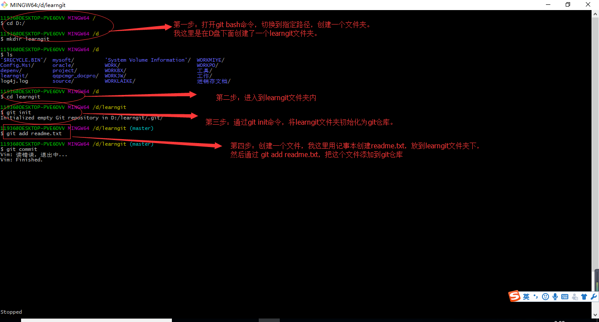

### 2.2、查看工作区状态
1. 通过git status命令，可以时刻掌握仓库当前的状态。

git config --global core.quotepath false 设置成识别中文

2. 通过git diff filename，查看文件发生哪些修改。

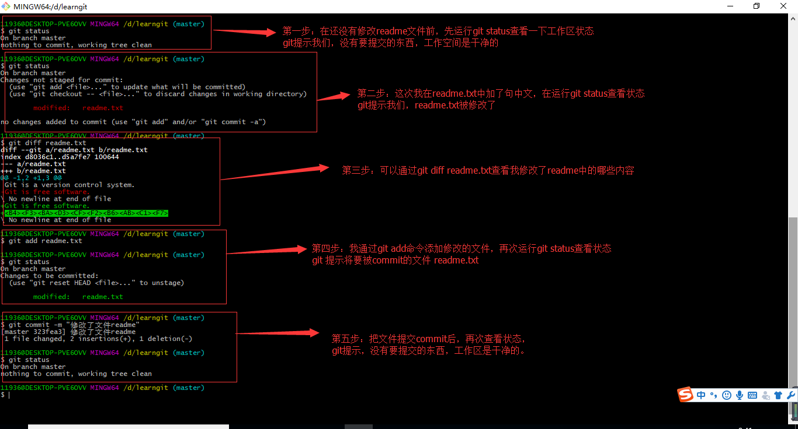

### 2.3、版本回退          
1. HEAD指向当前版本，可以通过git reset --hard commit_id切换版本
2. git log  或者 git log --pretty=oneline查看提交历史
3. 要切换版本，用 git reflog查看历史命令，以确定回到哪个版本

### 2.4、工作区和暂存区的概念

### 2.5、关于撤销操作
理解了工作区，暂存区的概念后，明白add命令是把工作区的东西添加到暂存区，commit命令是把暂存区的东西提交到分支上。
关于撤销修改的三种情况。

1. 工作区的文件进行修改，如果没有进行add操作，也就是还没有放到暂存区时，命令git checkout --filename进行撤销就回退到和版本库一样的状态。（上一次commit后的状态）

2. 工作区的文件进行了修改，并且通过add命令添加到了暂存区，接着又进行了修改，命令git checkout --filename进行撤销就会回到暂存区文件的状态。（上一次add后的状态）
命令git checkout -- readme.txt意思就是，把readme.txt文件在工作区的修改全部撤销。
总之，就是让这个文件回到最近一次git commit或git add时的状态。

3. 工作区的文件进行修改，并且add到了暂存区，你想要从暂存区回退到工作区，可以用git reset HEAD filename，将暂存区的文件移出到工作区。

### 2.6、删除文件
当一个文件，你已经add，commit提交了，然后在在工作区把文件删除了，这个时候工作区和版本库的状态不一致，可以通过git status查看，知道删除了哪个文件。

如果确实要删除这个文件 ，就用 git rm filename命令删除，并commit提交，那么版本库会和工作区一样，也删除这个文件。

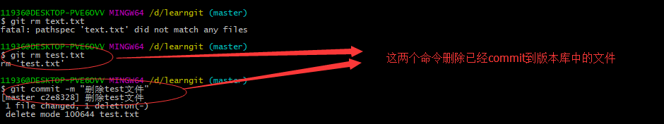

还有就是你在工作区不小心删错了，版本库还有，可以还原通过  git checkout -- filename

## 三、分支管理
分支就是科幻电影里面的平行宇宙，当你正在电脑前努力学习Git的时候，另一个你正在另一个平行宇宙里努力学习SVN。

如果两个平行宇宙互不干扰，那对现在的你也没啥影响。不过，在某个时间点，两个平行宇宙合并了，结果，你既学会了Git又学会了SVN！

分支在实际中有什么用呢？假设你准备开发一个新功能，但是需要两周才能完成，第一周你写了50%的代码，如果立刻提交，由于代码还没写完，不完整的代码库会导致别人不能干活了。如果等代码全部写完再一次提交，又存在丢失每天进度的巨大风险。

现在有了分支，就不用怕了。你创建了一个属于你自己的分支，别人看不到，还继续在原来的分支上正常工作，而你在自己的分支上干活，想提交就提交，直到开发完毕后，再一次性合并到原来的分支上，这样，既安全，又不影响别人工作。

### 3.1、创建与合并分支
在前面第二章节中了解，每一次commit，git都会把我们的每一次提交串成一条时间线，这条时间线就是一个分支，在git里，主分支为master，HEAD指向的分支为当前分支。

当我们创建新的分支时候，如dev，git创建一个指针叫dev，指向与master相同的提交，再把HEAD指向dev分支，这样就把分支切换到了dev分支上。

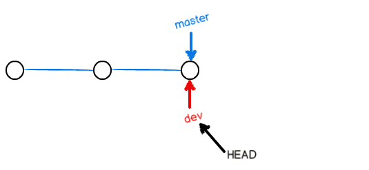

Git创建一个分支很快，因为除了增加一个dev指针，改改HEAD的指向，工作区的文件都没有任何变化！

不过，从现在开始，对工作区的修改和提交就是针对dev分支了，比如新提交一次后，dev指针往前移动一步，而master指针不变：

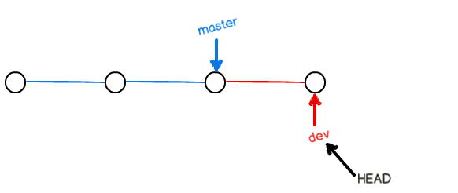

假如我们在dev上的工作完成了，就可以把dev合并到master上。Git怎么合并呢？最简单的方法，就是直接把master指向dev的当前提交，就完成了合并：

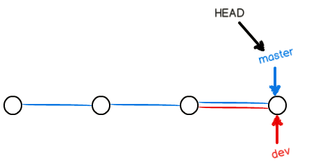

所以Git合并分支也很快！就改改指针，工作区内容也不变！

合并完分支后，甚至可以删除dev分支。删除dev分支就是把dev指针给删掉，删掉后，我们就剩下了一条master分支：

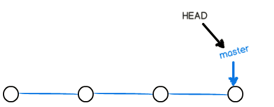

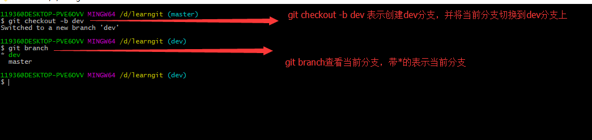

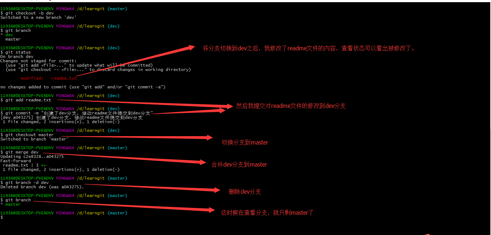

### 3.2、解决冲突

我们创建一个feature1分支，修改分支上的readme文件，提交。

然后修改master分支上的readme文件，提交。

现在合并会冲突，因为两个分支的同一个文件都修改了，git不知道怎么合并，就把两个文件不同的地方都合并起来。

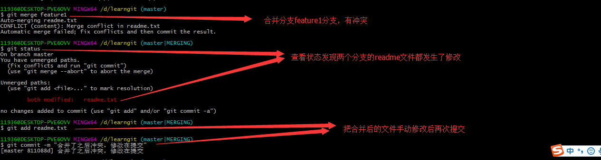

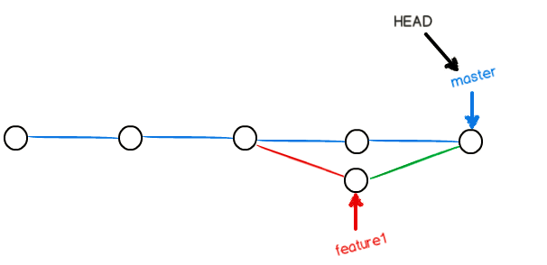

git基本常用功能和概念就差不多了，部分可以参看：

https://www.liaoxuefeng.com/wiki/0013739516305929606dd18361248578c67b8067c8c017b000
