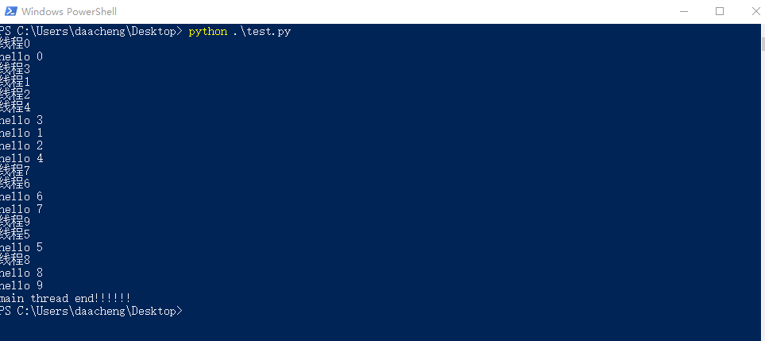

## 创建多线程

```python
import threading  
import time  

def action(arg):  
    time.sleep(2)  
    print('子线程id-{}  arg-{}'.format(threading.get_ident(), arg))  

if __name__ == '__main__':  
    for i in range(3):  
        t = threading.Thread(target=action, args=(i,))  
        t.start()  
    print('main thread end!!!')  
# 结果  
子线程id-12300  arg-1  
子线程id-10672  arg-0  
子线程id-7260  arg-2
```
## 创建多线程

```python
import threading  
import time  
class MyThread(threading.Thread):  
    def __init__(self, arg):  
        super().__init__()  # 必须显示调用父类的初始化函数  
        self.arg = arg  

    def run(self):  
        time.sleep(2)  
        print('子线程id-{}  arg-{}'.format(threading.get_ident(), self.arg))  

if __name__ == '__main__':  
    for i in range(3):  
        t = MyThread(i)  
        t.start()  
    print('main thread end!!!!!!')  
# 结果  
main thread end!!!!!!  
子线程id-12756  arg-0  
子线程id-12540  arg-1  
子线程id-12784  arg-2  
```
## setDeamon(bool)
- **setDeamon(True)**: 设置线程为守护线程(后台线程),主线程执行过程中，后台线程也在执行，主线程执行完毕后，后台线程无论是否执行完成，主线程和后台线程都停止.**主线程执行结束后会将守护线程回收。**
- **setDeamon(False)**:默认参数是False，前台线程。主线程执行过程中，前台线程也在执行，主线程执行完毕，前台线程会继续执行，直到前台执行完成，程序退出

#### 后台线程 setDaemon(True)
```python
import threading
import time

class MyThread(threading.Thread):
    def __init__(self,arg):
        super(MyThread,self).__init__()      #必须显示调用父类的初始化函数
        self.arg = arg
    def run(self):
        time.sleep(2)
        print(self.getName())
        print('hello',self.arg)

for i in range(10):
    t = MyThread(i)
    t.setDaemon(True)        #和idea有关
    t.start()
    name = '线程'+str(i)
    t.setName(name)

print('main thread end!!!!!!')
```


## join(timeout)
**设置join()之后，主线程会等待子线程全部执行完成或者子线程超时后，主线程才会结束，即使设置了setDeamon(True),主线程依然要等子线程结束才会结束**。

```python
import threading
import time

class MyThread(threading.Thread):
    def __init__(self,arg):
        super(MyThread,self).__init__()      #必须显示调用父类的初始化函数
        self.arg = arg
    def run(self):
        time.sleep(2)
        print(self.getName())
        print('hello',self.arg)

list_thread = []
for i in range(10):
    t = MyThread(i)
    t.setDaemon(True)        #和idea有关
    t.start()
    name = '线程'+str(i)
    t.setName(name)
    list_thread.append(t)

for t in list_thread:
    t.join()

print('main thread end!!!!!!')
```


