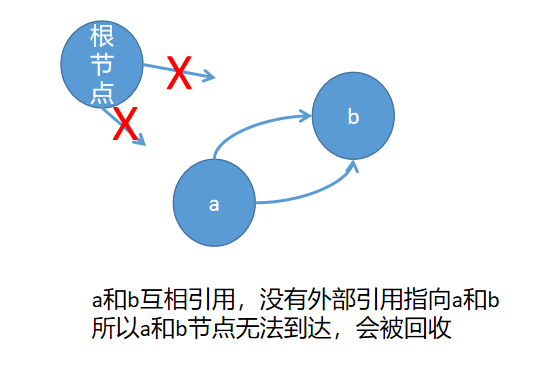

# Python垃圾回收机制
**引用计数+标记清除+分代回收**
## 1.通过引用计数来进行垃圾回收
Python中每个对象内部都有一个引用计数器，程序在运行过程中会实时更新“引用计数”的值，当某个对象的引用计数值为0时，这个对象的内存就会被立即释放掉。**Python 使用标记清除（mark-sweep）算法和分代回收（generational），来启用针对循环引用的自动垃圾回收。**
#### 增加引用计数的情况
* 对象被创建的时候，a={}
* 对象被引用的时候, b=a
* 对象被作为参数传入到一个函数中func(a)
* 对象作为元素存储在容器中
* 可以通过sys.getrefcount()方法查看对象的引用计数值

#### 减小引用计数的情况
* 对象别名被显示销毁 del
* 对象别名被赋予新的对象
* 一个对象离开他的作用域，函数执行结束对象引用减一
* 对象所在的容器被销毁或者是从容器中删除对象

```python
import sys

def func(a):
    pass

if __name__ == '__main__':
    a = []  # +1
    b = a  # +1
    func(a)  # 这里函数被调用的时候+1，函数执行结束引用计数-1
    dict_ = {'a': a}  # +1
    print(sys.getrefcount(a))  # 使用getrefcount()方法本身也会+1，所以最终打印是4

    b = None  # -1
    dict_.clear()  # -1
    print(sys.getrefcount(a))  # 4-1-1 = 2
    del a  # del只是删除对象的别名a，并不删除对象本身，引用计数-1
```

#### 引用计数的优点
* 逻辑简单，效率高
* 实时性，一旦一个对象的引用计数为0了，内存就直接释放了。（有的内存回收机制是有时间等待的）

#### 引用计数的缺点
* 每个对象需要分配单独的空间统计引用计数，增加了内存负担
* 当需要释放一个大的对象时，如字典，需要对引用的所有对象进行计算，花费时间比较长
* 没办法处理循环引用的情况，必须要使用其它的垃圾回收算法对其进行补充

#### 循环引用
a和b相互引用而再没有外部引用a与b中的任何一个，它们的引用计数都为1，但是如果按照引用计数法的话，永远不为0，永远无法回收。
```python
a = {'b': None}
b = {'a': None}
a['b'] = b
b['a'] = a
del a
del b
```

## 2.标记清除处理循环引用的情况

**只有容器才会产生循环引用的情况，如列表，字典，元组等，所以“标记清除”处理的也是容器循环引用的问题**
* 标记阶段：遍历所有对象，如果是可达的，说明还有对象引用，就标记。
* 清除阶段：再次遍历所有对象，如果说没有被标记，就将其回收

对象之间的引用通过指针连接在一起，构成一个有向图，每个对象是有向图的节点，引用关系构成有向图的变，从根对象出发，沿着有向边遍历对象，可以到达的标记为活动对象，不可到达的就是要被清除的对象。根节点就是全局变量、调用栈、寄存器。

如图所示，因为执行了 del a, del b,a和b都是互相引用，没有别的外部引用指向a和b，所以从根节点遍历无法到达ab节点，因此循环引用的ab对象会被回收。



## 3.分代回收
* 循环引用对象的回收过程中，程序是暂停的，所以应该控制“标记清除”的频次，而且不可能每次“标记清除”都遍历所有的对象。
* 分代回收用空间换取时间
* Python将所有对象分为三代，刚创建的对象是第一代，经过一次垃圾回收仍然存在的对象会放入到第二代，第二代对象经过一次垃圾回收会放入到第三代
* 当垃圾回收器中新增的对象减去要删除的对象到达一定阈值时，就执行一次垃圾回收
```python
import gc
print(gc.get_threshold())  # (700, 10, 10)
# 700：当垃圾回收器中新增的对象减去释放的对象差值大于700时，就执行一次一代回收
# 10次一代回收执行一次二代回收
# 10次二代回收执行一次三代回收
# 所以越后代的对象说明越重要，越不容易被回收
```

**在程序中，大部分(80%-90%)对象的生存周期比较短,只有少量对象生命周期比较长，甚至伴随着整个程序，所以，对象存在的时间越长，越不可能是垃圾，“标记清除”越应该减少去遍历这类对象，所以应该将这类对象放入到第二代第三代，以此来提高垃圾回收的效率。**
