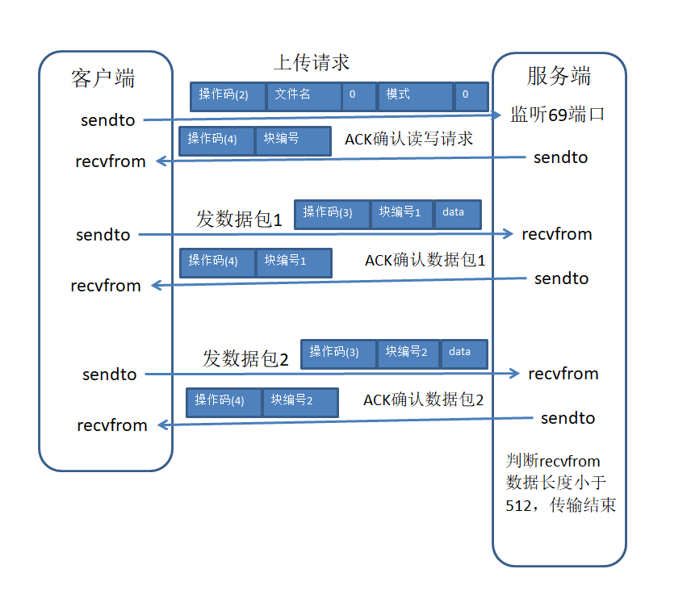

# Python实现TFTP文件传输
## 一、TFTP文件传输协议
1. TFTP文件传输协议属于TCP/IP协议族，是一个用于在客户端和服务器之间进行简单文件传输的协议。
2. 提供简单，开销不大的文件传输服务。
3. 端口号69.
4. 基于UDP协议实现。
5. 进行小文件传输，只能上传文件到服务器，或从服务器下载文件。

## 二、TFTP文件传输协议操作码及数据包格式
### 2.1、操作码
1：下载请求（读取服务器文件）

2：上传请求（往服务器写入文件）

3：数据包

4：确认码 ACK

5：错误码
### 2.2、数据包格式
读写请求：   操作码(1/2)(2字节) + 文件名 + 0(1字节) + 模式 + 0(1字节)

数据包：    操作码(3)(2字节) + 块编号(2字节) + data(512字节)

ACK确认包： 操作码(4)(2字节) + 块编号(2字节)

error:     操作码(5)(2字节) + 差错码(2字节) + 差错信息 + 0(1字节)

## 三、TFTP文件上传下载流程
### 上传

### 下载


## 四、代码实现
### 客户端上传

```python
# tftp 简单文件传输协议
# 上传文件
import struct
import socket

# 定义几个变量
# 要上传到服务端的文件名
uploadToServerFileName = "lenses.txt".encode("utf-8");
# 起始的快编号标记
kuaiBiaoHaoFlag = 0
# 建立UDP
udpSocket = socket.socket(socket.AF_INET, socket.SOCK_DGRAM);
# 建立读写请求
file_upload_request = "!H" + str(len(uploadToServerFileName)) + "s" + "b" + "5s" + "b";
tftp_upload_request = struct.pack(file_upload_request, 2, uploadToServerFileName, 0, "octet".encode("utf-8"), 0)
# 向服务器发送上传文件请求
udpSocket.sendto(tftp_upload_request, ("172.16.1.35", 69))
# 要上传的文件
ready_to_upload_file = open("lenses.txt".encode("utf-8"), "rb+")

while True:
    recv_data, recv_adr = udpSocket.recvfrom(516)
    print(recv_adr)
    print('服务器反馈 ：',recv_data)
    caozuoma, kuaibianhao = struct.unpack("!HH", recv_data[:4])
    print("操作码::%s" % caozuoma)  #
    print("块编号::%s" % kuaibianhao)

    if (caozuoma == 4):

        if (kuaibianhao == kuaiBiaoHaoFlag):
            print("服务端已经收到了我的数据，准备上传数据包")
            # 开始上传数据,此时要像服务端发送数据包，数据大小最大为512
            kuaiBiaoHaoFlag += 1;
            data = ready_to_upload_file.read(516);
            if(data==("".encode("utf-8"))):
                print("上传结束")
                break

            if (kuaibianhao == 65535):
                kuaiBiaoHaoFlag = 0
                kuaibianhao = 0

            # 向服务器发送数据包
            data_request = "!H" + "H" + str(len(data)) + "s"
            shujuBao = struct.pack(data_request, 3, kuaiBiaoHaoFlag, data)
            print(shujuBao)
            udpSocket.sendto(shujuBao, recv_adr)


        else:
            print("服务端没收到我上传的数据")
            break

udpSocket.close()
ready_to_upload_file.close()
```

### 客户端下载

```python
# tftp 简单文件传输协议
# 发送下载请求
import struct
import socket

fileName = "test.txt".encode("gb2312");
file_down_load_request = "!H" + str(len(fileName)) + "s" + "b" + "5s" + "b";
tftp_down_request = struct.pack(file_down_load_request, 1, fileName, 0, "octet".encode("utf-8"), 0);
udpSocket = socket.socket(socket.AF_INET, socket.SOCK_DGRAM)
# 向服务端发送下载请求
udpSocket.sendto(tftp_down_request, ("172.16.1.35", 69))
packNum = 0
jieShouFile = open("test2.txt".encode("gb2312"), "wb+")
while True:
    recv_data, recv_adr = udpSocket.recvfrom(516)
    caozuoma, kuaibianhao = struct.unpack("!HH", recv_data[:4])
    print("操作码::%s" % caozuoma)  #
    print("块编号::%s" % kuaibianhao)
    print(recv_data)
    # 块编号存放的是两位即16个字节=65536 从1开始

    # 返回的是正确的数据包;2(操作码)+2(快编号)+514b的数据

    if (caozuoma == 3):
        if(packNum>65536):
            packNum=0

        if (packNum == kuaibianhao):
            jieShouFile.write(recv_data[4:])
            packNum = kuaibianhao;

        # 向服务端发送确认操作 :4个字节
        ackData = struct.pack("!HH", 4, packNum)
        udpSocket.sendto(ackData, recv_adr)
    elif (caozuoma == 5):
        print("tffp协议下载错误")
        break
    # 判定下载完成
    if (len(recv_data) < 516):
        print("tffp协议下载完成")
        break

udpSocket.close()
jieShouFile.close()
```

### 服务端

```python
from threading import Thread
from socket import *
import struct

def upload(filename,user_ip,user_port):
    num = 0
    f = open(filename,'ab')
    s_up = socket(AF_INET,SOCK_DGRAM)
    # 发送反馈告诉客户端，收到了你的上传请求，同意你上传
    send_data_1 = struct.pack("!HH",4,num)
    s_up.sendto(send_data_1,(user_ip,user_port))  #第一次用随机端口发送
    num += 1

    while True:
        # 接收客户端上传的数据
        recv_data,user_info = s_up.recvfrom(1024)  #第二次客户连接我随机端口
        print(recv_data)
        caozuohao_up,ack_num = struct.unpack('!HH',recv_data[:4])
        print(caozuohao_up,ack_num,num)
        if int(caozuohao_up) == 3 and ack_num == num :
            f.write(recv_data[4:])
            send_data = struct.pack("!HH",4,num)
            s_up.sendto(send_data,(user_ip,user_port)) #第二次我用随机端口发
            num = num + 1
            if len(recv_data) < 512:
                print(user_ip+'上传文件'+filename+':完成')
                f.close()
                exit()


def download(filename,user_ip,user_port):
    # 创建socket用于文件传输
    s_down = socket(AF_INET, SOCK_DGRAM)
    num = 0

    try:
        # 读取客户端要下载的文件
        f = open(filename,'rb')
    except:
        error_data = struct.pack('!HHHb',5,5,5,num)
        s_down.sendto(error_data, (user_ip,user_port))  #文件不存在时发送
        exit()  #只会退出此线程

    while True:
        read_data = f.read(512)
        send_data = struct.pack('!HH',3,num) + read_data
        # 确定客户端要下载文件后，发送文件的数据包给客户端
        s_down.sendto(send_data, (user_ip,user_port))  #数据第一次发送
        if len(read_data) < 512:
            print('传输完成, 对方下载成功')
            exit()
        # 接收来自客户端的反馈（是否成功接收数据包）
        recv_ack =  s_down.recv(1024)  #第二次接收
        caozuoma,ack_num = struct.unpack("!HH", recv_ack)
        num += 1
        if int(caozuoma) != 4 or int(ack_num) != num-1 :
            exit()
    f.close()


# 创建socket,监听本地69端口
s = socket(AF_INET,SOCK_DGRAM)
s.bind(('0.0.0.0',69))
def main():
    while 1:
        # 第一次接收来自客户端的数据，判断客户端是上传还是下载
        recv_data,(user_ip,user_port) = s.recvfrom(1024)  # 第一次客户连接69端口
#         print(recv_data, user_ip, user_port)
        if struct.unpack('!b5sb',recv_data[-7:]) == (0, b'octet', 0):
            caozuoma = struct.unpack('!H',recv_data[:2])
            filename = recv_data[2:-7].decode('gb2312')
            if caozuoma[0] == 1:
                print('对方想下载数据',filename)
                t = Thread(target = download, args = (filename,user_ip,user_port))
                t.start()           
            elif caozuoma[0] == 2:
                print('对方想上传数据',filename)
                t = Thread(target = upload, args = ('upload.txt',user_ip,user_port))
                t.start()           

if __name__ == '__main__':
    main()
```
