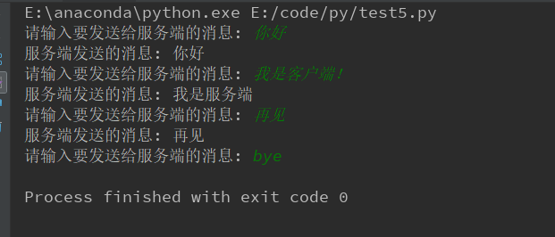
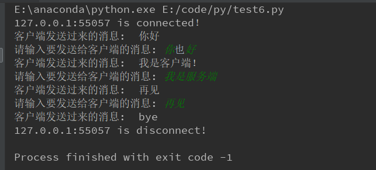

## TCP
#### TCP客户端
* 创建socket对象
* 指定IP和端口，建立连接
* 连接成功后，开始进行通信

```python
import socket  
if __name__ == '__main__':  
    s= socket.socket()  
    s.connect(('127.0.0.1', 9999))  
    while True:  
        send_data = input('请输入要发送给服务端的消息: ')  
        s.sendall(bytes(send_data, encoding='utf-8'))  
        if send_data == 'bye':  
            break  
        recv_data = str(s.recv(1024), encoding='utf-8')  
        print('服务端发送的消息:', recv_data)  
    s.close()  
```

#### TCP服务端
```python
import socketserver  
class MyServer(socketserver.BaseRequestHandler):  

    def setup(self):  
        ip = self.client_address[0].strip()  
        port = self.client_address[1]  
        print('{}:{} is connected！'.format(ip, port))  

    def handle(self):  
        while True:  
            conn = self.request  
            recv_data = str(conn.recv(1024), encoding='utf-8')  
            print('客户端发送过来的消息: ', recv_data)  
            if recv_data == 'bye':  
                break  
            send_data = bytes(input('请输入要发送给客户端的消息: '), encoding='utf-8')  
            conn.sendall(send_data)  

    def finish(self):  
        ip = self.client_address[0].strip()  
        port = self.client_address[1]  
        print('{}:{} is disconnect!'.format(ip, port))  

if __name__ == '__main__':  
    server = socketserver.ThreadingTCPServer(('127.0.0.1', 9999), MyServer)
    server.serve_forever()
```




## UDP
#### UDP客户端

```python
import socket  
if __name__ == '__main__':  
    s = socket.socket(socket.AF_INET, socket.SOCK_DGRAM)  
    while True:  
        send_data = input('客户端发送消息: ')  
        s.sendto(bytes(send_data, encoding='utf-8'), ('127.0.0.1', 9998))  
        recv_data = str(s.recv(1024), encoding='utf-8')  
        print('客户端接收到的消息: ', recv_data)  
        if send_data == 'bye':  
            break  
    s.close()  
```

#### UDP服务端

```python
import socketserver  
class MyServer(socketserver.BaseRequestHandler):  
    def handle(self):  
        conn = self.request[1]  
        recv_data = self.request[0].strip()  
        print('客户端发送来的数据: ', recv_data)  
        conn.sendto(bytes('我是服务端，收到你的消息了。', encoding='utf-8'), self.client_address)  
if __name__ == '__main__':  
    with socketserver.UDPServer(('127.0.0.1', 9998), MyServer) as server:  
        server.serve_forever() 
```
