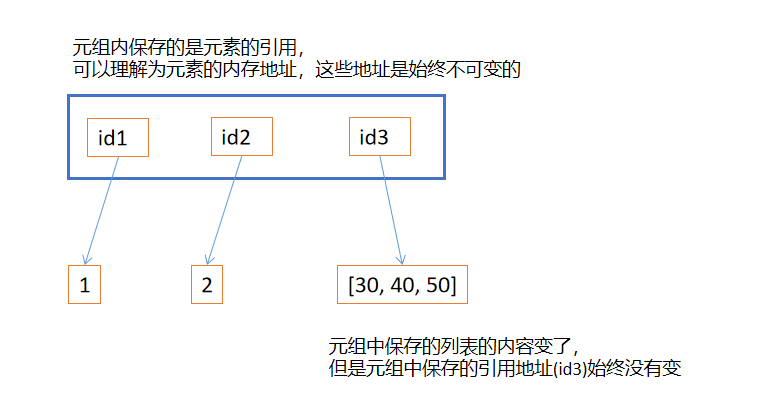

**元组不可变指的是tuple数据结构中的物理内容不变，也就是元组保存的引用是不可变的。**

**所以如果元组引用的元素是可变的，那即使元组本身包含的引用不可变，元素依然可变**
```python
# 元组内保存的三个元素的内存地址是不可变的
t1 = (1, 2, [30, 40])
print(id(t1[-1]))  # 1742619956424
t1[-1].append(50)
print(t1)          # (1, 2, [30, 40, 50])
print(id(t1[-1]))  # 1742619956424
```



#### 尽量不要把可变对象放在元组中
#### 增量赋值不是一个原子操作，虽然程序抛出异常，但还是会添加成功
+= 是赋值操作，相当于要改变引用地址，元组内引用地址是不可变的，所以会报错
答案：D

