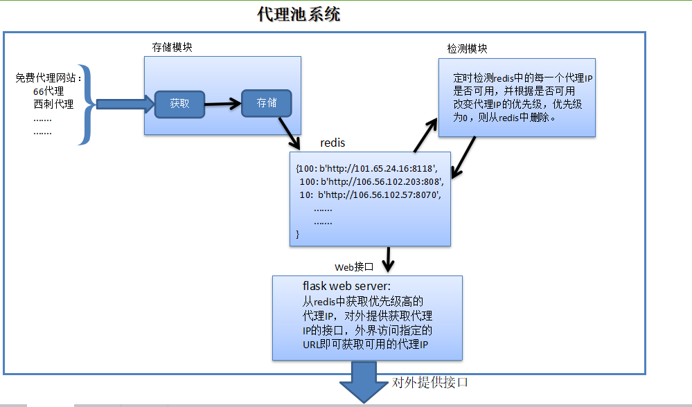

# Python爬虫--代理池维护
## 大致思路
1. 去代理网站上爬取大量代理IP，并将其存储在redis数据库。
2. 定时获取redis中的所有代理IP，检测每一个代理IP是否可用。
3. 通过flask，对外提供获取代理IP的接口，如果想要使用代理池中的代理IP，只需要访问我们提供的接口即可。
**现在网上免费代理IP网站越来越少，而且免费的代理质量非常不稳定，本文只是提供构建代理IP池的一种思路，实战的话还是要想办法获取优质的代理。**

## 代理池系统具体实现思路

## [代理池完整代码](agent_pool)

#### agent_pool.py 整体流程
存储模块：主要实现的功能是，去一些免费代理网站爬取大量的代理IP，并存储至redis数据库中。redis的Sorted Set结构是一个有序集合，我们会对每一个爬取到的代理IP
设置一个初始化的优先级10，Sorted Set也是通过这个优先级来进行排序的。</br>

* Getter:爬取代理网站的免费代理IP，存入redis
* Tester:从redis中取出代理，测试代理是否可用，并调整代理IP的优先级
* Controller:启动Getter()与Tester()

```python
from Crawler import Crawler
from RedisClient import RedisClient
import traceback
import time
import requests
import multiprocessing
from concurrent import futures

FULL_COUNT = 2000

class Getter(object):
    # 爬取代理网站的免费代理IP，存入redis
    def __init__(self):
        self.redis_client = RedisClient()
        self.crawler = Crawler()

    def is_full(self):
        # 判断代理池是否满了
        return self.redis_client.get_proxy_count() >= FULL_COUNT

    def run(self):
        # 将爬取到的代理存入redis
        if not self.is_full():
            proxys = self.crawler.get_crawler_proxy()
            for proxy in proxys:
                self.redis_client.add(proxy)

class Tester(object):
    # 从redis中取出代理，测试代理是否可用，并调整代理IP的优先级
    def __init__(self, test_url):
        self.redisdb = RedisClient()
        # 用来测试代理是否可用的地址
        self.test_url = test_url

    def test_proxy(self, proxy):
        try:
            if isinstance(proxy, bytes):
                proxy = proxy.decode('utf-8')
            proxies = {
                'http': 'http://' + proxy,
                'https': 'https://' + proxy
            }
            print('正在检测:{}'.format(proxy))
            res = requests.get(self.test_url, proxies=proxies, timeout=10)
            if res.status_code == 200:
                return True, proxy
            else:
                return False, proxy
                # 代理不可用，就降低其优先级
        except Exception as e:
            return False, proxy
            # print('代理检测异常:{}  {}'.format(proxy, e))
            self.redisdb.decrease(proxy)
            print('代理不可用:{}'.format(proxy))


    def run(self):
        print('启动检测模块......')
        try:
            # 获取redis中所有爬取到的代理
            proxies = self.redisdb.get_all_proxy()
            for i in range(0, len(proxies), 50):
                test_proxies = proxies[i:i+50]
                workers = len(test_proxies)
                with futures.ThreadPoolExecutor(workers) as executor:
                    tasks_res = executor.map(self.test_proxy, test_proxies)
                    for res, proxy in tasks_res:
                        if not res:
                            # 代理不可用，就降低其优先级
                            self.redisdb.decrease(proxy)
                            print('代理不可用:{}'.format(proxy))
                        else:
                            # 代理可用,将其优先级置为最大
                            self.redisdb.max(proxy)
                            print('代理可用:{}'.format(proxy))

        except Exception as e:
            print(traceback.format_exc())
            print('检测模块出错！！！')

class Controller(object):
    def control_get(self):
        # 获取功能：爬取代理网站，将代理存储到redis
        getter = Getter()
        while True:
            try:
                getter.run()
            except:
                print(traceback.format_exc())
            time.sleep(30)

    def control_test(self):
        # 检测功能，检测redis中的代理是否可用
        tester = Tester(test_url='http://www.baidu.com')
        while True:
            try:
                tester.run()
            except:
                print(traceback.format_exc())
            time.sleep(30)

    def run(self):
        print('代理池开始运行了......')
        # 两个进程
        get = multiprocessing.Process(target=self.control_get)
        get.start()
        test = multiprocessing.Process(target=self.control_test)
        test.start()

if __name__ == '__main__':
    control = Controller()
    control.run()
```

#### WebAPI_to_get_proxy.py 通过flask向外提供获取代理IP的接口
```python
from flask import Flask, g
import RedisClient

"""
    对外提供web接口，通过提供的web接口，来获取redis中的代理
    g是上下文对象，处理请求时，用于临时存储的对象，每次请求都会重设这个变量。比如：我们可以获取一些临时请求的用户信息。
"""


app = Flask(__name__)


@app.route('/')
def index():
    return '<h2>欢迎来到daacheng代理池系统</h2>'


def get():
    if not hasattr(g, 'redis'):
        g.redis = RedisClient.RedisClient()
    return g.redis


@app.route('/random')
def get_random_proxy():
    # 从代理池中返回一个代理
    redisdb = get()
    return redisdb.get_proxy()


@app.route('/count')
def count():
    # 查询代理池中代理的个数
    redisdb = get()
    return str(redisdb.get_proxy_count())


@app.route('/all')
def get_all():
    # 查询代理池中代理的个数
    redisdb = get()
    return str(redisdb.get_all_proxy())


if __name__ == '__main__':
    app.run(host='0.0.0.0', port=5000)
    app.debug = True

```
