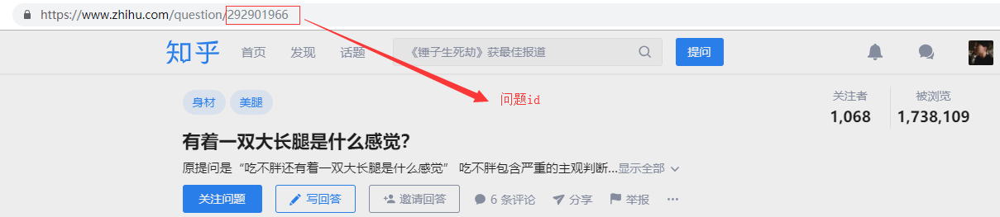

# Python爬虫之知乎钓鱼贴图片爬取
**单线程爬取，速度比较慢，因为怕被封IP没有办法并发爬取。**

## 大概思路
### 一、请求URL分析
**爬取知乎钓鱼贴，首先要确定哪些是你要爬取的钓鱼贴，比如知乎每一个问题，都有一个对应的id，这里我就去找了下面这20多个帖子，如图：**


**随便打开一个帖子，F12打开，不断向下滑动，观察得到一下结果。**


**多向下滑动，获取不同的请求url，对比发现URL有什么不同**


### 二、解析获取图片url
**我们发现了请求url的规律，知道如何获取答案数据，之后就是从答案中解析获取图片url的路径，这个就比较简单了，直接通过正则表达式，就可以获取答案中所有的
图片链接了。**

    r""""""

### 三、代码 spider_zhihu.py
```python
import re
import os
import time
import requests


class SpiderZhihu:
    def __init__(self, question_id_dict):
        self.question_id_dict = question_id_dict
        self.user_agent = 'Mozilla/5.0 (Windows NT 10.0; WOW64) AppleWebKit/537.36 (KHTML, like Gecko) Chrome/70.0.3538.67 Safari/537.36'
        self.cookies = '_zap=aac8772b-82fe-4610-9e18-fb971c17e76d; d_c0="APAXshY-axGPToll8CUAac2WEodv24DdD1k=|1592034700"; _ga=GA1.2.835003185.1592034702; _xsrf=1eVbObCFd8rVPPp0kmPfUFH0JxGyyOPj; tst=r; q_c1=4b5b6bae6d844394bc932031ac804299|1599205031000|1595569976000; capsion_ticket="2|1:0|10:1601452480|14:capsion_ticket|44:ZmExNDlhYzA5MDEzNDZlNDg5YTkwYWE4ZDUzMDI3Y2U=|3f2e838fbba84981e1503edc2b01ae0452c567bef1818fe4ce1c6d1a65a4f67a"; z_c0="2|1:0|10:1601452502|4:z_c0|92:Mi4xcDljekFBQUFBQUFBOEJleUZqNXJFU2NBQUFDRUFsVk4xY2FiWHdERmw0dWhyTnFBUWplTTZ5SC04b2k5dkU1NE5R|bd99445515df216391ddc99f9dd91ad8d22a344174ec978ec29684444925adae"; Hm_lvt_98beee57fd2ef70ccdd5ca52b9740c49=1602729290,1602839705; SESSIONID=h0ctlKWZ2wqZJYfH0Hk9ETTRQoaXozCv4d17mUvDJum; JOID=VlAXBUslBfUtSIFOGyedZOYGBqAMQT-SXyDGE0UTfo5zBNwkWVBFenBAh0AZ3QcAqJoBmvkQhK_oiiGarr0KBRc=; osd=VlAVBkslBfcuSIFOGSSdZOYEBaAMQT2RXyDGEUYTfo5xB9wkWVJGenBAhUMZ3QcCq5oBmvsThK_oiCKarr0IBhc=; KLBRSID=4843ceb2c0de43091e0ff7c22eadca8c|1603096356|1603096173'

        self.img_tag = re.compile(r"""""", re.I)
        self.pic_urls = []
        self.base_dir = r'F:\zhihu_picture'

    def get_pic_urls(self):
        for question_id in question_id_dict.keys():
            headers = {
                'referer': 'https://www.zhihu.com/question/' + question_id,
                'user-agent': self.user_agent,
                'cookie': self.cookies
            }
            for i in range(0, 500, 5):
                try:
                    url = 'https://www.zhihu.com/api/v4/questions/' + question_id + '/answers?include=data%5B%2A%5D.is_normal%2Cadmin_closed_comment%2Creward_info%2Cis_collapsed%2Cannotation_action%2Cannotation_detail%2Ccollapse_reason%2Cis_sticky%2Ccollapsed_by%2Csuggest_edit%2Ccomment_count%2Ccan_comment%2Ccontent%2Ceditable_content%2Cvoteup_count%2Creshipment_settings%2Ccomment_permission%2Ccreated_time%2Cupdated_time%2Creview_info%2Crelevant_info%2Cquestion%2Cexcerpt%2Crelationship.is_authorized%2Cis_author%2Cvoting%2Cis_thanked%2Cis_nothelp%2Cis_labeled%2Cis_recognized%2Cpaid_info%2Cpaid_info_content%3Bdata%5B%2A%5D.mark_infos%5B%2A%5D.url%3Bdata%5B%2A%5D.author.follower_count%2Cbadge%5B%2A%5D.topics&limit=5&offset=' + str(i) + '&platform=desktop&sort_by=default'

                    res = requests.get(url, headers=headers)
                    if res.status_code == 200:
                        data = res.json()
                        if not data['data']:
                            print('no data ({})'.format(url))
                            break
                        for answer in data['data']:
                            content = answer.get('content', '')
                            if content:
                                image_url_list = self.img_tag.findall(content)

                                for image_url in image_url_list:
                                    print('图片url: {}, 问题id: {}'.format(image_url, question_id))
                                    self.pic_urls.append((image_url, question_id))
                    else:
                        print('返回值:{}, url:{}'.format(res.status_code, url))

                    # 防止访问频繁
                    time.sleep(1.1)

                except Exception as e:
                    print('请求出错({})'.format(e))
                    time.sleep(1.1)
                    continue
            print('爬取结束-{}'.format(question_id))

    def download_pic(self):
        for pic_url, question_id in self.pic_urls:
            headers = {
                'referer': 'https://www.zhihu.com/question/' + question_id,
                'user-agent': self.user_agent,
                'cookie': self.cookies
            }
            data = None
            for _ in range(3):
                try:
                    res = requests.get(pic_url, headers=headers, timeout=3)
                    print('返回值:{}, url:{}'.format(res.status_code, pic_url))
                    if res.status_code == 200:
                        data = res.content
                        break
                except Exception as e:
                    print('请求异常({})'.format(e))

            if data:
                # 获取图片所属的问题名称
                question_name = self.question_id_dict.get(question_id)
                # 创建图片存储的文件夹
                pic_dir = os.path.join(self.base_dir, question_name)
                os.makedirs(pic_dir, exist_ok=True)
                # 图片名称
                pic_name = pic_url.split('/')[-1].split('?')[0]
                pic_path = os.path.join(pic_dir, pic_name)
                with open(pic_path, 'wb') as f:
                    f.write(data)
                    print('下载成功: {}'.format(pic_name))

    def run(self):
        self.get_pic_urls()
        self.download_pic()


if __name__ == '__main__':
    question_id_dict = {'328457531': '女生身材好是种怎样的体验'}
    zhihu = SpiderZhihu(question_id_dict)
    zhihu.run()
```

### 四、最终结果

